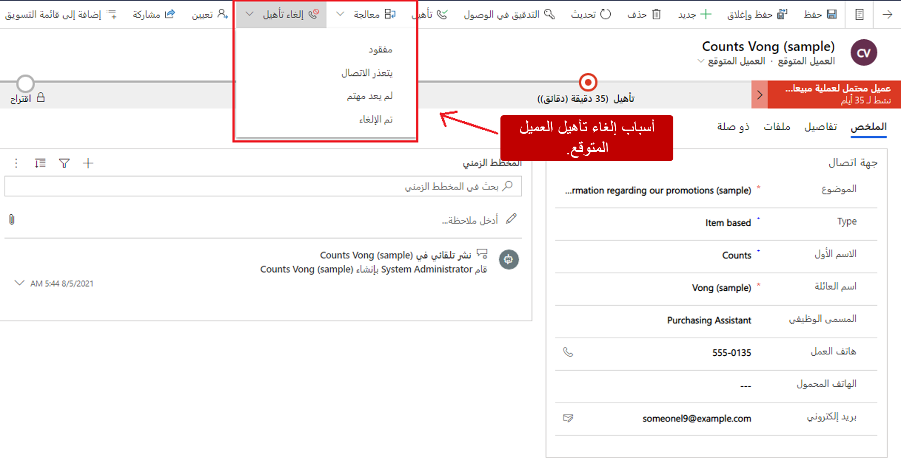
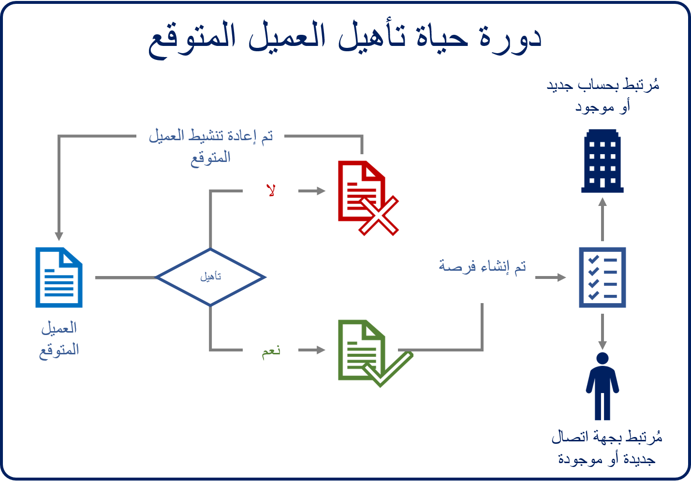

بعد أن يحدد المسؤول التنفيذي للحساب جدوى العميل المتوقع، يمكن إما أن يكون العميل المتوقع مؤهلاً أو غير مؤهل. من خلال تأهيل العملاء المتوقعين، فإنك تشير إلى أنهم يعتبرون مبيعات محتملة قابلة للتطبيق ومستعدون للانتقال إلى المرحلة التالية من عملية المبيعات. من خلال تأهيل العملاء المتوقعين، فإنك تشير إلى أنهم يعتبرون مبيعات محتملة قابلة للتطبيق ومستعدون للانتقال إلى المرحلة التالية من عملية المبيعات.

على الرغم من أن العميل المحتمل غير المؤهل قد لا يكون مناسباً لمؤسستك في الوقت الحالي، فقد تظل هناك إمكانية للقيام بأعمال تجارية مع هذا العميل يوماً ما. يمكن إعادة تنشيط العميل المحتمل الذي تم استبعاده اليوم وتأهيله لاحقاً.

## استبعاد عميل متوقع

يمكن استبعاد العملاء المتوقعين لأسباب متعددة. إليك بعض الأمثلة:

- لم يكن المسؤول التنفيذي عن الحساب قادراً على التواصل مع العميل المتوقع خلال الإطار الزمني المطلوب لترقية معينة.
- لا يهتم العميل المتوقع بمنتجات الشركة أو خدماتها.
- يحتاج العميل المحتمل إلى منتج أو خدمة لا توفرها الشركة.
- هناك خطر يتمثل في أن التعامل مع العميل قد لا يكون في مصلحة أحد الطرفين أو كليهما.

أنت تستبعد عميلاً متوقعاً من سجل العميل المتوقع نفسه. في شريط الأوامر، حدد **استبعاد**،ثم في القائمة التي تظهر، حدد سبباً لعدم الأهلية. تم تحديد أربعة أسباب افتراضية:

- تم خسارته
- يتعذر الاتصال
- لم يعد مهتماً
- تم الإلغاء

عندما يتم استبعاد عميل متوقع، يظل السجل في Microsoft Dynamics 365، ولكن يتم نقله إلى حالة غير نشطة. لا يمكن تحرير السجلات غير النشطة، ولكن يمكن عرض المعلومات الموجودة فيها. هذا السلوك حسب التصميم. هناك سببان لإلغاء تنشيط السجلات بدلاً من حذفها:

- تأكد من وجود سجل تاريخي للعميل المتوقع.
- الاحتفاظ بالعميل المحتمل المتوفر لإعادة التنشيط لاحقاً، إذا لزم الأمر.

على سبيل المثال، قد يتم استبعاد العملاء المتوقعين للترويج التسويقي الحالي لأنهم غير مهتمين بالمنتجات التي تشكل جزءاً من هذا الترويج. ولكن نظراً لأنهم يمتلكون بعض المنتجات التي تقدمها مؤسستك، فمن المحتمل أن تكون هناك فرص أخرى للعمل معهم. من خلال استبعاد العملاء المحتملين بدلاً من حذف سجلهم بالكامل، فإنك تحتفظ بهم لإعادة التنشيط في المستقبل.

## إعادة تنشيط عميل محتمل

في بعض الأحيان، قد يتعين إعادة تنشيط العميل المحتمل الذي تم استبعاده سابقاً. قد يحدث هذا، على سبيل المثال، عندما يهتم الآن شخص لم يكن مهتماً في السابق بمنتجات أو خدمات مؤسستك. في عرض **العملاء المحتملون المغلقون** في تطبيق مركز المبيعات، يمكنك عرض أي عملاء محتملين تم استبعادهم. لإعادة تنشيط عميل محتمل مغلق، افتح سجل العميل المتوقع، وحدد **إعادة تنشيط العميل المتوقع**. يتم إعادة فتح العميل المتوقع ويظهر في عرض **العملاء المحتملين المفتوحين** للمالك الأصلي للعميل المتوقع. يمكن لمالك العميل المتوقع بعد ذلك تشغيل العميل المتوقع كما لو كان عميلاً متوقعاً جديداً تم تعيينه له أو لها.

## تأهيل عميل متوقع.

بعد استيفاء العميل المتوقع لمعايير التأهيل التي حددتها المؤسسة للتقدم إلى المرحلة التالية من عملية المبيعات، يكون جاهزاً للتأهل كفرصة.. لتأهيل العملاء المتوقعين، حدد **تأهيل** في شريط الأوامر في سجل العميل المتوقع. يتم إغلاق العميل المتوقع، ويتم إنشاء سجل فرصة مقابل وربطه بسجل العميل المتوقع. يتم ملء تفاصيل الفرصة تلقائياً استناداً إلى القيم التي تم التقاطها في العميل المتوقع.

بخلاف سجلات العميل المتوقع، يجب أن تقترن سجلات الفرصة في Dynamics 365 بسجل عميل. يمكن أن يكون العميل إما فرداً أو مؤسسة.

- يتم تخزين المنظمات في Dynamics 365 كسجلات حساب.
- يتم تخزين الأفراد في Dynamics 365 كسجلات جهات اتصال.

يمكن أن يكون سجل جهة الاتصال سجلاً مستقلاً، أو يمكن إقرانه بمؤسسة. على سبيل المثال، قد تقوم المؤسسة التي تبيع بشكل أساسي للشركات بإنشاء سجل جهة اتصال لـ Jenny، وهي وكيل مشتريات لمؤسسة. في هذه الحالة، سيتم أيضاً ربط سجل جهة اتصال Jenny بسجل حساب مؤسستها. قد تستخدم المؤسسة التي تبيع بشكل أساسي للأفراد جهات الاتصال فقط في Dynamics 365 لتمثيل الأفراد الذين تبيع لهم. في هذه الحالة، قد يكون لدى Jenny سجل جهة اتصال مستقل فقط.

لدعم كلا السيناريوهين، يمكن تعيين العمود **العميل المحتمل** في سجل الفرصة إما إلى سجل حساب أو سجل جهة اتصال. إذا كان العميل المتوقع مقترناً بعميل حالي، فسيتم استخدام العميل الحالي الذي تم تحديده للعميل المتوقع كعميل للفرصة. إذا كان العميل المتوقع عبارة عن عميل جديد تماماً، فيجب وجود حساب و / أو سجل جهة اتصال للعميل المتوقع قبل إنشاء فرصة. للمساعدة في هذه العملية، يمكن لـ Dynamics 365 إنشاء سجلات إضافية يمكن إقرانها بفرصة.

تصف الصورة التالية السجلات التي ينشئها Dynamics 365، بناءً على ما إذا كان قد تم تحديد سجل حساب موجود أو سجل جهة اتصال عند تحويل العميل المتوقع.

يتم إنشاء سجل حساب جديد فقط إذا تم تعيين عمود **الشركة** في سجل العميل المتوقع.

تتحكم القيم التالية في صفحة **العميل المتوقع** في نتيجة عملية التأهيل:

- **العنوان:** تصبح هذه القيمة عنوان الفرصة التي تم إنشاؤها.
- **الاسم:** إذا تم إدخال هذه القيمة، فإنها تصبح الاسم الكامل لجهة الاتصال الجديدة.
- **الشركة:** تصبح هذه القيمة اسم الحساب الذي تم إنشاؤه حديثاً باستخدام اسم الشركة.

يتم تعيين البيانات الإضافية، مثل موازنة العميل من العميل المتوقع، للفرصة الجديدة.

عندما يتم إنشاء سجل فرصة من عميل متوقع، يتم إنشاء علاقة مع سجل العميل المتوقع وتبقى مع الفرصة.

تصف الصورة التالية مثالاً لدورة حياة تأهيل العميل المتوقع.

نظراً لأن العملاء المتوقعين المؤهلين يظلون في التطبيق ويرتبطون بالفرص الجديدة، يمكن الوصول إليهم في أي وقت عن طريق تحديد مرحلة **التأهيل** في تدفق إجراءات العمل بالفرصة (BPF). يتم فتح سجل العميل المتوقع المؤهل ويعرض جميع المعلومات ذات الصلة.

لمزيد من المعلومات حول تأهيل العملاء المحتملين واستبعادهم:

> [!VIDEO https://www.microsoft.com/videoplayer/embed/RE2NCXe]

[تأهيل عميل متوقع وتحويله إلى فرصة (مركز المبيعات والمبيعات)](/dynamics365/customer-engagement/sales-enterprise/qualify-lead-convert-opportunity-sales).

