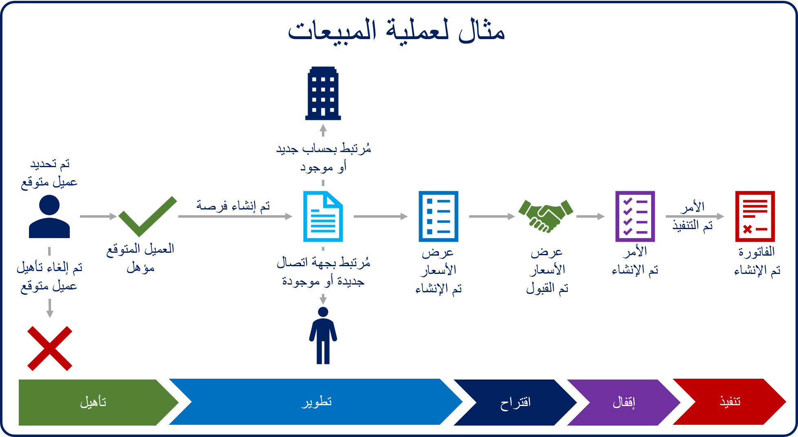

Microsoft Dynamics 365 Salesيسمح للمؤسسات بإدارة عملية دورة حياة المبيعات بالكامل، من البداية إلى النهاية. رغم أن كل مؤسسة تعد مختلفة، إلا أن دورة حياة المبيعات النموذجية تشبه الصورة الآتية.

عندما يعبر العملاء المتوقعون أو العملاء عن اهتمام مؤهل في شراء منتجاتك أو خدماتك، فإنهم يمثلون فرصًا.

الفرصة هي عملية بيع محتملة. ويصبح العملاء المتوقعون فرصًا بعد تحديدهم كي يكونوا عملاء يمكن اكتسابهم. وعلى عكس سجلات العملاء المتوقعين، والتي تتضمن عادةً معلومات أساسية فقط، توفر سجلات الفرص مزيدًا من التفاصيل الخاصة مثل الإيراد المحتمل والمخططات الزمنية ومعلومات حول المنتجات أو الخدمات.

وتستخدم المؤسسات الفرص لتقدير الإيرادات. وبمجرد إدخال الفرص، يتم تقدير القيمة المستقبلية للمبيعات المحتملة لتقديم توقعات لمسار المبيعات. ونظرًا إلى أن الفرص مُقفلة ، تتم مقارنة الإيراد الفعلي الذي تم إنشاؤه بالإيراد المتوقع. وقد يتضمن العمل على الفرصة العديد من تفاعلات العملاء، مثل المقابلات أو المكالمات الهاتفية أو المهام. في كثير من الأحيان، فعالية فريق المبيعات في إدارة هذه المرحلة يمكن أن تحدث الفارق بين الفوز والخسارة.

يمكن أن تتضمن إدارة الفرص الفعالة العديد من المهام. إليك بعض الأمثلة:

- تخصيص الفرص ومشاركتها مع الأفراد أو الفرق الأكثر ملاءمة
- تعقب تفاصيل المنتج والخدمة للأصناف التي يهتم بها العميل
- توفير أنسب المؤلفات للعميل
- إدارة أنشطة المبيعات المتعلقة بالفرصة وتعقبها.
- تعقب حملة الأسهم و المنافسين
- نقل الفرص خلال سير عمل عملية المبيعات

تعد الفرص جزءًا مهمًا من عملية المبيعات نظرًا إلى أن فريق المبيعات يستثمر فيها معظم وقته وجهده. بالإضافة إلى الفرص، يتضمن Dynamics 365 sales العديد من المكونات المستخدمة ليس في البيع للعملاء فحسب، ولكن للمساعدة أيضًا على الحفاظ على العلاقة السليمة طويلة الأجل مع العملاء. فيما يأتي بعض مكونات المبيعات الأكثر استخدامًا:

| المصطلح                  | التعريف |
|-----------------------|------------|
| العميل              | يمكن أن يكون العميل حسابًا أو جهة اتصال. في سيناريوهات متاجرة عمل-عمل (B2B)، يكون العميل هو الحساب في العادة. وفي سيناريوهات متاجرة عمل-مستهلك (B2C)، يكون العميل هو جهة الاتصال في العادة. بالنسبة إلى الفرص، العميل يمثل العميل المحتمل الذي تنطبق عليه الفرصة. |
| الحساب               | حساب يمثل شركة أو مؤسسة. حساب يمكن تعيينه كعميل محتمل لإحدى الفرص. |
| جهة الاتصال               | جهة اتصال تمثل فردًا واحدًا. جهة اتصال يمكن تعيينها كعميل محتمل لإحدى الفرص. |
| الأنشطة            | النشاط هو نوع من أنواع الجداول يوفر خيارات التعقب والجدولة. تتضمن الفرص عادةً أنشطة متعددة لأشياء مثل المهام والمواعيد والمكالمات الهاتفية. |
| سير إجراءات العمل | سير إجراءات العمل (BPF) هو أحد أنواع الأتمتة في Microsoft Power Platform. يظهر ‏‫سير إجراءات العمل (BPF) في صفحة الجدول ويمنح دليل المستخدمين وخطة إجراءات متوقعة لجمع البيانات. بالنسبة إلى الفرص، يقوم ‏‫سير إجراءات العمل (BPF) بإرشاد المستخدمين خلال الخطوات والمراحل اللازمة لتحويل الفرصة إلى عملية بيع. |
| عميل متوقع                  | يتم استخدام العملاء المتوقعين لتحديد صلاحية شخص ما كعميل محتمل. يتم تحويل العملاء المتوقعين المؤهلين إلى فرص. |
| كتالوج المنتجات       | كتالوج المنتجات هو مجموعة من السجلات التي تتفاعل مع الفرص وعروض الأسعار والأوامر والفواتير لتسهيل إدارة المنتجات وقوائم الأسعار والخصومات ومجموعات المنتجات لحركات المبيعات. يمكن إضافة منتجات من كتالوج المنتجات إلى الفرص كأصناف بنود. |
| عرض أسعار                 | عرض الأسعار هو عرض رسمي لمنتجات أو خدمات مقدم للعميل بأسعار محددة وشروط سداد ذات صلة. يمكن إنشاء عروض الأسعار من سجلات الفرص. |
| الأمر                 | الأمر هو طلب مؤكد لتسليم السلع والخدمات بشروط محددة. وبدلاً من ذلك، إنه عرض أسعار وافق عليه العميل. |
| الفاتورة               | الفاتورة هي أمر أو سجل لعملية بيع تمت فوترتها للعميل. وهي تتضمن تفاصيل حول المنتجات أو الخدمات التي تم شراؤها. |

تعرض الصورة الآتية مثالاً لعملية مبيعات من البداية إلى النهاية.

في الصورة أعلاه، يمكننا رؤية عميل متوقع اتصل بمؤسستنا للاستفسار عن المنتجات والخدمات. لقد تواصل المدير التنفيذي للحساب مع العميل المتوقع لجمع مزيد من المعلومات عنه ولتحديد ما إذا كان العميل المتوقع ومؤسستك ملائمين مع بعضهما.

1. إذا قام المدير التنفيذي للحساب بتحديد وجود ملائمة جيدة، فسيتم تأهيل العميل المتوقع على أنه فرصة.

    - إذا كان العميل المتوقع هو عميل حالي، فسيتم إنشاء فرصة جديدة وإقرانها بحساب و/أو سجل جهات اتصال حالي.
    - إذا كان العميل المتوقع عميلاً جديدًا، فسيتم إنشاء سجلات جديدة للحساب وجهة الاتصال والفرصة.

    وبدلاً من ذلك، في حالة تحديد المدير التنفيذي للحساب عدم وجود ملائمة جيدة، فإنه يتم إلغاء تأهيل العميل المتوقع، ومن ثمَّ تنتهي عملية المبيعات.

2. تمت إضافة التفاصيل إلى الفرصة. وهذه التفاصيل تشمل المنتجات والخدمات الذي يهتم بها العميل المتوقع والإيرادات المقدّرة والجداول الزمنية.
3. تمت إضافة عرض أسعار إلى الفرصة. عرض الأسعار يمثل الاقتراح الرسمي للعميل.
4. عندما يوافق العميل على عرض الأسعار، يتم إنشاء أمر. يتم إقفال عرض الأسعار والفرصة المتعلقين بالأمر.
5. بعد استيفاء الأمر، يتم إنشاء فاتورة للعميل.
