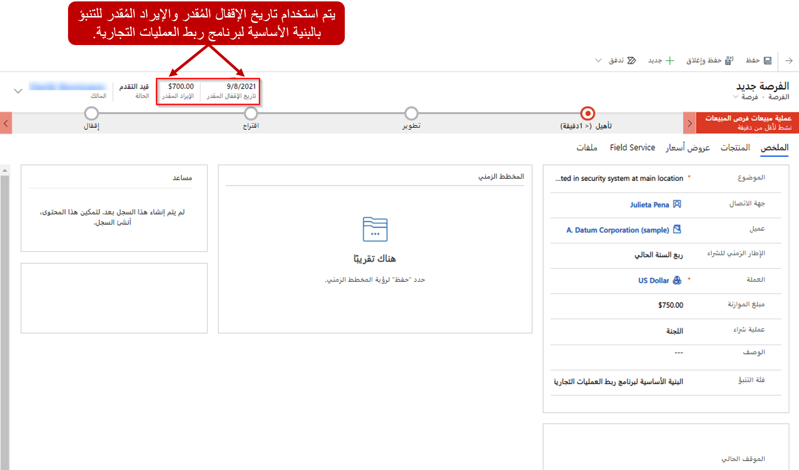
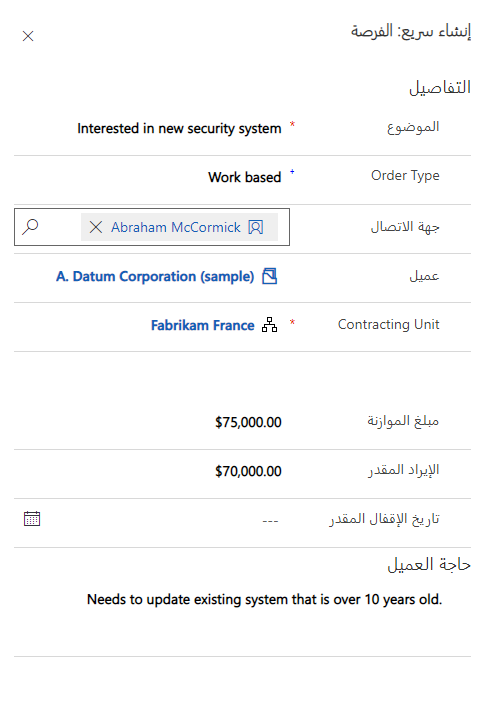
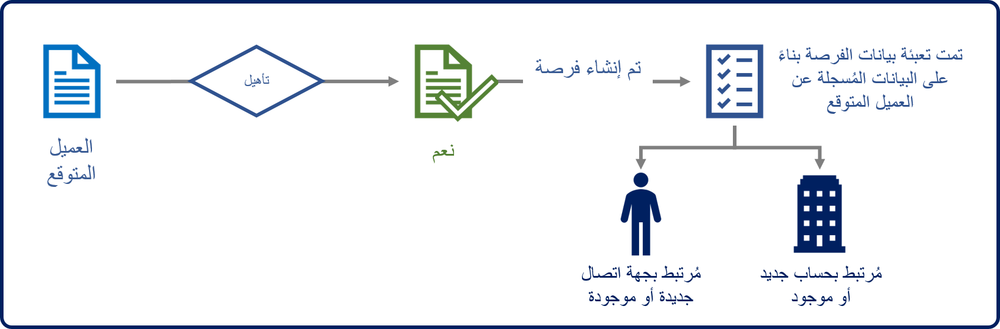
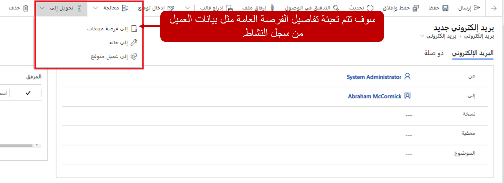
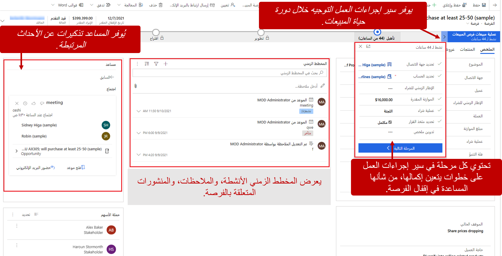
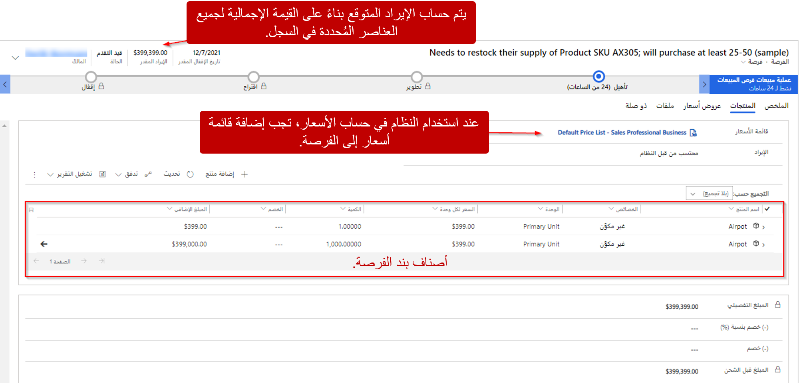

تتعدد طرق إنشاء المؤسسة لسجلات الفرصة. قد تأتي الفرصة من بريد إلكتروني أو مكالمة هاتفية تلقاها شخص ما في المؤسسة. قد يتم إنشاؤه كجزء من دورة مبيعات سنوية أو نصف سنوية حيث يتم تبديل أو ترقية الخدمات و / أو المعدات. ولكن الأكثر شيوعاً، يتم إنشاء الفرصة من خلال تأهيل عميل متوقع.

عندما يتم تأهيل عميل متوقع، يتم إنشاء سجل فرصة تلقائياً. تتم إضافة جميع المعلومات ذات الصلة التي تم التقاطها في العميل المتوقع تلقائياً إلى الفرصة. تتضمن هذه المعلومات العميل المحتمل والجدول الزمني ومبلغ الموازنة. تم إغلاق العميل المتوقع الأصلي، ولكن يمكن لموظفي المبيعات الوصول إليه في أي وقت عن طريق تحديد مرحلة **تأهيل** من سير إجراءات العمل (BPF).

## إنشاء الفرص يدوياً

يمكنك إنشاء فرص يدوياً في Microsoft Dynamics ‏365 باستخدام تطبيق مركز المبيعات. في تطبيق مركز المبيعات، افتح خريطة الموقع، ثم ضمن **المبيعات**، حدد **الفرص**. ثم قم بإنشاء فرصة عن طريق تحديد **جديد** في شريط الأوامر. يجب تحديد موضوع وعملة وعميل محتمل لكل فرصة يتم إنشاؤها. يمكنك تحديد العميل من خلال إقران الفرصة إما بسجل حساب أو سجل جهة اتصال.

عندما يتم إنشاء الفرص من العملاء المتوقعين المؤهلين، يتم إدخال الموضوع والعملة والعميل المحتمل تلقائياً.

### مربع حوار الإنشاء السريع

تجعل وظيفة الإنشاء السريع من السهل والسريع إدخال أي نوع من المعلومات تقريباً في النظام. يمكن الوصول إلى وظيفة الإنشاء السريع مباشرة من شريط التنقل. لذلك، فهو متاح دائماً متى احتجت إليه. ما عليك سوى تحديد الزر **جديد** لفتح مربع الحوار **إنشاء سريع**. 

على سبيل المثال، يمكنك تحديد جهة اتصال جديدة من المساهمون لفرصة تعمل حالياً على إغلاقها. بدلاً من الذهاب إلى قائمة جهات الاتصال لإنشاء سجل جهة اتصال، ثم العودة إلى الفرصة، يمكنك استخدام مربع الحوار **إنشاء سريع** لإضافة جهة الاتصال بينما لا تزال في صفحة الفرصة. بعد حصولك على مزيد من المعلومات حول جهة الاتصال، يمكنك العودة إلى سجل جهة الاتصال لملء التفاصيل الإضافية المناسبة.

## تحويل سجلات النشاط إلى فرص

هناك طريقة أخرى لإنشاء الفرص وهي تحويل أنشطة Dynamics 365 الحالية إلى فرص. على سبيل المثال، يتصل مسؤول تنفيذي بالحساب بالعملاء كل بضعة أشهر للتحقق من سير الأمور. عادةً ما يتم تسجيل هذه المكالمات في Dynamics 365 على أنها أنشطة مكالمات هاتفية. خلال مكالمة واحدة، ذكرت إحدى العميلات أنه يجب عليها طرح تطبيق برمجي جديد خلال الاثني عشر شهراً القادمة، وطلبت بعض معلومات التسعير. في هذه الحالة، يقوم المدير التنفيذي للحساب بتحويل المكالمة الهاتفية مباشرة إلى فرصة باستخدام الزر **تحويل إلى** في شريط الأوامر لنشاط المكالمة الهاتفية. يمكن أيضاً تحويل سجلات البريد الإلكتروني والمهمة ونشاط المواعيد إلى فرص بنفس الطريقة.

## تحديد تفاصيل الفرصة

عند إنشاء الفرص، من المهم أن تحدد أكبر قدر ممكن من المعلومات حول الوضع الحالي وما المطلوب للمضي قدماً. يمكن أن تساعد هذه المعلومات في تحديد عملية البيع التي يجب استخدامها، بناءً على نوع الفرصة وحجمها ومخططها الزمني. يمكن أن تساعد هذه المعلومات أيضاً في تحديد موارد المبيعات التي يجب تخصيصها للسجل لمنح مؤسستك أفضل فرصة للفوز بالصفقة.

فيما يلي وصف لبعض المعلومات الرئيسية التي يمكن تضمينها للحصول على فرصة.

<table>
<tbody>
<tr>
<td><strong>المساهمون</strong></td>
<td>جهات الاتصال في Dynamics 365 الذين لديهم مصلحة راسخة في الفرصة. يمكن أن يشمل المساهمون مديري المشروع وأعضاء مجلس الإدارة والمحامين والجهات الراعية.</td>
</tr>
<tr>
<td><strong>فريق المبيعات</strong></td>
<td>أعضاء الفريق الداخليون الذين سيشاركون في تحويل الفرصة إلى بيع.</td>
</tr>
<tr>
<td><strong>المنافسون</strong></td>
<td>أي منافسين خارجيين قد تتنافس معهم على الصفقة.</td>
</tr>
<tr>
<td><strong>معلومات التسعير</strong></td>
<td>قوائم الأسعار التي سيتم استخدامها وطريقة الحساب التي سيتم استخدامها لتقدير قيمة الفرصة.</td>
</tr>
<tr>
<td><strong>بند أصناف الفرصة</strong></td>
<td>المنتجات والخدمات المحددة التي يتم اقتراحها على العميل كجزء من الحل.</td>
</tr>
</tbody>
</table>

> [!div class="mx-imgBorder"]
> 

## المنافسون

معرفتك للمنافسة من حولك على فرصة ما يمكن أن يعني الفرق بين الفوز وفقدان تلك الفرصة. تساعد هذه المعرفة فرق المبيعات في وضع خدماتها ومنتجاتها بشكل أفضل في مواجهة المنافسين، وبالتالي تساعد في تحسين فرصهم في الفوز.

تستخدم تقارير Dynamics 365 سجلات المنافسين وتحدد من تتنافس معه أثناء عملية المبيعات أو من فقدت فرصة له. لذلك، يمكن أن توفر هذه التقارير لفرق المبيعات الكثير من المعلومات حول المنافسين الذين يحققون أداءً جيداً ضدهم وأي منهم غالباً ما يخسرون أمامهم. لكل منافس، يمكنك توثيق نقاط القوة والضعف لدى المنافسين وأي من منتجاتك يتنافسون ضدها. يمكنك أيضاً إضافة أدبيات المبيعات ذات الصلة، مثل المستندات المنافسة لتثقيف موظفيك أو المستندات الأخرى التي يمكن أن تساعد موظفي المبيعات على المنافسة بفعالية.

## التسعير ومعلومات المنتج

تتمثل إحدى المزايا الرئيسية لاستخدام Microsoft Dynamics ‏365 Sales لإدارة الفرص في إمكانية تحديد معلومات المنتج والتسعير في سجل الفرصة نفسه. نظراً لأن عروض الأسعار والأوامر والفواتير يمكنها سحب معلومات المنتج والتسعير مباشرة من الفرص، فإن التعريف على مستوى الفرصة يساعد في جعل التنبؤ أكثر دقة.

يمكن للمستخدم توفير معلومات الإيرادات أو احتسابها بواسطة النظام. اضبط عمود **الإيرادات** على إحدى القيم التالية:

- **يوفره المستخدم:** يُدخل المستخدم يدوياً الأرباح المقدرة من الفرصة (افتراضي).

    - لا يلزم إضافة قائمة أسعار Dynamics 365 إلى الفرصة.
    - لا يلزم إضافة العناصر الخاصة بالمنتجات الفردية إلى الفرصة.
    - كتالوج منتج Dynamics 365 غير مطلوب.

- **تم احتساب النظام:** يتم احتساب الإيرادات المقدرة من الفرصة تلقائياً استناداً إلى البنود الفردية التي تمت إضافتها إلى الفرصة.

    - يجب إضافة قائمة أسعار Dynamics 365 إلى الفرصة.
    - يمكن إضافة بند أصناف المنتجات إما من المنتجات الحالية في كتالوج منتجات Dynamics 365 أو كمنتجات مكتوبة. تتضمن عناصر خط الإنتاج المعلومات التالية:

        - **منتج موجود أو اكتب في المنتج:** أدخل اسم المنتج الذي تتم إضافته.

            - تستخدم المنتجات الحالية الاسم المتوفر في كتالوج المنتج.
            - يمكن تحديد اسم للمنتجات المكتوبة عند إضافتها.

        - **الوحدة::** أدخل الوحدة التي يجب بيع المنتج بها. تشمل الأمثلة كل، حزمة، وحالة.
        - **سعر الوحدة:** أدخل المبلغ التكلفة لكل وحدة يتم بيعها.
        - **الكمية:** أدخل عدد الوحدات المراد تضمينها.
        - **مبلغ الخصم اليدوي:** أدخل مبلغ أي خصومات يدوية ينبغي تطبيقها.
        - **الضريبة:** أدخل أي معلومات حول ضريبة المبيعات.

### المنتجات الحالية مقابل المنتجات المكتوبة

إذا قمت بتحديد خيار الإيرادات **النظام المحسوب** في سجل فرصة وتحديد قائمة أسعار، يمكنك إضافة عنصر سطر واحد أو أكثر إلى السجل. يمكن لـ Dynamics 365 تلقائياً حساب القيمة الإجمالية للبيع المحتمل.

بالنسبة لسجلات الفرصة، يُشار إلى عناصر السطر باسم *منتجات الفرصة*. بالنسبة لعروض الأسعار والأوامر وسجلات الفواتير، يُشار إلى البنود باسم *منتجات عروض الأسعار*، *منتجات الطلبات*، و *فوترة المنتجات*، على التوالي. عند إضافة بند أصناف، يجب تحديد عدة قيم، مثل سعر المنتج والكمية التي يتم شراؤها والخصومات والضرائب.

### استخدام المنتجات غير المدرجة

عند إضافة أصناف إلى الفرص أو عروض الأسعار أو الطلبات أو الفواتير، يمكنك تحديد المنتجات من قائمة الأسعار المحددة. يشار إلى هذه المنتجات باسم *المنتجات المدرجة*. بدلاً من ذلك، يمكنك إضافة منتجات غير مدرجة. المنتجات غير المدرجة مخصصة للحالات التي يجب فيها تضمين منتج أو خدمة غير موجودة حالياً في كتالوج المنتج.

فيما يلي مثالان يوضحان متى يمكنك استخدام المنتجات غير المدرجة:

- يجب عليك تضمين التكاليف أو رسوم متنوعة (على سبيل المثال، المصاريف المتعلقة بالسفر أو تكلفة الشحن) في عرض أسعار، بحيث يرى العميل قائمة شاملة بجميع البنود، حتى إذا لم يتم تضمين هذه الأنواع من العناصر في كتالوج المنتج.
- يجب إدخال بند الأصناف التي تحتوي على قيم سالبة لتعكس الأرصدة. لإدخال رصيد، أضف صنف غير مدرج، وأدخل رقماً سالباً في العمود **السعر لكل وحدة** ثم أدخل *1* في العمود **الكمية**.

## إنشاء الفرص

> [!VIDEO https://www.microsoft.com/videoplayer/embed/RE2NFzt]
