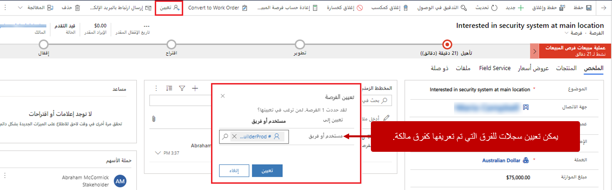
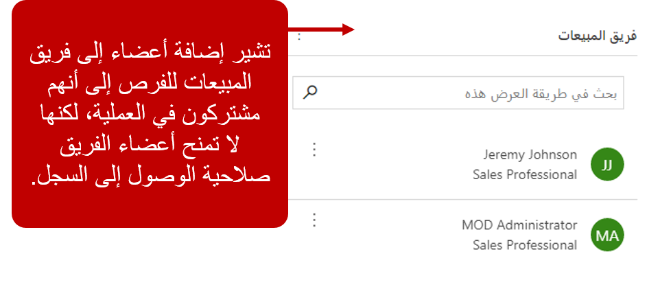
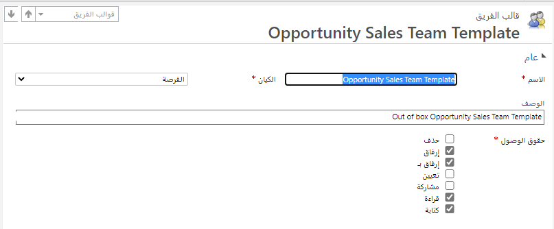
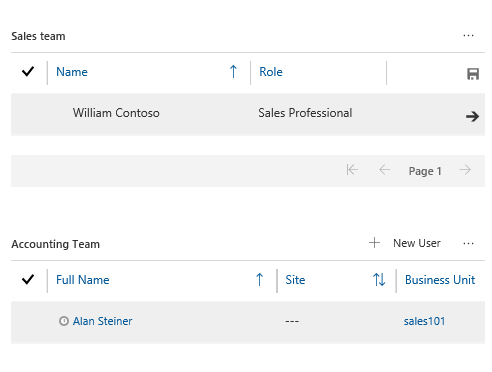

لكل سجل تم التفاعل معه في ‪Microsoft Dynamics 365‬ مالك مسؤول عنه. على سبيل المثال، لكل من الحسابات وجهات الاتصال والعملاء المتوقعين مالكون. وعادةً ما يكون هذا المالك مستخدماً واحداً. لكن في مؤسسات الشركات الكبيرة، قد تكون الحسابات مملوكة من جانب فريق من المستخدمين بدلاً من ذلك.

على الرغم من أن المالك الأساسي للحسابات وجهات الاتصال يمكن أن يكون مستخدماً فردياً أو فريقاً من المستخدمين، فنادراً ما ترتبط عملية البيع الفعلية لأحد العملاء بشخص واحد فقط. عادةً ما تكون المبيعات نتيجةً لجهد فريق كامل.

على سبيل المثال، تصنّف إحدى المؤسسات أي فرصة تنطوي على إيراد مقدّر بأكثر من \$250,000 دولار أمريكي كفرصة ذات أولوية عالية. يتم تعيين الفرص ذات الأولوية العالية للفريق المعني بالتحفيز، الذي يتألف من خمسة أشخاص يعملون معاً للفوز بهذه الفرص. لكن قد يتم إشراك أشخاص آخرين في مراحل مختلفة لمساعدة الفريق المعني بالتحفيز. إليك بعض الأمثلة:

- يساعد خبراء المبيعات الفنيين في تعريف نطاق المشروع.
- ويساعد أعضاء فريق المبيعات الداخليين في الميزات المرتبطة بالتسعير.
- يصمم فريق التصميم منتجات معيّنة أو عناصر أخرى مستخدمة في الصفقات.
- تساعد الفرق القانونية في ضمان دقة وصحة صياغة العقود.

على الرغم من إمكانية تحديد المؤسسة بسهولة للأشخاص الخمسة الذين يتألف منهم الفريق المعني بالتحفيز، إلا أن تحديد أعضاء الفريق الفني وفريق التصميم والفريق القانوني المطلوبين قد يكون أكثر صعوبة بسبب إمكانية اختلافهم اعتماداً على حجم الفرصة ومخططها الزمني ونطاقها.

يوفّر ‪Microsoft Dynamics 365 Sales‬ خيارات متعددة لدعم الفرق ومبيعات الفرق.

## فِرق المالك

يمكن أن تخضع السجلات في Dynamics 365 لملكية مستخدم فردي أو مجموعة من المستخدمين يُعرفون على أنهم *فريق*. عادةً ما يتم تعيين الفِرق على أنها مالكة السجل عند ضرورة عمل مستخدمين متعددين ومعرّفين مسبقاً على السجل معاً. إحدى ميزات تعيين سجل إلى أحد الفِرق هو أن جميع أعضاء الفريق يشاهدون السجل في طريقة عرض **‏‫الفرصة‬ المفتوحة الخاصة بي‬**، تماماً لو أنه تم تعيين السجل إليهم بشكل فردي. من المميزات الأخرى هو إمكانية إزالة أي مستخدم من الفريق إذا لم يعُد جزءاً منه. ستظل أي سجلات معيّنة للفريق متاحة للمجموعة المتبقية من أعضاء الفريق.

قبل أن تتوفّر ملكية السجلات لأي فريق، يجب تعريف الفريق وعضويته في Dynamics 365. لتعريف فريق، انتقل إلى **إعدادات** > **الأمان** > **الفرق**. يجب أن يكون الفريق الذي تنشئه فريقاً مالكاً. حدد **المالك** على أنه نوع الفريق، وأضِف أعضاءً.

بعد تعريف فريق وعضويته، يمكنك تعيين سجلات إلى الفريق. حدد الزر **تعيين** في شريط الأوامر، ثم في مربع الحوار الذي يظهر، حدد الفريق. تُعد السيناريوهات التي لا تتغيّر فيها عضوية الفريق كثيراً جداً هي أفضل استخدام لفِرق المالك.

> [!NOTE]
> يجب أن يتم تعيين دور أمان واحد على الأقل إلى أي مستخدمين أو فِرق تملك سجلات لتعريف أذونات الأمان في التطبيق.

لمزيد من المعلومات عن فِرق المالك، يُرجى الاطّلاع على [لمحة عن فِرق المالك](/dynamics365/customer-engagement/admin/manage-teams?azure-portal=true#about-owner-teams).

لمزيد من المعلومات حول تعريف أدوار الأمان، اطّلع على [أدوار الأمان والامتيازات](/dynamics365/customer-engagement/admin/security-roles-privileges?azure-portal=true).

### استخدام الاتصالات لتحديد فِرق المبيعات

في بعض الأحيان، ليس على الأشخاص الذي يساعدون في عملية المبيعات امتلاك السجلات بأنفسهم أو أن يصبحوا جزءاً من الفريق الذي يملك السجلات. يجب فقط أن يقترنوا بالسجل كجزء من الفريق. يمكنك إقران المستخدمين بسجلات من خلال استخدام *الاتصالات*. على سبيل المثال، بشكل افتراضي، يتيح لك جدول الفرص ربط سجل الفرصة بمستخدمين. بهذه الطريقة، يمكنك تحديد فريق المبيعات.

تتميّز الاتصالات في Dynamics 365 بأنها مرنة للغاية ومفيدة في العديد من السيناريوهات. وتتيح لك ربط المستخدمين بالفرص وتحديد دور المستخدمين في ما يتعلق بالفرصة. على الرغم من أن الاتصالات مفيدة لتحديد أعضاء الفِرق، فهي لا تشمل مفاهيم الأمان مثل ملكية السجل أو امتيازات الوصول. وبالتالي، فأنت لا تمنح المستخدمين حق الوصول إلى سجل بإضافتهم إلى فريق المبيعات فقط.

إذا كان المستخدمون، مثل العملاء الهامين للمبيعات الفنيين أو المديرين الإقليميين أو مصممي المنتجات يتطلبون حق الوصول إلى سجل، يجب مشاركة السجل معهم. يمكن أن تمثل مشاركة السجلات مع مستخدمين فرديين صعوبة في الإدارة والعرض. ويمكن أن تتسبب في مشاكل في الأداء بمرور الوقت. في هذه الحالات، تلعب *فرق الوصول* دوراً مهماً.

توفر فِرق الوصول طريقة سهلة لمشاركة كائنات الأعمال والتعاون مع أشخاص آخرين عبر وحدات الأعمال.

يشمل Dynamics 365 Sales قالباً لفرق مبيعات الفرص يوفر امتيازات *القراءة* و *الكتابة* و *الإلحاق* و *‏‫الإلحاق بـ‬*.

عند إضافة مستخدم إلى فريق مبيعات الفرص باستخدام الاتصالات، يضيف التطبيق تلقائياً هذا المستخدم إلى فريق الوصول للفرصة. لذلك، يتم منح المستخدم حقوق الوصول لهذه الفرصة فقط. في حالة إزالة الاتصال، تتم إزالة المستخدم من فريق الوصول، ويتم إبطال حقوقه في الوصول إلى الفرصة.

## فِرق الوصول المخصصة

لا تملك فِرق الوصول السجلات، ولا يتم تعيين أدوار أمان إليها. فهي تمنح المستخدمين المرونة لإنشاء أمان مخصص لسجل معيّن حسب الحاجة. يمكنك إنشاء فريق وصول يدوياً عن طريق تحديد نوع الفريق على أنه *الوصول*. بدلاً من ذلك، يمكنك استخدام قوالب الفِرق للسماح للنظام بإنشاء فريق الوصول وإدارته لك.

تعتبر فرق الوصول اليدوية مفيدة في السيناريوهات التي تتطلب مشاركة السجلات مرات قليلة مع مجموعة من المستخدمين بدور معيّن. على سبيل المثال، يمكنك تعريف فريق الوصول باسم *المدققون* ثم مشاركة سجل الحساب الذي لا يكون متاحاً بخلاف ذلك مع هذا الفريق. بهذه الطريقة، يمكنك منح أعضاء الفريق أذونات وصول محددة للحساب خلال عملية التدقيق.

يتم إنشاء فريق وصول مُدار بواسطة النظام (أو مستند إلى قالب) تلقائياً لسجل معيّن، ولا يمكن مشاركة السجلات الأخرى مع هذا الفريق. عليك توفير قالب فريق ليستخدمه النظام لإنشاء فريق. في هذا القالب، تحدد نوع الجدول وحقوق الوصول التي سيتمتع بها أعضاء الفريق لهذا السجل عند إنشاء الفريق.

في ما يلي الخطوات اللازمة لإنشاء فرق الوصول المستندة إلى قالب:

1. **إتاحة وظيفة فريق الوصول للجدول:** في Dynamics 365 Sales، يمكن استخدام فرق الوصول فقط مع جدول الفرص بشكل افتراضي.
2. **إنشاء قالب للفريق:** يتم تعريف حقوق الوصول في قالب الفريق. ومن الأمثلة على ذلك هو قالب فريق مبيعات الفرص المعرّف مسبقاً.
3. **إضافة شبكة فرعية للمستخدم إلى صفحة الجدول لإدارة عضوية فريق الوصول:** بهذه الطريقة، يمكن إدارة الفريق يدوياً لكل سجل.

إذا كانت المجموعات المختلفة من المستخدمين تتطلب حقوق وصول مختلفة، فجرّب إنشاء قوالب متعددة لفريق الوصول لهذا الجدول. على سبيل المثال، إذا كان من الضروري أن يحصل المستخدمون من إدارة حسابات المدفوعات على حق الوصول للقراءة فقط لبعض أنواع الفرص، لأغراض التقييم المالي، فجرّب إنشاء قالب لفريق محاسبة الفرص يمنح امتيازات *القراءة* فقط للفرصة.

لمزيد من المعلومات حول إنشاء قوالب الفرق، اطّلع على [لمحة عن قوالب التعاون مع الفريق](/dynamics365/customer-engagement/admin/about-team-templates?azure-portal=true).

لمزيد من المعلومات حول تعريف حقوق الوصول، اطّلع على [إنشاء قالب للفريق للتحكم في حقوق الوصول للفرق التي يتم إنشاؤها تلقائياً](/dynamics365/customer-engagement/admin/create-team-template-add-table-form?azure-portal=true).
