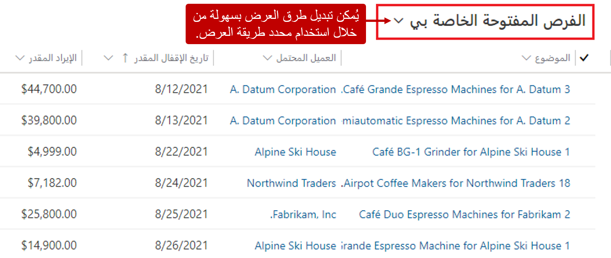
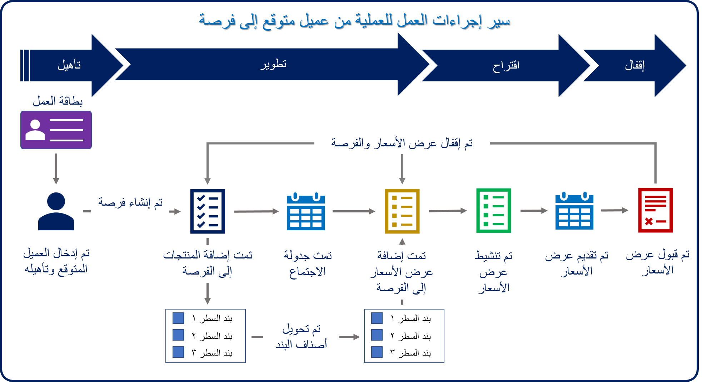
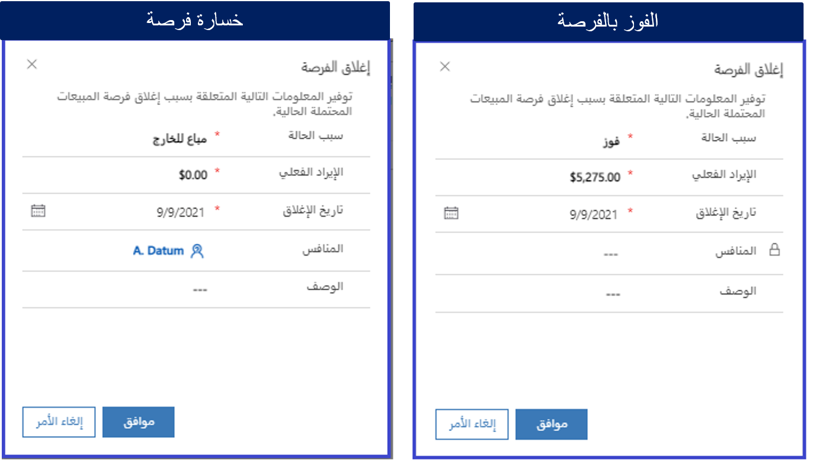

من المهم أن يتوفر لدى موظفي المبيعات جميع المعلومات الضرورية تحت تصرفهم. وغالباً ما تعني هذه المعلومات الفرق بين التعامل مع العميل وعدم التعامل معه. على سبيل المثال، إذا تمت جدولة فرصة لإقفالها هذا الأسبوع، فمن المحتمل أنك ترغب في الاتصال بالعميل في أقرب وقت ممكن، للتأكد من استمرارية تحكمك فيها.

Microsoft Dynamics 365 for Sales يوفر العديد من الأدوات التي تساعد موظفي المبيعات للحصول على البيانات التي يحتاجون إليها. وهذه الأدوات تتضمن لوحات المعلومات. عند فتح تطبيق مركز المبيعات للمرة الأولى، يتم عرض لوحة معلومات **نشاط المبيعات**. ومن ثمَّ، يمكن لموظفي المبيعات عرض مسار المبيعات الحالي والتعامل مع العملاء المتوقعين المفتوحين والانتباه إلى المعلومات المهمة بالنسبة لهم.

ومن الميزات التي تنبه المستخدمين بالمعلومات المهمة هي "مساعد العلاقة". يوفر "مساعد العلاقة" رسائل تذكير بأشياء مثل الاجتماعات المقبلة أو الفرص التي تمت جدولتها لإقفالها قريباً. ويمكن للمستخدمين فتح السجلات المرتبطة مباشرة من لوحات المعلومات والتفاعل معها حسب الحاجة.

## طرق عرض Dynamics 365

Microsoft Dynamics 365يوفر طرق عرض متعددة لبيانات الفرصة. تتم تصفية كل طريقة عرض مسبقاً لإظهار الفرص بطريقة مختلفة. وتعتبر طرق العرض أداة أخرى، بالإضافة إلى لوحات المعلومات، للتفاعل مع الفرص.

ويمكنك استخدام طرق العرض هذه عند تحديد سجل الفرص في تطبيق مركز المبيعات. بشكلٍ افتراضي، يمكنك رؤية الفرص التي تم تعيينها إليك. لكن يمكنك تحديد طرق عرض مختلفة لعرض مجموعات مختلفة من الفرص.

فيما يأتي بعض طرق العرض المتعلقة بالفرصة التي يتضمنها Microsoft Dynamics 365:

- **فرصي المفتوحة:** جميع الفرص المفتوحة التي تم تعيينها إلى المستخدم الذي قام بتسجيل الدخول.
- **فرص مُقفلة:** جميع الفرص التي تم إقفالها. يتم تضمين كل من الفرص الرابحة والخاسرة.
- **فرص خاسرة:** جميع الفرص المُقفلة التي تم تحديدها على أنها خاسرة.
- **فرص حديثة:** جميع الفرص التي تم إنشاؤها حديثاً.
- **فرص الرابحة:** جميع الفرص المُقفلة التي تم تحديدها على أنها رابحة.

قد يستخدم المديرون التنفيذيون للحسابات طريقة عرض **فرصي المفتوحة** للاطلاع فقط على الفرص التم تم تعيينها إليهم أو الفريق الذي هم أعضاء فيه. بعد العثور على الفرص التي يريدون التعامل معها، يمكنهم فتحها مباشرة من طريقة العرض.

> [!div class="mx-imgBorder"]
> 

## التعامل مع سجلات الفرص الفردية

يشتمل كل سجل فرصة على مجموعة متنوعة من المعلومات ذات الصلة التي يمكن أن تكون مفيدة عندما تكون الفرصة قيد العمل. ويتم تقسيم هذه المعلومات بين عدة أقسام. فيما يأتي وصف لبعض الأقسام الرئيسية وأنواع المعلومات التي تتضمن:

- **مخطط زمني:** هذا الجزء يعرض أنشطة الفرص ذات الصلة. تظهر جميع الأنشطة بترتيب زمني. قد تتضمن الأنشطة المكالمات الهاتفية التي تم إنشاؤها أو استلامها أو المواعيد الخاصة بالعميل المرتبطة بالفرصة أو عمليات النشر الداخلية التي قام الزملاء بإجرائها حول السجل أو الملاحظات التي تمت إضافتها حول السجل.

    على سبيل المثال، قد يسرد المخطط الزمني جميع المواعيد التي قام بها المدير التنفيذي للحساب مع العميل. ومن ثمَّ، يمكن للمدير التنفيذي للحساب فتح كل موعد لتجميع معلومات إضافية من هذا الاجتماع.

- **مساعد العلاقة:** هذا الجزء يوفر رسائل تذكير أو إخطارات خاصة بالأصناف المرتبطة بالفرصة.

    على سبيل المثال، قد يقوم مساعد العلاقة بتنبيهك بأنه قد تم تعيين الفرصة لإقفالها هذا الأسبوع. وقد يقوم أيضاً بتذكيرك بموعد مقبل يتعلق بالفرصة. يمكن عرض تفاصيل الموعد من خلال فتح السجل مباشرة من الفرصة.

- **حملة الأسهم:** هذه الشبكة تحدد الأشخاص الذين ربما يكون لديهم اهتمام راسخ أو يتم إشراكهم في عملية اتخاذ القرار. في العادة، يكون حملة الأسهم سجلات جهات الاتصال التي تتم الإشارة إليها في السجل.

    على سبيل المثال، قد يكون حامل الأسهم محامياً تستخدمه المؤسسة أو قائد مشروع أو أعضاء مجلس إدارة يشاركون في عملية اتخاذ القرار.

- **منافسون:** هذه الشبكة تحدد أي موردين آخرين قد تتنافس معهم مؤسستك على أعمال العميل.
- **أصناف بنود خاصة بالمنتج:** هذه الشبكة تحدد المنتجات والخدمات وتفاصيل قائمة الأسعار للصنف المضمن في الفرصة.
- **سير إجراءات العمل:** حالات سير إجراءات العمل (BPFs) تمثل إجراءات العمل الموجهة التي تقود المديرين التنفيذيين للحسابات خلال دورة حياة المبيعات بأكملها.

بناءً على نوع الفرصة أو إجراءات الشركة، قد تتضمن الفرصة إجراءات عمل متعددة يمكن التبديل إليها، وذلك بناء على تفاصيل معينة في سجل الفرصة. ويمكن أن تتضمن هذه التفاصيل حجم الفرصة أو المنتج المرفق أو ‏‫الإطار الزمني للشراء‬.

## التعامل مع الأنشطة

بشكلٍ عام، بطريقة أو بأخرى، يتم تنفيذ معظم الأعمال المطلوبة لإقفال الفرصة خلال التفاعلات مع العميل. ويتم تسجيل هذا العمل في Dynamics 365 كأنشطة. يمكن إضافة أنشطة إلى فرصة قبل الانتهاء منها، وذلك لتعقب الإجراءات التي يجب اتخاذها. يمكنك إضافة أنواع أنشطة معينة مثل المكالمات الهاتفية أو رسائل البريد الإلكتروني أو المواعيد أو يمكنك استخدام نشاط المهمة لتعقب الأنشطة العامة التي يجب تنفيذها.

على سبيل المثال، للاتصال بجهة اتصال خاصة بالفرصة، قم بإنشاء نشاط ولاحظ الإجراء الذي يجب أن تتضمنه المكالمة الهاتفية. بعد الانتهاء من المكالمة الهاتفية، ضع علامة على النشاط تفيد بأنه مكتمل. يتم وضع علامة على بعض الأنشطة، مثل البريد الإلكتروني، تلقائياً تفيد بأنها مكتملة عند إرسالها من Dynamics 365. بعد انتهاء نشاط، يصبح جزءاً من السجل الخاص بالفرصة. يمكنك عرض الأنشطة المختلفة التي تم تنفيذها لفرصة. يمكنك أيضاً عرضها عبر أطر زمنية مختلفة، مثل الأسبوع الماضي أو آخر 90 يوماً.

## عمليات سير إجراءات العمل

أحد المزايا العديدة في عمليات سير إجراءات العمل (BPFs) في Dynamics 365 هي أنه يمكن تمتد إلى جداول متعددة. وهذه القدرة مهمة لأن دورة حياة مبيعات المؤسسة غالبا ما تمتد إلى جداول أعمال متعددة. تسمح BPFs للمؤسسة باستيعاب العديد من نماذج المبيعات والنُّهج المختلفة.

على سبيل المثال، بطريقة مبتكرة، يتضمن Dynamics 365 Sales عمليتان من عمليات سير إجراءات العمل تركزان على المبيعات:
 
- **عمليات مبيعات من عميل متوقع إلى فرصة** يستخدم سير إجراءات العمل هذا عند بدء عملية مبيعات من مؤسسة مع عميل متوقع. وبعد تأهيل العميل المتوقع، يتم إنشاء فرصة.
- **عملية مبيعات الفرصة:** يتم استخدام سير إجراءات العمل هذا عند عدم بدء عملية مبيعات المؤسسة مع عميل متوقع لكن تبدأ مباشرة مع فرصة.

تتبع عمليات سير إجراءات العمل هذه نمطاً مشتركاً من أربع مراحل. تتشابه المرحلة الأولى في كلتا العمليتين، ولكن تختلف نقطة البداية (جدول). وتعد المراحل المتبقية متماثلة.

<table>
<thead>
<tr>
<th>المرحلة</th>
<th>الجدول</th>
<th>الوصف</th>
</tr>
</thead>
<tbody>
<tr>
<td>تأهيل‬</td>
<td>عميل متوقع (سير إجراءات عمل لعملية مبيعات من عميل متوقع إلى فرصة)</td>
<td>إذا لم يكن العميل المتوقع بالفعل في تطبيقات Dynamics 365 Customer Engagement، فيجب عليك أولاً إنشاء العميل المتوقع في النظام.

بعد أن تحدد أن العميل المحتمل يهتم بالحل أو المنتج الذي تقدمه ويتمتع بالقوة الشرائية المناسبة، يمكنك تأهيل العميل المتوقع. عند تأهيل عميل متوقع، يتم تحويله إلى فرصة.

</td>
</tr>
<tr>
<td>تأهيل‬</td>
<td>فرصة (سير إجراءات عمل عملية مبيعات الفرصة)</td>
<td>عندما تبدأ من فرصة، يجب عليك تحديد الحساب المستهدف وجهة الاتصال. بعد ذلك، يمكنك تأهيل الفرصة من خلال جمع مزيد من المعلومات.</td>
</tr>
<tr>
<td>تطوير</td>
<td>الفرصة</td>
<td>خلال هذه المرحلة، يمكنك تحديد حملة الأسهم والمنافسين وأعضاء فريق المبيعات والحصول على حل مقترح.</td>
</tr>
<tr>
<td>اقتراح</td>
<td>الفرصة</td>
<td>أثناء هذه المرحلة، تقوم بتطوير المقترح وتقديمه للعميل المحتمل.</td>
</tr>
<tr>
<td>إقفال</td>
<td>الفرصة</td>
<td>خلال هذه المرحلة، يجب العمل مع العميل للتوصل إلى قرار ضمن الإطار الزمني المحدد وإقفال الفرص على أنها إما رابحة أو خاسرة.</td>
</tr>
</tbody>
</table>

هذه المراحل توفر مؤشراً مرئياً يخبر الموظفين بمقدار تقدمهم في إجراءات العمل. تحتوي كل مرحلة في سير إجراءات العمل على خطوات يجب إكمالها قبل اكتمال المرحلة.

تبدأ عمليات سير إجراءات العمل تلقائياً عند إنشاء السجلات، وذلك في حالة توفر سير إجراءات عمل مناسب للمستخدم الذي يقوم بإنشاء السجل. في حالة توفر العديد من عمليات سير إجراءات العمل، يعتمد سير إجراءات العمل الذي يبدأ بناءً على ترتيب العمليات وأدوار المستخدمين، كما هو محدد حسب عمليات التخصيص.

لنلقِ النظر على كيفية استخدام مجموعة كافة الميزات التي قمنا بذكرها لإقفال فرصة.

تم تقديم توم، المدير التنفيذي للحساب، إلى عميل متوقع في أحد العروض التجارية. وقام توم والعميل المتوقع بتبادل بطاقات الأعمال وقام توم بإدخال العميل المتوقع في Dynamics 365.

1. **تأهيل:** يقوم توم بتأهيل العميل المتوقع كعميل قابل للاستمرار في استمارة التقديم.
2. **تطوير:** يتم تلقائياً تقديم السجل إلى مرحلة **التطوير** عند تحويل العميل المتوقع إلى فرصة.

    1. قام توم بإدخال معلومات إضافية مطلوبة للفرصة، مثل تاريخ الإقفال المقدر واحتياجات العميل ومعلومات الموازنة.
    2. تمت إضافة حملة الأسهم. حملة الأسهم يمثلون أعضاء فريق المشروع وأعضاء اللجنة الاستشارية والمستشار القانوني وما إلى ذلك.
    3. تمت إضافة المنافسين. والمنافسون هم المؤسسات الأخرى التي تنافس مؤسستك على الفرصة.
    4. يتم تحديد معلومات المنتج والتسعير.

        - ويتم تعيين الفرصة لاستخدام التسعير المحسوب بواسطة النظام، ويتم تحديد قائمة أسعار البيع بالتجزئة.
        - ويتم تضمين كل صنف بند، وكذلك يتم تحديد معلومات التسعير.

    5. تم تحديد موعد اجتماع مع العميل بعد أسبوع من اليوم.
    6. يعمل "مساعد العلاقة" على تذكير توم بالموعد.
    7. وفي أثناء الاجتماع، طلب العميل عرضاً رسمياً للحل.
    8. وقدَّم توم الفرصة إلى مرحلة **مقترح**.

3. **مقترح:** يتم إنشاء عرض أسعار رسمي وتسليمه إلى العميل.

    1. ويتم تحديد موارد المبيعات الداخلية التي ستكون ضرورية للفرصة.
    2. تمت إضافة أعضاء فريق المبيعات.
    3. اختياري: يمكن استخدام فرق الوصول لتوفير الوصول إلى السجل لأعضاء الفريق المحددين.
    4. تمت إضافة عرض أسعار إلى الفرصة. ويتضمن كافة المنتجات التي تم تحديدها للفرصة.
    5. وتم تحديد موعد اجتماع مع العميل بحيث يمكن تقديم عرض الأسعار بشكلٍ رسمي.
    6. وقام الفريق بتحضير عرض تقديمي نهائي مرفق بالفرصة.
    7. اختياري: يمكن استخدام التكامل مع Microsoft SharePoint أو Microsoft OneDrive for Business لتخزين المستندات ذات الصلة.
    8. تم تنشيط عرض الأسعار، وتم تقديمه إلى العميل أثناء الاجتماع.
    9. وتم تحديث ملاحظات حول الاجتماع.
    10. ووافق العميل على عرض الأسعار.
    11. وقدَّم توم الفرصة إلى مرحلة **إقفال**.

4. **إقفال** تم إكمال المهام المطلوبة لإقفال الفرصة.

    1. وتم تسليم العرض النهائي إلى العميل وتم توقيعه.
    2. وقد تم إقفال عرض الأسعار وتحويله إلى أمر.
    3. تم إقفال الفرصة.

## إدارة الفرص

> [!VIDEO https://www.microsoft.com/videoplayer/embed/RE2NIb0]

## إقفال الفرص

يمكن إقفال الفرص بطرق متعددة. على سبيل المثال، يمكن إقفال الفرصة عند إقفال عرض أسعار مرتبط بها أو عند إنشاء أمر من عرض أسعار. يُطالَب المستخدم الذي يقوم بإنشاء الأمر بإقفال الفرصة أيضاً. 

ولكن يتم إقفال الفرص يدوياً في الغالب. لإقفال فرصة، حدد إما **مُقفلة كخاسرة** أو **مُقفلة كرابحة** في شريط الأوامر في سجل الفرصة.

إذا كانت الفرصة إما رابحة أو خاسرة، فيتم إنشاء نوع خاص من النشاط. يشار إلى هذا النشاط بأنه *نشاط الدقة*. وهو يساعد مستخدمين آخرين غير تابعين للمبيعات على رؤية أنواع الأنشطة التي حدثت فيما يتعلق بالعميل، وذلك بالإضافة إلى أنشطة مثل المكالمات الهاتفية ورسائل البريد الإلكتروني والمواعيد.

ويمكن للمستخدمين فتح الأنشطة وعرض معلومات حول وقت حدوث النشاط وقيمة المبيعات الفعلية. في حالة خسارة الفرصة، يمكن للمستخدمين أيضاً معرفة السبب المحتمل لخسارتها أو المنافس الذي خسرها.

## تحديد أصناف بنود الفرصة

> [!VIDEO https://www.microsoft.com/videoplayer/embed/RE2NIb7]
