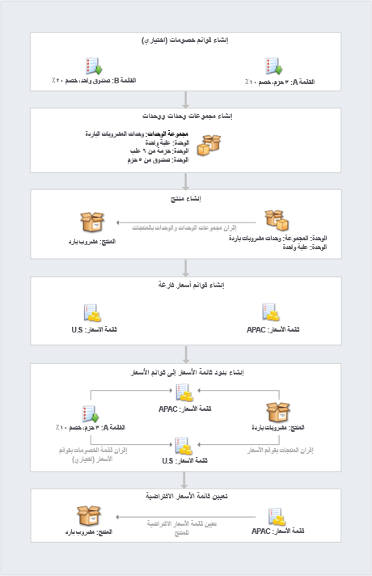

كتالوج المنتجات هو مجموعة من المنتجات والخدمات التي تبيعها المؤسسة وتوفرها للعملاء. وهي تتضمن معلومات التسعير. لا يتضمن كتالوج المنتجات النموذجي قائمة بالمنتجات التي تبيعها المؤسسة فحسب، بل يحدد أيضًا خيارات تسعير مختلفة، مثل البيع بالتجزئة والجملة ومستويات الكمية المتعلقة بكيفية بيع المنتج.

Microsoft Dynamics 365يتضمن كتالوج منتجات يمكن المؤسسات من إنشاء نظام تصنيف منتجات غني يوفر الدعم للإجراءات الآتية:

- تحديد بنية هرمية لمجموعات المنتجات والمنتجات التي تشمل خصائص (سمات) قابلة للتكوين. تساعدك هذه السمات على تقليل عدد وحدات حفظ المخزون (SKU) الخاصة بالمنتجات المطلوبة للحفاظ على كتالوج المنتجات.
- بيع المنتجات الفردية أو تجميعها في حِزم ومجموعات. الحزمة أو المجموعة هي تشكيلة من المنتجات التي تباع على أنها وحدة واحدة. حَزم المنتجات يعد مفيدًا في تجميع المنتجات بطريقة يستفيد بها العملاء من مجموعة كاملة من المنتجات. كما تتيح لك إمكانية تقديم خصومات في المنتجات المجمعة.
- تحديد المنتجات ذات الصلة في النظام. (على سبيل المثال، قد تكون هذه المنتجات ذات الصلة منتجات بديلة أو مكملة أو إضافية أو منتجات ملحقة.) ويتم عرض المنتجات المرتبطة بأحد المنتجات لمندوبي المبيعات كاقتراحات عند إضافتهم المنتج إلى فرصة أو عرض أسعار أو أمر أو فاتورة.
- تحديد نماذج تسعير وخصم متعددة. يمكنك كذلك استخدام التسعير المخصص بدلاً من تسعير نظام Dynamics 365 لحساب الأسعار عند ربط منتج أو حزمة بفرصة أو عرض أسعار أو أمر أو فاتورة. بالإضافة إلى ذلك، يمكنك تحديد ما إذا كان سيتم تطبيق الخصومات على المنتجات في مستوى كل وحدة أم على مستوى البنود.
- حدد ما إذا كان يجب تعيين مستوى السعر (أي ، قائمة الأسعار) تلقائياً لفرصة أو عرض أسعار أو أمر أو فاتورة استنادًا إلى علاقة القطاع الجغرافي للمبيعات.
- حدد القيم المترجمة لبعض خصائص (سمات) المنتج لتوفير أسماء المنتجات والأوصاف باللغات المفضلة للمستخدم.

## مكونات كتالوج المنتجات

يتكون كتالوج منتجات Dynamics 365 من أربعة مكونات:

- **مجموعات الوحدات:** مجموعة الوحدات تحدد كيفية تعبئة المنتج للبيع. ومن بين القيم الأخرى، تحدد وحدات القياس التي يباع بها المنتج أو الخدمة.على سبيل المثال، المؤسسة التي تبيع أجهزة ألعاب يمكنها بيعها بشكل فردي في حِزمة واحدة قد تتضمن 12 جهاز ألعاب فردي. المؤسسة التي تقدم خدمات إلى العملاء يمكن أن تبيع خدماتها بزيادات للساعة أو الأيام أو الأسبوع.
- **المنتجات:** المنتج يمثل نوع المنتج الذي قد تحتفظ به الشركة في المخزون أو المنتج المصمم بشكل مخصص أو الخدمة المقدمة إلى عميل. على سبيل المثال، قد تشتمل قائمة منتجات صالون تجميل على منتجات تصفيف شعر مختلفة وكذلك خدمات مثل قص الشعر وتلوينه وخدمات المنتجعات الصحية.
- **قوائم الأسعار:** قائمة الأسعار هي مجموعة أسعار تفرض على المنتجات في ظل ظروف معينة. على سبيل المثال، قد يكون لدى المؤسسة قوائم أسعار متعددة لاستيعاب الاختلافات الموسمية أو المناسبات الخاصة أو الأسواق المختلفة التي تبيع فيها (مثل القطاع الحكومي والتجاري والتعليمي).
- **قوائم الخصومات:** قائمة الخصومات تسمح للمؤسسات بعرض المنتجات أو الخدمات بأسعار مختلفة وفقًا للكمية التي يتم شراؤها. على سبيل المثال، المورد الصغير الذي يشتري خمسة أجهزة تلفزيون تلفزيونات لبيعها في متجره يدفع 350.00 دولار أمريكي مقابل كل تلفزيون، في حين أن المورد الكبير الذي يشتري 500 جهاز تلفزيون لبيعها في مواقع متعددة يمكن أن يدفع 300.00 دولار أمريكي مقابل كل تلفزيون.

> [!NOTE]
> ومن كافة المكونات الموجودة في القائمة السابقة، فقط قوائم الخصومات التي لا يلزم توفيرها. ويجب إعداد كافة المكونات الأخرى لأي مؤسسة ستستخدم كتالوج المنتجات.

وبسبب الطريقة التي يتم بها ربط الوحدات والخصومات والأسعار، من المهم أن تقوم بإعداد مكونات كتالوج المنتجات بالترتيب الآتي.

