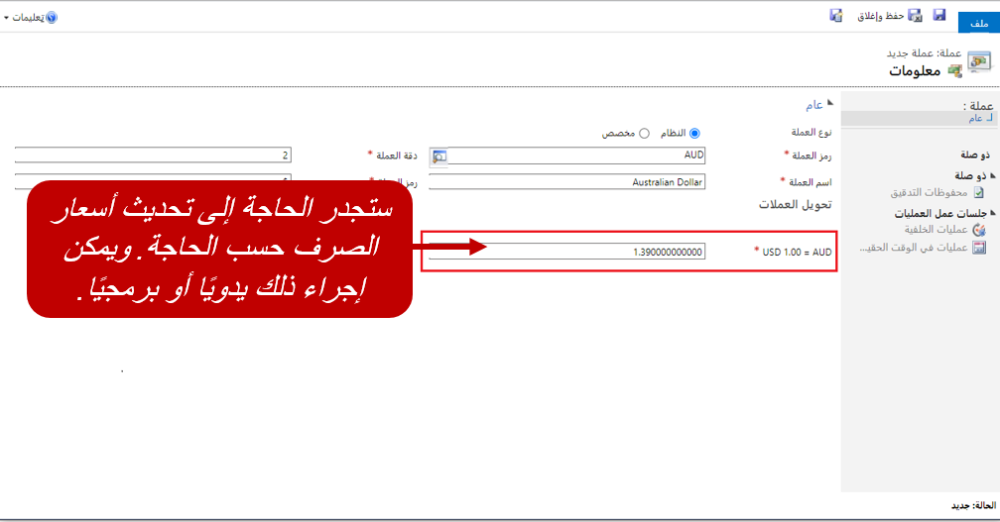
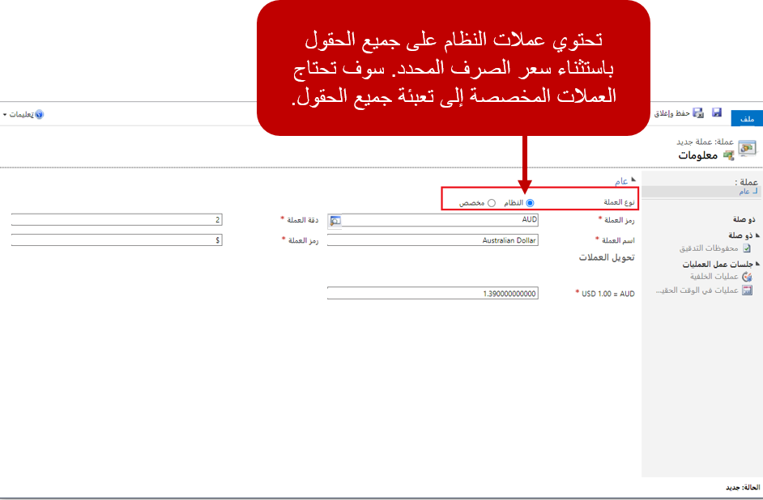

غالبًا ما تحتاج المؤسسات التي تمارس نشاطًا تجاريًا في بلدان / مناطق متعددة إلى استخدام عملات متعددة. يدعم Microsoft Dynamics365 استخدام عملات متعددة في المؤسسة وبواسطة مستخدمين فرديين. لذلك، يستطيع المستخدمون إجراء حركات مالية مثل الفرص وعروض الأسعار والأوامر والفواتير بعملات متعددة.

تساعد المكونات الثلاثة على دعم حل Dynamics 365 متعدد العملات:

- **عملة أساسية-** العملة الأساسية هي العملة التي يتم تسعير العملات الأخرى بها.

- **عملة الحركة-** عملة الحركة هي العملة المستخدمة في حركة محددة.

- **أسعار الصرف-** سعر الصرف يمثل عدد وحدات عملة الحركة التي تساوي وحدة واحدة من العملة الأساسية.

على سبيل المثال، المؤسسة الموجودة في الولايات المتحدة تحدد الدولار الأمريكي كعملة أساسية. ولكن هذه المؤسسة لديها عملاء في أوروبا. لذلك، يجب أن تكون عروض الأسعار المقدمة إلى العملاء الأوروبيين باليورو. إذا كان سعر الصرف الحالي هو 0.88 يورو مقابل دولار أمريكي واحد، فإن السعر الذي تبلغ قيمته 88,000.00 يورو تبلغ قيمته بالدولار الأمريكي حوالي 100,000.00 دولار.

## العملة الأساسية

عند تثبيت Dynamics 365 في مؤسسة، يتم تحديد عملة افتراضية للمؤسسة. كما أن العملة الافتراضية تمثل العملة الأساسية التي سيتم استخدامها للمؤسسة. العملة الأساسية توفر طريقة لمراجعة جميع الحركات النقدية التي تحدث بعملة واحدة بصرف النظر عن كيفية إدخال هذه الحركات. بعد تحديد العملة الأساسية للمؤسسة، يمكن تغييرها.

> [!IMPORTANT]
> لا يلزم تحديد عملة افتراضية. ولكن إذا لم يتم تحديد عملة افتراضية، فيجب على المستخدمين تحديد عملة في كل مرة يتم فيها إنشاء حركة مالية جديدة. وإذا تم تحديد عملة افتراضية، فسيتم استخدامها ما لم يتم تحديد عملة مختلفة لحركة محددة.

## عملة الحركة

يمكن إنشاء عملات مختلفة للمؤسسة واستخدامها على أساس كل حركة على حدة. تتم الإشارة إلى هذه العملات بعملات الحركة.

وتتيح لك عملات الحركة إجراء هذه المهام:

- حدد العملة التي ترغب في تحديدها للفرص وعروض الأسعار والأوامر والفواتير وإجراء الحركات بها.

- تحديد أسعار صرف العملات بالنسبة للعملة الأساسية.

- تحديد عملات المعاملة وتحديد أسعار الصرف لربط العملة الأساسية بعملات المعاملة تلك.

- تعرف على قيمة الحركة بالعملة الأساسية وعملة الحركة في جميع الحركات المالية.

- تحديد قوائم أسعار المنتجات لكل عملة.

عندما تقوم بإعداد Dynamics 365 Sales، يجب عليك تحديد كل عملة يمكن استخدامها في التطبيق. لإضافة عملات جديدة، انتقل إلى **الإعدادات** > **إدارة الأعمال** > **العملات**.

عند تحديد عملة، يجب تحديد القيم في الأعمدة الآتية:

- **كود العملة:** حدد كود العملة المقترن بالعملة.

- **اسم العملة:** أدخل اسم العملة.

- **دقة العملة:** حدد عدد المنازل العشرية التي يجب اعتمادها.

- **رمز العملة:** حدد الرمز المستخدم مع العملة.

- **سعر الصرف:** حدد سعر صرف العملة.

- **نوع العملة:** حدد ما إذا كانت العملة عملة نظام أو عملة مخصصة.

    - **النظام:** يحتوي Dynamics 365 على العديد من عملات النظام المحددة مسبقًا. تتضمن الأمثلة *USD‎* للدولار الأمريكي و *MXN‎* للبيزو المكسيكي. بالنسبة إلى عملات النظام، يتم ملء كود العملة واسمها ودقتها ورمزها تلقائياً.

    - **مخصص:** يمكنك إضافة عملات مخصصة لتمثيل أي عملة أخرى ربما تكون غير موجودة في بيئة Dynamics 365. وتتضمن الأمثلة البيتكوين. بالنسبة إلى العملات المخصصة، يجب عليك إدخال كود العملة واسمها ودقتها ورمزها يدويًا.

بعد إنشاء عملة الحركات، يمكن تعيينها كعملة في السجلات المرتبطة بعروض الأسعار والأوامر والفواتير وقوائم الأسعار. على سبيل المثال، يتم تعيين اليورو كعملة للحساب. عند إنشاء فرصة من سجل الحساب هذا ، تقوم الفرصة باكتساب العملة وتستخدم اليورو تلقائياً. يمكن تغيير العملة في الفرص الفردية حسب الحاجة.

## أسعار الصرف

بالنسبة إلى كل عملة محددة لمؤسسة، يجب تحديد سعر الصرف. لا يتم تحديث أسعار الصرف تلقائياً لكل عملة. ويجب تحديثها برمجيًا أو بطرق أخرى.

نظرًا إلى أن أسعار الصرف تتغير بشكل متكرر، يستخدم Dynamics 365 المعايير الآتية لتحديد الوقت الذي يجب فيه تطبيق آخر سعر صرف على أعمده الأموال الموجودة في السجل:

- عند إنشاء السجل.

- عند تحديث أي عمود أموال في الجدول.

- تغير حالة السجل.

### المزيد حول أسعار الصرف

لا يفرض التغيير في الكمية في أحد السجلات إعادة حساب أعمدة أموال السجل بناء على آخر سعر صرف. عند تحديث سعر الصرف لعملة الحركة، لا يتم تحديث السجلات الموجودة التي تم تعيين العملة إليها. ولكن إذا تم تحديث عمود أموال في أحد هذه السجلات لاحقًا أو إذا تغيرت حالة السجل، فسيقوم النظام باسترداد آخر سعر صرف للعملة وإعادة حساب أعمدة أموال السجل استنادًا إلى آخر سعر. عند عرض سجل، تستند القيم النقدية التي يتم عرضها إلى سعر الصرف الذي تم تعيينه في المرة الأخيرة إلى السجل . وقد لا يعكس هذا السعر آخر سعر صرف.

على سبيل المثال، عند إنشاء أمر يتم حساب قيم أعمدة الأموال الخاصة به بناء على سعر الصرف الساري للعملة التي تم تعيينها في ذلك الوقت. وإذا تم عرض الأمر بعد عشرة أيام، فإن قيم أعمدة الأموال تظل تعكس سعر الصرف الذي تم تطبيقه عند إنشاء الأمر، حتى وإن كان سعر الصرف المعين للعملة قد تم تحديثه عدة مرات منذ إنشاء الأمر.
