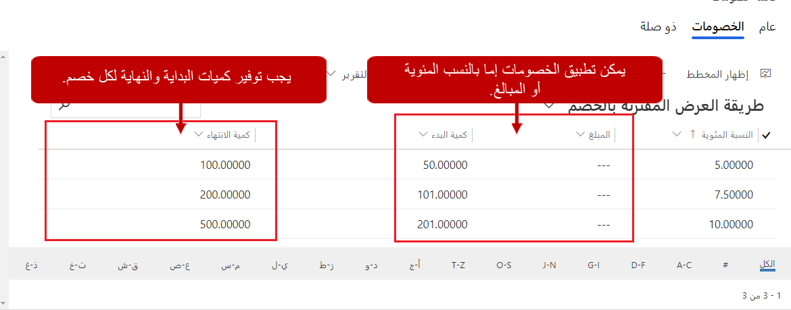
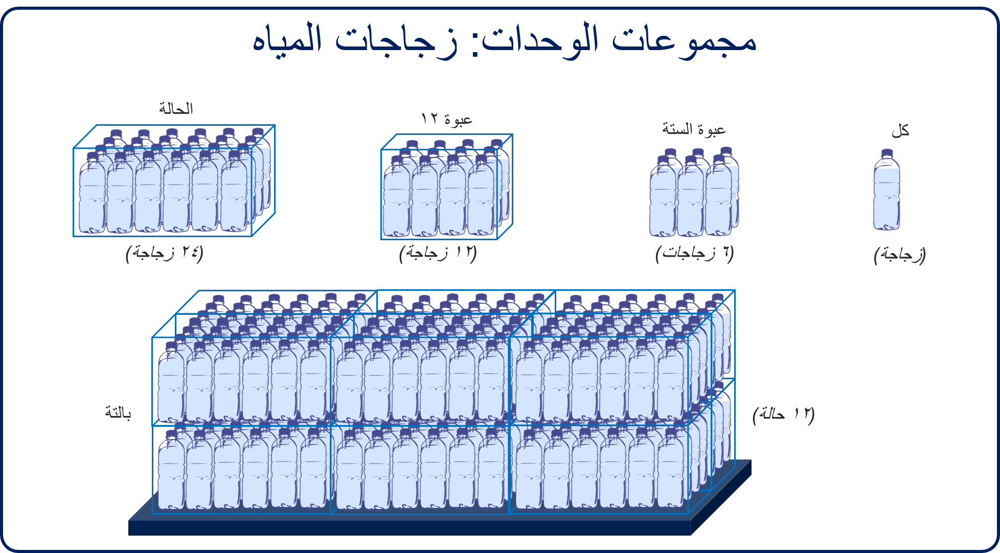
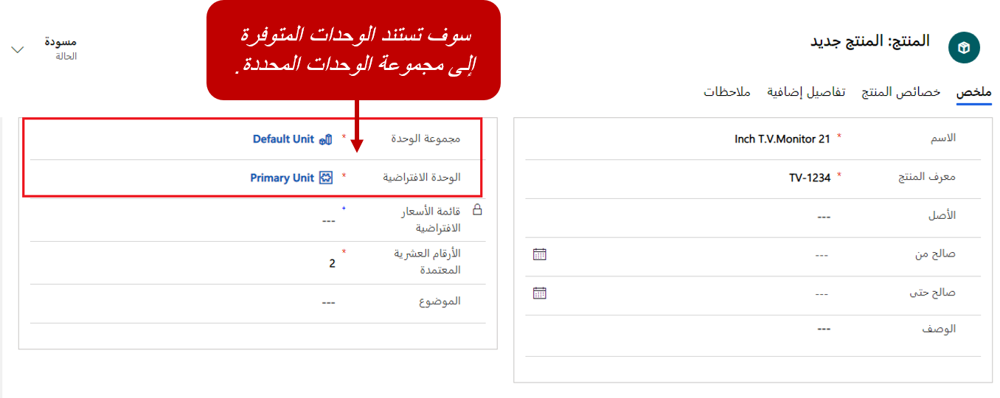
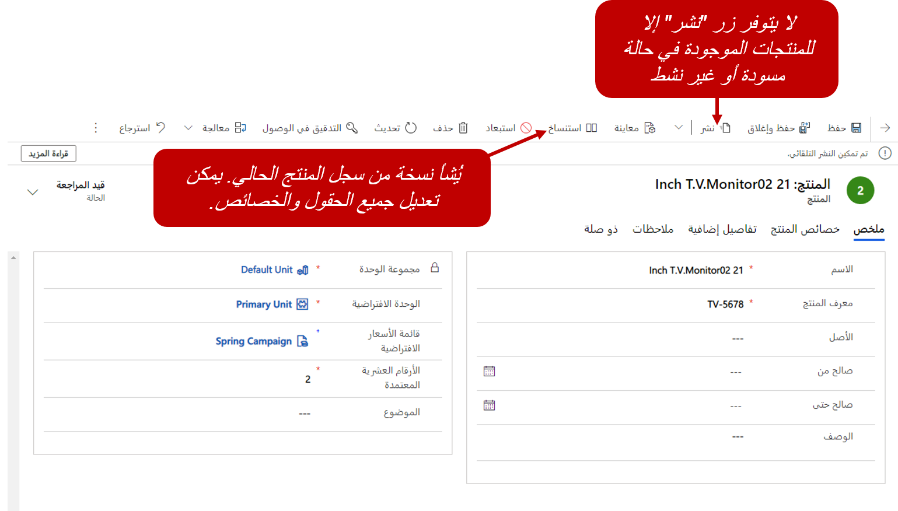
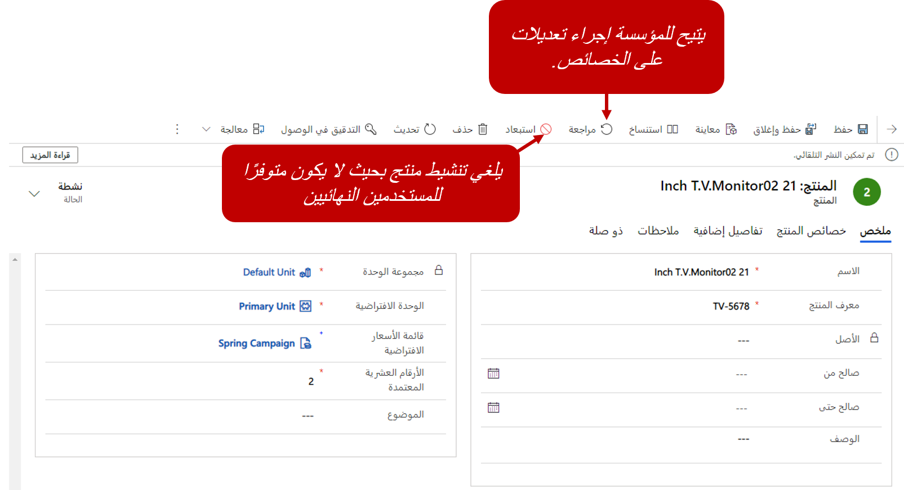

تمثل المنتجات الموجودة في كتالوج المنتجات أصنافًا وخدمات فردية تبيعها المؤسسة لعملائها. ويمكن أن يستخدم المنتج لتحديد شيء فعلي مثل طابعة أو قميص أو جهاز مطبخ. وبدلاً من ذلك، قد يتم استخدامه لتحديد خدمة يتم توفيرها مثل خدمة تخلص أو رسوم استشارة. ويمكن تحديد المنتجات بشكلٍ فردي أو كمجموعات أو حزم. وقبل إعداد المنتجات، نوصيك بتحديد أي خصومات يمكن تطبيقها على أساس كميات المنتج الذي يتم بيعه.

## قوائم خصومات

لا يلزم توفير قوائم خصومات، لكن يمكن استخدامها لإعداد الخصومات وفقًا لحجم المنتجات التي يتم شراؤها. بعد إعداد قائمة خصومات، يمكن إقرانها بأصناف فردية في قوائم الأسعار التي تستخدمها المؤسسة. نظرًا إلى أن المؤسسة يمكنها استخدام العديد من قوائم الأسعار المختلفة، فمن الممكن استيعاب العديد من سيناريوهات التسعير المختلفة. في قائمة الأسعار، يمكن تطبيق الخصم على بنود قائمة الأسعار فقط للكميات الموجودة في نطاق معين.

على سبيل المثال، تتضمن قائمة الأسعار القياسية حامل تلفزيون بقيمة \$100.00 دولار أمريكي. في هذا السيناريو، قد تحدد قائمة الخصومات أن العملاء الذين يقومون بشراء كمية تتراوح بين 101 و500 يحصلون على خصم 5 بالمائة، والعملاء الذين يشترون كمية تتراوح بين 501 و 5,000 يحصلون على خصم بنسبة 10 بالمائة، والعملاء الذين يشترون أكثر من 5,000 يحصلون على خصم بنسبة 15%.

لإعداد خصومات في كتالوج المنتجات، حدد **قوائم الخصومات**. بعد حفظ قائمة الخصم للمرة الأولى، يمكنك إضافة كل خصم تم إدراجه فيها. بالنسبة إلى كل خصم، يجب أن تحدد كمية البداية والنهاية ومبلغ الخصم المطلوب تطبيقه. يمكن تحديد الخصومات إما أنها بالنسب المئوية أو المبالغ.

## مجموعات وحدات

قبل تحديد المنتجات، يجب أن تحدد المؤسسة الوحدات لتحديد كيفية بيع منتجاتها. الوحدات هي الكميات أو القياسات التي تبيع منتجاتك أو خدماتها بها. على سبيل المثال، المؤسسة التي تبيع لوازم البستنة يمكن أن تبيع البذور في عبوات فردية أو صناديق بها عبوات متعددة أو حاويات تحتوي على صناديق متعددة. كل خيار من خيارات البيع هذه يمثل وحدة. مجموعة الوحدات هي مجموعة من هذه الوحدات المختلفة.

لنلقِ نظرة على مثال آخر، حيث تبيع مؤسسة زجاجات مياه.

بمجرد أن تظهر الصورة السابقة، قد يتم إنشاء مجموعة وحدات لتحديد كيفية بيع زجاجات المياه. يتم تمثيل زجاجة المياه الواحدة باستخدام وحدة *كل*. وكل وحدة إضافية تمثل كميات مختلفة من الوحدات:

- **كل** هذه الوحدة تمثل زجاجة المياه الواحدة

- **6 عبوات:** هذه الوحدة تمثل ست زجاجات مياه.

- **12 عبوة:** هذه الوحدة تمثل اثنتا عشرة زجاجة مياه.

- **صندوق** هذه الوحدة تمثل 24 زجاجة مياه.

وتعتمد كل وحدة من هذه الوحدات على الكميات الفردية. لكن قد تبيع مؤسستك أيضًا لبائعي جملة يتعاملون بكميات كبيرة. لمعالجة هذا السيناريو، يمكنك تحديد وحدة *الحاوية* التي تمثل 12 صندوقًا من زجاجات المياه.

لتحديد مجموعات الوحدات، انتقل إلى **إعدادات التطبيق** في تطبيق مركز المبيعات. بالنسبة إلى كل مجموعة وحدات، يتم تحديد الوحدة الأساسية. الوحدة الأساسية تمثل عادةً كمية واحدة من الصنف الذي يتم بيعه. تستند الوحدات الإضافية التي تمت إضافتها بعد ذلك إلى عدد محدد من الوحدات الأساسية. على سبيل المثال، قد تقوم المؤسسة التي تبيع الخدمات بتحديد *الساعة* كوحدة أساسية لمجموعة وحدات. بعد ذلك، تستطيع هذه المؤسسة تحديد الوحدة الثانية، *اليوم*، التي تمثل ثمانِ ساعات.

يتم تناول الجدول الآتي بإسهاب في هذا المثال.

| اسم الوحدة           | الوحدة الأساسية      | الكمية (الوحدات الأساسية) |
|---------------------|----------------| ----------------------|
| الساعة (الوحدة الأساسية) | غير قابل للتطبيق | 1                     |
| يوم                 | ساعة           | 8                     |
| أسبوع                | يوم            | 5                     |
| شهر               | أسبوع           | 4                     |

بعد تحديد مجموعات الوحدات المختلفة التي يجب أن تكون متاحة، يمكن ربطها بالمنتجات الفردية عند إنشائها.

## إنشاء منتجات

شاهد الفيديو التالي للتعرف على إنشاء المنتجات.

> [!VIDEO https://www.microsoft.com/videoplayer/embed/RE2NFzy]

## تكوين المنتج

المنتجات هي العمود الفقري لأي عمل تجاري يبيع شيئاً ما. ويمكن أن تكون منتجات أو خدمات فعلية. يمكن لموظفي المبيعات استخدام منتجات من كتالوج المنتجات لإنشاء فرص وعروض أسعار وأوامر وفواتير. وقد يقوم ممثلو خدمة العملاء باستخدامها عند إنشاء حالات خدمة عملاء. يمكن للمؤسسات إنشاء مجموعات منتجات لتجميع المنتجات المماثلة أو حزم منتجات لتجميع منتجات مشابهة معًا لدعم بيع العبوات. كما يمكنها تحديد منتجات فردية. يمكن إنشاء منتجات من مساحة **إعدادات التطبيق** الخاصة بتطبيق مركز المبيعات. ما عليك سوى تحديد **المجموعات والمنتجات**.

عند تحديد أحد المنتجات، يمكنك إدراج المعلومات الآتية:

| العمود                | الوصف |
|----------------------|-------------|
| الاسم                 | أدخل اسم المنتج الذي سيتم استخدامه عند إضافة المنتج إلى قوائم الأسعار والفرص وأوامر العمل وأوامر الشراء وما إلى ذلك. |
| معرف المنتج           | حدد معرف المنتج. يمكن بعد ذلك الرجوع إلى هذا المعرف عند إضافة المنتج إلى سجلات Microsoft Dynamics ‏365. |
| الأصل               | يستخدم هذا العمود عندما يكون المنتج مقترنًا بمجموعة منتجات. لا يمكن تغيير القيمة بعد حفظ السجل. |
| تاريخ بدء الصلاحية، تاريخ انتهاء الصلاحية | حدد نطاق التاريخ الذي يمكن إضافة المنتج إلى الأصناف فيه. |
| الوصف          | أدخل وصفًا مختصرًا للمنتج. يمكنك استخدام هذا العمود لتوفير مزيد من التفاصيل. |
| ‏‫مجموعة الوحدات           | حدد مجموعة الوحدات التي تحدد معلومات الكمية المرتبطة بكيفية بيع المنتج. |
| الوحدة الافتراضية         | حدد الوحدة الافتراضية التي سيتم استخدامها للمنتج، استنادًا إلى مجموعة الوحدات. |
| قائمة الأسعار الافتراضية   | حدد قائمة الأسعار التي سيتم استخدامها لهذا المنتج افتراضيًا. رغم أنه يمكن إقران المنتج بقوائم أسعار متعددة، إلا أنه يمكن أن يكون له قائمة أسعار افتراضية واحدة فقط. |
| الأرقام العشرية المدعومة   | حدد عدد المنازل العشرية التي يمكن استخدامها عند إضافة المنتج إلى الأصناف. يتم التحقق من دقة عمود **الكمية** في عرض الأسعار أو الأمر أو سجل منتج الفاتورة مقابل القيمة الموجودة في هذا العمود إذا لم يكن للمنتج قائمة أسعار مقترنة. |
| الموضوع              | إقران هذا المنتج بموضوع. يمكنك استخدام موضوعات لتصنيف المنتجات وتصفية التقارير. |

## نشر المنتجات واستنساخها ومراجعتها وإيقافها

بشكلٍ افتراضي، يتم إنشاء سجلات المنتجات في حالة مسودة. عندما يكون المنتج في حالة مسودة، لن يتمكن موظفو المبيعات من إضافته إلى أصناف مثل الفرص أو عروض الأسعار أو الأوامر. عندما تكون على استعداد لبيع منتج، من المفترض أن تقوم بنشره.

في بعض الأحيان، يكون المنتج الذي يتم إنشاؤه مشابهًا لمنتج موجود لكنه ليس المنتج نفسه. لتوفير الوقت عند إنشاء هذه المنتجات، يمكنك تحديد زر **استنساخ** في شريط الأوامر لعمل نسخة من المنتج الموجود. عند استنساخ منتج، يتم نسخ تفاصيل المنتج إلى سجل منتج جديد. وبعد ذلك، يمكن تحرير سجل المنتج الجديد حسب الحاجة لإظهار التفاصيل الخاصة بهذا المنتج.

بعد نشر المنتج، لا يمكن إجراء تغييرات (مثل التغييرات في خصائص المنتج). إذا كان يلزم إجراء تغييرات على خصائص المنتج، فيجب تحديد زر **مراجعة** في شريط الأوامر لإرجاع المنتج إلى حالة مسودة. وبعد ذلك، يمكن إجراء تغييرات على خصائص المنتج. بعد الانتهاء من إجراء التغييرات، يجب عليك نشر المنتج مرة أخرى وبالتالي يكون متاحًا للمستخدمين.

إذا لم تعد مؤسستك تبيع منتجًا، فيمكنك تحديد زر **إيقاف** في شريط الأوامر. وبهذه الطريقة، يمكنك التأكد من أن المنتج لم يعد متوفرًا ليستخدمه موظفو المبيعات. عند إيقاف المنتج، يتم إلغاء تنشيطه ولا يمكن إضافته بعد ذلك إلى أصناف مثل الفرص والأوامر. إذا كان من المفترض توفير منتج تم إيقافه سابقًا لأي سبب من الأسباب، فمن الممكن إعادة تنشيطه. ومن ثمَّ تتم إعادته مرة أخرى إلى حالة "تم النشر".

