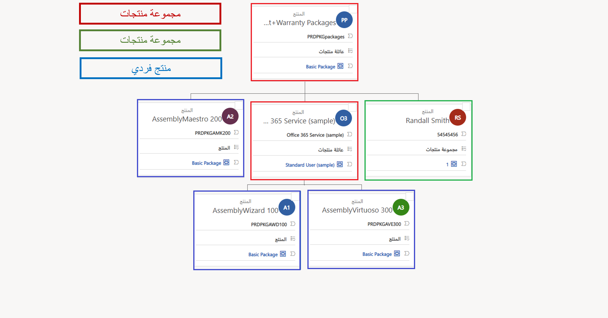
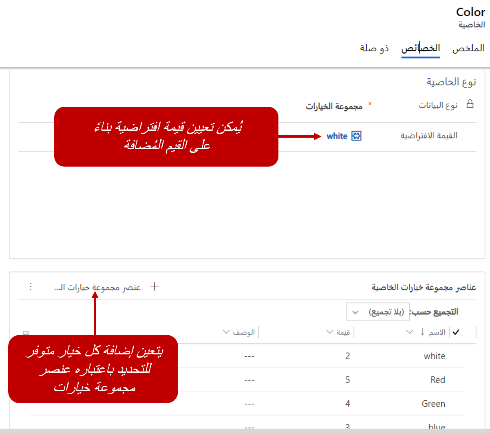
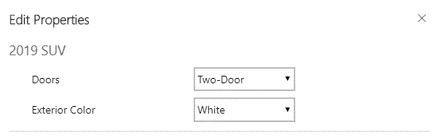
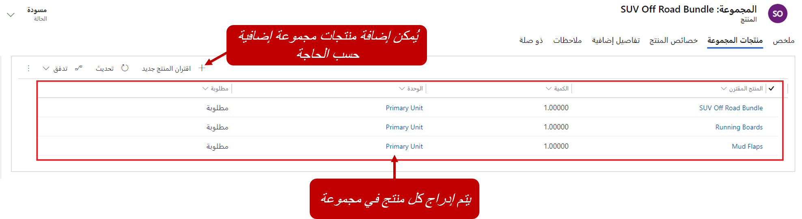
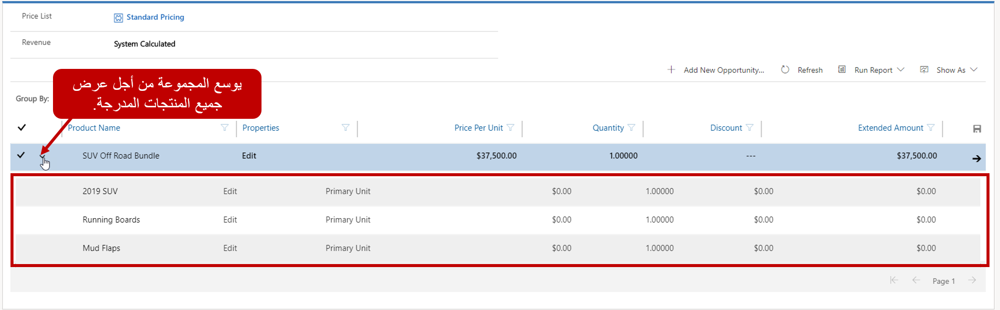
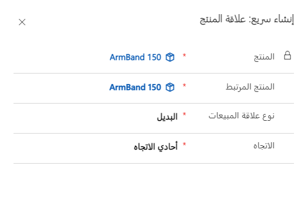

تسهل مجموعات المنتجات لموظفي المبيعات البحث عن منتجات وخدمات في كتالوج منتجات. وتتيح لك إمكانية تجميع المنتجات المتشابهة وتصنيفها معًا، استنادًا إلى القواسم المشتركة بينها. على سبيل المثال، وكالة بيع سيارات قد يتوفر لديها مجموعة منتجات مثل *سيارة رياضية* و *شاحنة* و *سيارة رياضية متعددة الأغراض*. من خلال تجميع كل سيارة مع سيارات أخرى في الفئة نفسها، يمكن للمؤسسة تحليل اتجاهات المبيعات حسب الفئة. كما يمكنها أيضًا تحليل خصائص المنتج عبر المنتجات الموجودة في مجموعة منتجات. على سبيل المثال، قد يكون طراز شاحنة محدد بألوان داخلية وخارجية مختلفة أو قد تكون متوفرة في طرازات ذات بابين أو أربعة أبواب. تتيح مجموعات المنتجات لوكالة البيع تحديد هذه الخيارات في مستوى المجموعة، بحيث يمكن لموظفي المبيعات اختيار الخيارات المحددة عند تحديد سيارة واحدة.

تتيح مجموعات المنتجات للمؤسسة تنفيذ هذه المهام:

- تصنيف المنتجات بالطريقة الأكثر إفادة لها.

- إنشاء منتجات فرعية وحزم منتجات فرعية داخل مجموعة منتجات.

- إنشاء العديد من مستويات مجموعات المنتجات التي ترغب فيها عن طريق إنشاء مجموعة داخل مجموعة.

## عرض تدرج هرمي للمنتجات

بالإضافة إلى تجميع العناصر المتشابهة، تقوم مجموعات المنتجات بإنشاء تدرج هرمي يوفر لقطة مرئية للمنتجات التي تبيعها المؤسسة. لذلك، من السهل معرفة المنتجات المتوفرة للبيع وكيفية اتصالها.

## استخدام مجموعات المنتجات والتدرجات الهرمية

شاهد الفيديو التالي للتعرف على مجموعات المنتجات والتدرجات الهرمية.

> [!VIDEO https://www.microsoft.com/videoplayer/embed/RE2NFzF]

## خصائص المنتجات

ومن الميزات الأخرى لمجموعات المنتجات أنه يمكنك تحديد خصائص للمساعدة على تمييز المنتجات. على سبيل المثال، يمكن استخدام خاصية لتقديم خيارات الحجم أو اللون لقُمصان تنتمي إلى نفس المجموعة.

يمكن تحديد الخصائص على مستوى المجموعة فقط عندما تكون المجموعة في حاله مسودة أو مراجعة. لتحديد الخصائص، حدد زر **إضافة خاصية جديدة** ". أي منتجات فرعية أو حزم منتجات أو مجموعات فرعية سوف تكتسب الخصائص من مجموعتها الأصلية بشكلٍ تلقائي.

وعند إنشاء إحدى الخصائص، يجب عليك تحديد التفاصيل التالية:

- **الاسم:** أدخل اسم الخاصية التي سيتم تقديمها للمستخدمين عند قيامهم بتعيينها.

- **للقراءة فقط:** حدد ما إذا كان بإمكان المستخدمين تحرير الخاصية.

- **مطلوب:** حدد ما إذا كان يجب تحديد قيمة للخاصية.

- **مخفي:** حدد ما إذا كان سيتم إخفاء الخاصية للمستخدمين عند استهلاكها.

لكل خاصية محددة، يجب تحديد نوع البيانات في علامة تبويب **تخصيص**. ويقوم نوع البيانات بتحديد نوع البيانات التي يمكن الحصول عليها للخاصية. يمكن أن تكون البيانات اختيارًا أو رقمًا عشريًا أو رقم فاصلة عائمة أو سطرًا واحدًا من النص أو رقمًا صحيحًا. استنادًا إلى نوع البيانات المحدد، قد تتوفر خيارات إضافية للخاصية. على سبيل المثال، قد يتم تعيين الخاصية التي تحدد الألوان التي يتوفر بها خط السيارة في نوع بيانات *اختيار*. بعد حفظ السجل، تجب إضافة كل خيار لون كعناصر اختيار الخصائص.

عند إضافة منتجات فردية إلى أصناف مثل الفرص وعروض الأسعار والأوامر، يمكن للمستخدمين تحديد القيم المتاحة لكل خاصية محددة لمجموعة المنتجات. حدد فقط زر **تحرير الخصائص** في الشبكة الفرعية **عناصر البنود**.

## حزم المنتجات الفرعية

الحزمة هي تشكيلة منتجات تباع كوحدة واحدة. من داخل حزمة، يمكن للمستخدمين رؤية جميع المنتجات المضمنة في الحزمة.

فيما يأتي بعض السيناريوهات التي يمكن أن يكون فيها حزم المنتجات مفيدة:

- إذا كنت ترغب في إقران منتج أكثر مبيعًا مع منتج أقل شيوعًا.

- تريد تجميع المنتجات بطريقة تجعل العملاء يستفيدون بشكل أكبر من مجموعة المنتجات الكاملة. أمثلة هذا الاستخدام لحزم المنتجات الفرعية تتضمن Microsoft 365 وكاميرا رقمية تأتي بالعدسات.

رغم أن المنتجات الموجودة في حزمة المنتجات يتم بيعها معًا، إلا أنه يمكن تمييز منتجات محددة في حزمة المنتجات كاختيارية. يمكن أيضًا بيع هذه المنتجات بشكل فردي.

بعد تنشيط إحدى حزم المنتجات الفرعية وربطها بقائمة أسعار، يمكن إضافتها كصنف بند في سجلات مثل الفرص وعروض الأسعار والأوامر. يمكن أيضًا توسيع الحزم لإظهار الأصناف المحددة المضمنة فيها.

## تحديد المنتجات ذات الصلة

ويكون للعديد من المنتجات نوعًا من الاقتران بالمنتجات الأخرى التي تبيعها المؤسسة. على سبيل المثال، عند بيع منتج مثل التلفزيون، يمكن تزويد مندوبي المبيعات بنماذج ترقية محتملة كفرصة لزيادة البيع. لا يمكن لعلاقات المنتجات المساعدة فقط على فرص زيادة البيع، ولكن يمكن استخدامها لتقديم منتجات بديلة أو ملحقات موصى بها أو المساعدة للحصول على فرص بيع مُكمّلة.

يمكن تحديد المنتجات ذات الصلة لسجلات المنتجات الفردية أو حزم المنتجات الفرعية، ولكن لا يمكن تحديدها لمجموعة منتجات. لإضافة علاقة، حدد **علاقات المنتج** في علامة تبويب **ذات صلة**. بعد ذلك، حدد زر **إضافة علاقة منتج جديد**.

عند تحديد علاقة منتج، يمكنك إدراج المعلومات الآتية:

- المنتج الذي تم إنشاء العلاقة له.

- المنتج ذو الصلة الذي يرتبط به المنتج.

- نوع العلاقة. يمكنك تحديد *زيادة بيع*  أو *بيع مُكمّل* أو *بديل* أو *ملحق*.

- اتجاه العلاقة:

    - **أحادي الاتجاه:** تتوفر العلاقة فقط من المنتج.
    
    - **ثنائي الاتجاه:** تتوفر العلاقة من المنتج والمنتج ذي الصلة.

في أثناء إدارة الفرصة أو الأمر، يتم عرض المنتجات المرتبطة على أنها اقتراحات. تساعد هذه الاقتراحات موظفي المبيعات في التوصية بالمنتجات وحزم المنتجات/الأطقم ذات الصلة للعملاء. لذلك، يمكنهم المساعدة على زيادة مبيعات المنتجات.
