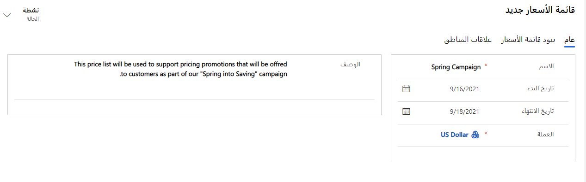

قد تبيع المؤسسات المنتجات والخدمات لأنواع مختلفة من العملاء. وبحسب نوع العميل، يمكن استخدام خيارات تسعير مختلفة. على سبيل المثال، يعد سعر البيع بالتجزئة للعملاء الفرديين أعلى بشكل عام من أسعار الجملة التي تقدم للموزعين، لأن الموزعين عادة ما يشترون كميات أكبر في أغلب الأحيان. بالنسبة لكل منتج تبيعه المؤسسة، قد تضطر إلى تحديد مستويات مختلفة من التسعير، وذلك اعتمادًا على العميل.

لا يمكن إضافة الخصائص إلا إلى مجموعات من المنتجات الموجودة في حالة إعداد أو مراجعة. لتقديم خيارات التسعير التي تتطلبها المؤسسات، يتضمن كتالوج منتجات Microsoft Dynamics 365قوائم الأسعار. ويتم توضيح قائمة الأسعار بشكل أفضل في صورة مستوى التسعير الذي تقدمه لأنواع معينة من العملاء. تقوم معظم المؤسسات بإنشاء قوائم أسعار متعددة لدعم سيناريوهات بيع مختلفة يستخدمونها.

فيما يلي بعض السيناريوهات التي قد يتم فيها استخدام قوائم أسعار متعددة:

- تبيع المؤسسة مباشرة إلى العملاء وعبر شبكة من الموزعين. في هذه الحالة، يمكن للمؤسسة إنشاء قوائم أسعار للبيع بالتجزئة والبيع بالجملة. 

- يتعين عليك إنشاء قوائم أسعار تُستخدم فقط في حملة تسويقية معينة.

- يتعين عليك إنشاء قوائم أسعار مخصصة لعملاء معينين، مثل العقد أو العملاء المفضلين.

دعنا نلقي نظرة على مثال أكثر تفصيلاً، حيث تقوم مؤسسة بتصنيع مراتب وتبيع منتجاتها لثلاثة أنواع مختلفة من العملاء.

- **عملاء البيع بالتجزئة:** العملاء الذين يشترون مباشرة من موقع البيع بالتجزئة يدفعون مبلغاً بقيمة 750.00 دولاراً لكل مرتبة.

- **عملاء البيع بالجملة:** سلاسل متاجر البيع بالتجزئة التي تشتري مباشرة من المؤسسة لكي تبيع المنتجات في متاجرها تدفع مبلغ بقيمة 600.00 دولار لكل مرتبة.

- **الموزعون:** العملاء الذين يشترون مباشرة من المؤسسة حتى يتمكنوا من بيع المنتجات لتجار البيع بالتجزئة الآخرين يدفعون مبلغًا بقيمة 500.00 دولار لكل مرتبة.

لاستيعاب هذا السيناريو، أنشئ قوائم أسعار باسم *البيع بالتجزئة* و *البيع بالجملة* و *الموزع*، وأضف المراتب إلى كل قائمة أسعار في شكل بنود قائمة أسعار. سيختلف المبلغ الذي يتم دفعه مقابل المرتبة في كل قائمة أسعار. لا تحتاج جميع المؤسسات إلى إنشاء قوائم أسعار متعددة. وقد يبيع البعض فقط لعملاء البيع بالتجزئة ويحددون مستوى تسعير واحد فقط. في هذه الحالات، يجب وجود قائمة أسعار واحدة فقط، كما تتم إضافة أي منتج تخطط المؤسسة لبيعه إلى قائمة الأسعار هذه.

تعد قوائم الأسعار بشكل عام آخر عنصر تم إعداده في كتالوج المنتجات. تجمع الوحدة والمنتج وتفاصيل التسعير معًا. لذلك، قبل إنشاء قوائم الأسعار، تأكد من تحديد الوحدات والمنتجات.

## إنشاء قوائم أسعار

يمكن إنشاء قوائم أسعار من منطقة **إعدادات التطبيق** في تطبيق مركز المبيعات. عند إنشاء قائمة أسعار، يجب إدخال اسم قائمة الأسعار، مثل *البيع بالتجزئة* أو *البيع بالجملة*. يتعين عليك تحديد العملة المستخدمة مع قائمة الأسعار. وبشكل افتراضي، تستخدم قوائم الأسعار العملة الأساسية التي يتم تحديدها لإحدى المؤسسات. بالإضافة إلى ذلك، إذا كانت قائمة الأسعار ستُستخدم لوضع تسعير خاص أثناء حملة تسويقية أو ترويجية، فسيتعين عليك تحديد تاريخي البدء والانتهاء. وبهذه الطريقة، ستضمن أن قائمة الأسعار لن يتم استخدامها إلا خلال الأوقات المناسبة.

### تحديد بنود قائمة الأسعار

بعد حفظ قائمة الأسعار لأول مرة، يمكنك تحديد بنود قائمة الأسعار الفردية من خلال تحديد الزر **إضافة بنود قائمة أسعار جديدة** ذمن علامة تبويب **بنود قائمة الأسعار**. وعند إضافة عنصر لأول مرة، يمكنك تحديد القيم التالية:

- **قائمة الأسعار:** حدد قائمة الأسعار لإضافة بند إليها.

- **المنتج:** حدد المنتج من كتالوج المنتجات لإقران البند به.

- **الوحدة:** حدد وحدة القياس المراد استخدامها مع البنود، بناءً على مجموعة الوحدات المقترنة بالمنتج.

- **قائمة الخصومات:** حدد قائمة الخصم المراد استخدامها إذا تطلب البند تقديم أي خصومات على الحجم.

- **خيار الكميات المبيعة:** حدد ما إذا كان يمكن بيع الصنف بالكامل أو بكميات جزئية.

يتم تحديد معلومات تسعير لكل بند ضمن علامة تبويب **التسعير** في صفحة **بنود قائمة الأسعار**. العمود الأول والأهم الذي يجب تحديده هو عمود **أسلوب التسعير**. يحدد هذا العمود السعر الفعلي للعنصر وفقًا لقائمة الأسعار هذه. تتوفر الخيارات التالية:

- **مبلغ العملة:** حدد هذا الخيار لتجاهل قائمة أسعار المنتج في كتالوج المنتجات وأدخل سعر مختلف يدويًا لقائمة الأسعار هذه.

- **نسبة مئوية من القائمة:** حدد هذا الخيار لحساب سعر المنتج في قائمة الأسعار كنسبة مئوية من قائمة الأسعار ذات الصلة.
 
- **نسبة السعر إلى التكلفة - التكلفة الحالية:** حدد هذا الخيار لإضافة نسبة سعر أعلى من التكلفة الحالية التي تم إدخالها في كتالوج المنتجات.

- **هامش الربح - التكلفة الحالية:** حدد هذا الخيار إذا كان يجب أن ينتج عن السعر المعروض في قائمة الأسعار نسبة مئوية من هامش الربح للتكلفة الحالية.

- **نسبة السعر إلى التكلفة - التكلفة القياسية:** حدد هذا الخيار لإضافة نسبة سعر أعلى من التكلفة القياسية التي تم إدخالها في كتالوج المنتجات. 

- **هامش الربح - التكلفة القياسية:** حدد هذا الخيار إذا كان يجب أن ينتج عن السعر المعروض في قائمة الأسعار نسبة مئوية من هامش الربح للتكلفة القياسية.

> [!NOTE]
> قد تتوفر طرق تسعير إضافية، وذلك بناءً على وحدة تطبيق Dynamics 365 المثبتة. على سبيل المثال، يضيف حل Microsoft Dynamics 365 for Field Service بعض الخيارات التي تتعلق على وجه التحديد بالمنتجات ذات الصلة بالخدمة.

> [!VIDEO https://www.microsoft.com/videoplayer/embed/RE2NIba]

## تعيين قوائم الأسعار إلى المناطق

قد تستخدم بعض المؤسسات خيارات تسعير مختلفة، وذلك استنادًا إلى المناطق أو الأقاليم الجغرافية. يمكن لكتالوج المنتجات استيعاب هذه السيناريوهات من خلال السماح بإضافة قوائم أسعار افتراضية للمناطق أو شرائح العملاء التي يديرها الوكلاء. عندما تعرض قائمة الأسعار المحددة على أنها القائمة الافتراضية لإقليم ما أي عناصر جديدة في تلك المنطقة، مثل فرصة، يتم استخدام قائمة الأسعار الافتراضية. ويمكن بعد ذلك تحديد قائمة أسعار مختلفة حسب الحاجة.

## تعطيل قوائم الأسعار

عندما تصبح قائمة الأسعار غير صالحة، يمكن تعطيلها عن طريق تحديد زر **إلغاء التنشيط** الموجود في شريط أوامر قائمة الأسعار. على سبيل المثال، كان لدى إحدى الشركات قائمة أسعار تمهيدية لإطلاق منتج. بعد عدة أشهر، يتم تجاوز العرض التمهيدي، حيث لم تعد قائمة الأسعار صالحة. في هذه الحالة، يمكنك إلغاء تنشيط قائمة الأسعار التمهيدية بحيث لا يمكن تطبيقها على أي منتجات.
