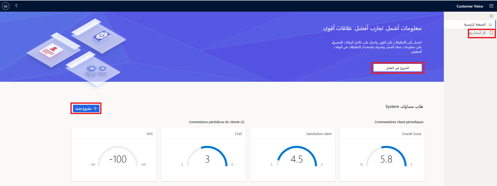
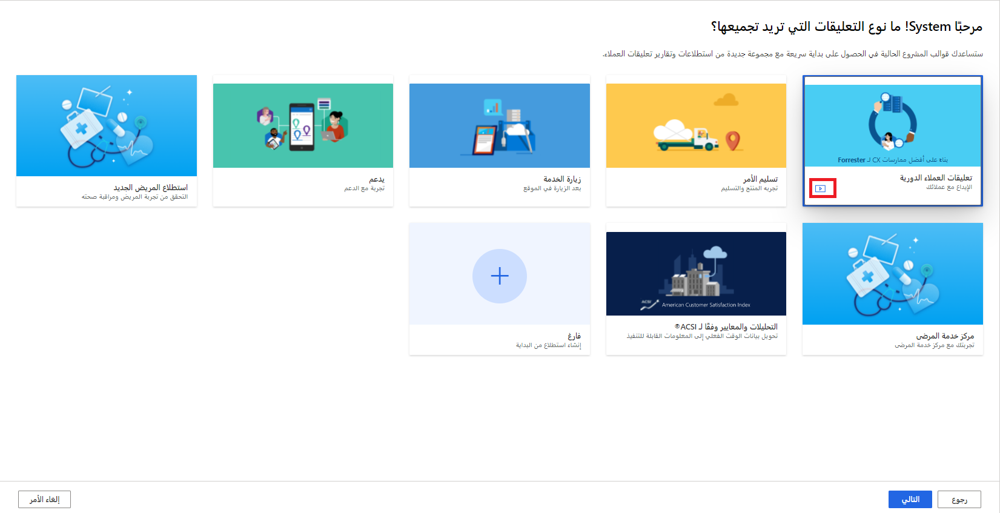
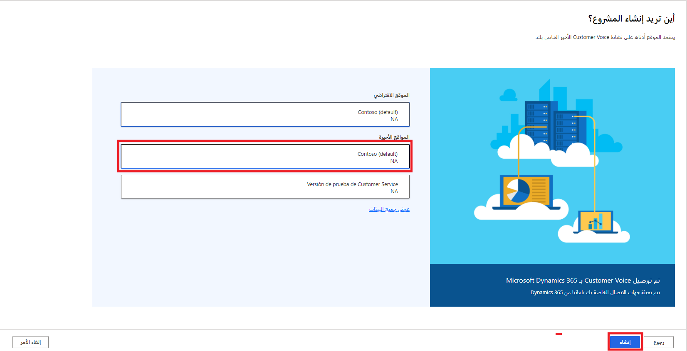
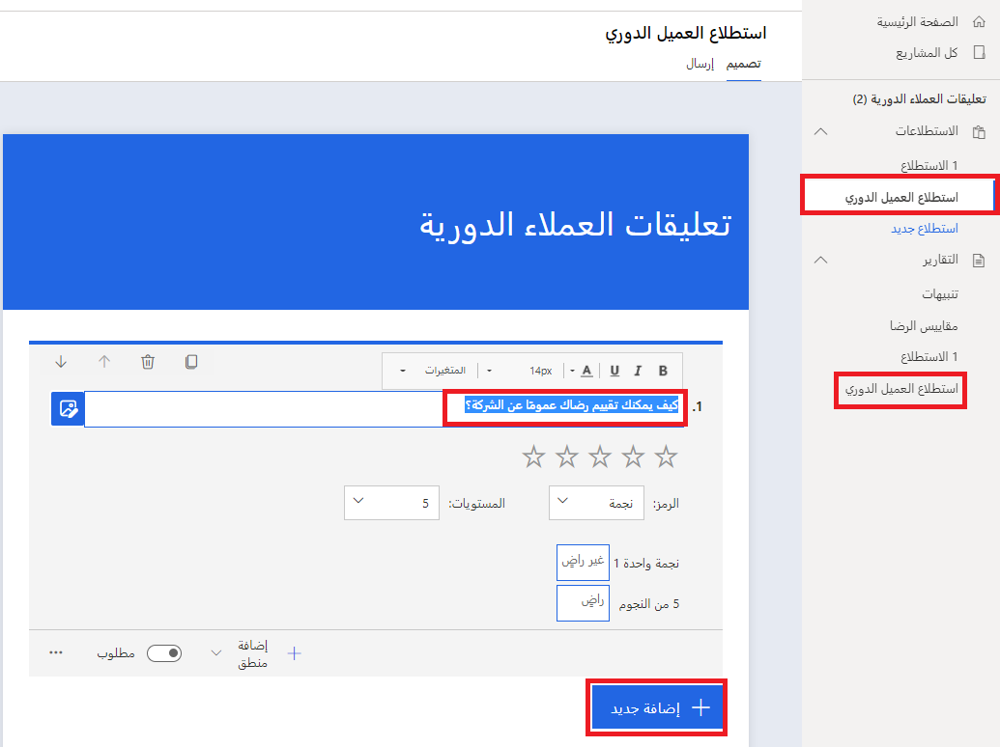

بإمكان منشئي الاستطلاعات الوصول إلى [Dynamics 365 Customer Voice](https://customervoice.microsoft.com/?azure-portal=true). من الصفحة الرئيسية، تتوفر طرق متعددة تسمح للمستخدم بالشروع في العمل. تحتوي منطقة التنقل الرئيسية على ارتباط إلى المنطقة الرئيسية الحالية الجاري عرضها، وإمكانية الوصول إلى جميع المشاريع التي قد تكون موجودة حالياً. يمكن إضافة المشاريع من النظرة العامة على *كافة المشاريع*، وأيضاً باستخدام الزرين **الشروع في العمل** أو **مشروع جديد** على الصفحة الرئيسية. بعد تحديد أحد الخيارات لإنشاء مشروع جديد، على المستخدم أن يحدد نوع التعليقات التي يجب جمعها.

> [!div class="mx-imgBorder"]
> 

يتضمن Customer Voice سبعة قوالب مشاريع توفر عينات للاستطلاعات ومتغيرات وقوالب بريد إلكتروني بالاستناد إلى نوع التفاعل أو الرحلة التي ربما يكون العميل قد قام بها. يتضمن مشروع تعليقات العملاء الدورية استطلاعاً يطالب بتقييم الرضا والتجربة مع الشركة بشكل عام خلال الأشهر الثلاثة الماضية. يطالب مشروع تسليم الأمر بإرسال تعليقات على التجربة بشكل عام بالاستناد إلى أمر حديث والوقت الذي استغرقه إكمال العملية. تتضمن مشاريع زيارة الخدمة والدعم استطلاعات مرتبطة بزيارة الموقع والتجربة مع فريق الدعم على التوالي. هناك أيضاً مشاريع يمكن استخدامها في مجال الرعاية الصحية ومشروع التحليلات والمعايير الذي يستند إلى مؤشر رضا العميل الأمريكي. ويؤدي تحديد أحد المشاريع إلى توفير أيقونة معاينة، مما يمنح المستخدم القدرة على تكوين فهم للاستطلاعات التي سيتم تضمينها قبل اختيار أحدها للاستخدام. إذا لم يبدو أي قالب من قوالب المشروع مناسباً أو لم يكن نقطة البداية الصحيحة، فيمكن استخدام الخيار "فارغ"، مما يعني أنه سيتم إنشاء مشروع بدون أي أسئلة على استطلاع فارغ، مما يمنح المستخدم صفحة بيضاء للبدء بها.

> [!div class="mx-imgBorder"]
> 

بعد تحديد المشروع والانتقال إلى الشاشة التالية، الخطوة الثانية المتعلقة بإنشاء المشروع الجديد هي تحديد موقعه. لأن منشئ الاستطلاع يستخدم Customer Voice بشكل متكرر، فإن المواقع المقترحة تستند إلى التحديدات السابقة. تتضمن هذه المواقع بيئة Dataverse الافتراضية للمؤسسة، وأي بيئات Dataverse أخرى موجودة. إذا كانت المؤسسة تستخدم تطبيقات Dynamics 365 Customer Engagement، فستكون جميع هذه التطبيقات متوفرة. يؤدي تحديد الارتباط **عرض جميع البيئات** إلى عرض جميع بيئات Dataverse. سيؤدي تحديد بيئة إلى إجراء فحص سريع للتأكد من أن المستخدم يملك إذن الوصول إلى البيئة واستخدامها لإنشاء مشروع جديد فيها. بعد الموافقة على البيئة، يمكن تحديدها، ويمكن استخدام الزر **إنشاء** لإنشاء المشروع الجديد وإضافته إلى البيئة المحددة.

> [!div class="mx-imgBorder"]
> 

عندما يصبح المشروع موجوداً، سيكون التقرير الذي يحتوي على كافة الأسئلة المحددة مسبقاً مرئياً، إذا تم اختيار قالب. سيتم أيضاً إنشاء تقرير مناظر للاستطلاع. يمكن الآن تعديل الاستطلاع عن طريق تحرير نصوص الأسئلة الموجودة أو أوصافها أو إضافة أسئلة جديدة كما تقتضي الحاجة. يمكن إضافة المزيد من الاستطلاعات، مما يوفر مشروعاً قوياً لقسم أو وظيفة داخل المؤسسة. إذا تم إنشاء مشروع فارغ، فسيستمر وجود الاستطلاع والتقرير المناظر، ولكن الاستطلاع لن يتضمن أي أسئلة، وسيكون عنوان الاستطلاع *عنوان الاستطلاع*. يجب إضافة جميع الأسئلة إلى الاستطلاع لجعله قابلاً للاستخدام.

> [!div class="mx-imgBorder"]
> 

