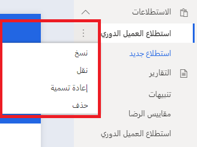
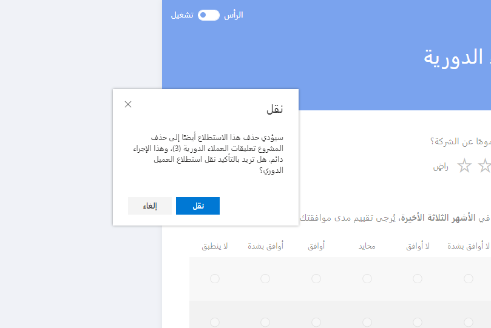
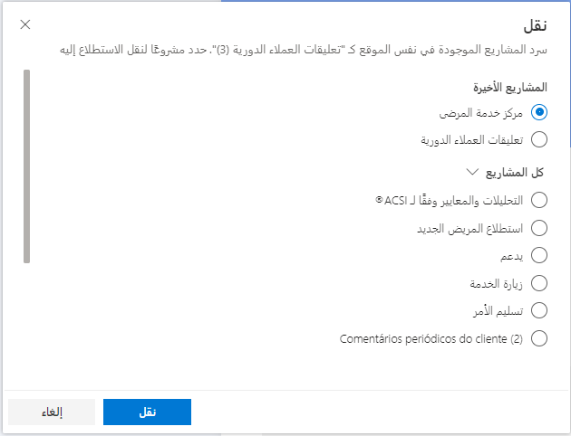
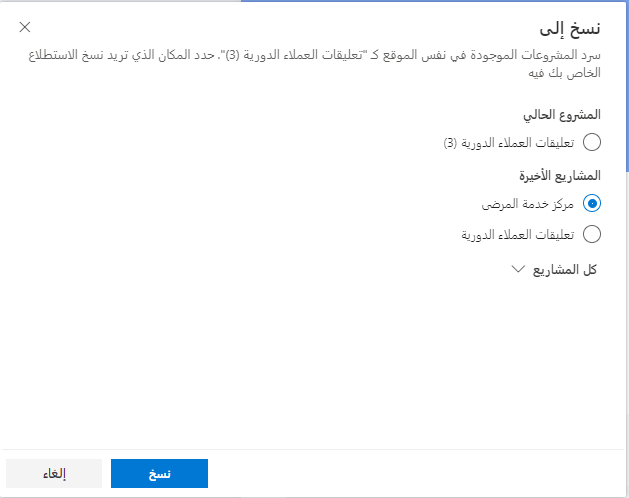

سوف يساعد التخطيط للمشاريع والاستطلاعات المناظرة لها بعناية على التأكد من أن المشروع سيوفر الصورة الأكبر للمؤسسة. على الرغم من أنه يمكن إضافة استطلاع إلى مشروع، وعلى الرغم من أنه قد يكون المكان المناسب لوضعه، فإن المتطلبات والهياكل التنظيمية قد تتغير مع مرور الوقت. قد يكون الاستطلاع الذي كان موجوداً في السابق في مشروع "إدارة الحساب" مناسباً الآن بشكل أفضل لمشروع دعم العملاء. يتسم Dynamics 365 Customer Voice بالمرونة ويوفر نهجاً سريعاً وسهلاً للتنقل بين الاستطلاعات.

لنقل استطلاع من داخل مشروع، قم بتمرير المؤشر فوق اسم الاستطلاع، الذي سيعرض قائمه علامة حذف (**...**). حدد علامة الحذف بالخيار لنقل الاستطلاع.
يؤدي نقل الاستطلاع إلى التأكد من أن التخصيصات الموجودة وقوالب البريد الإلكتروني ومهام سير العمل ذات الصلة في Power Automate، والردود على أي استطلاع موجود ستنتقل مع الاستطلاع من دون فقدانها. لن تنتقل مقاييس الرضا إلى الموقع الجديد للاستطلاعات، لذا يجب عليك إعدادها من جديد.

> [!div class="mx-imgBorder"]
> 

بعد تحديد الخيار **"نقل"**، سيتعذر بقاء المشروع بدون استطلاع في حال وجود استطلاع واحد فقط في المشروع. سيتم إبلاغ المستخدم الذي يبدأ عملية النقل بأن هذا الإجراء سيؤدي إلى حذف المشروع.
يمكن نقل استطلاع من مشروع إلى آخر فقط في حال امتلاك المشروعين (المصدر والهدف) من قبل المستخدم نفسه.

> [!div class="mx-imgBorder"]
> 

سيؤدي عندئذٍ تحديد الزر **نقل** إلى توفير قائمة بجميع المشاريع الموجودة في نفس الموقع أو البيئة التي يقيم فيها الاستطلاع حالياً. ستظهر المشاريع الأخيرة التي تم الوصول إليها أولاً، ثم قائمة بجميع المشاريع. قم باختيار مشروع من القائمة ثم قم بوضع الاستطلاع في المشروع الجديد الذي قمت بتحديده.

> [!div class="mx-imgBorder"]
> 

يمكن استخدام الخيار **نسخ** لتكرار استطلاع لوضعه في نفس المشروع أو في مشروع مختلف، ولكن فقط في نفس الموقع أو البيئة. الشيء الوحيد الذي يتم نسخه هو الاستطلاع نفسه، مع أي تخصيصات مثل السمة أو العنوان أو الشعار. لا تُعد الردود على الاستطلاع أو قوالب البريد الإلكتروني أو مهام سير العمل في Power Automate جزءاً من عملية النسخ. بعد تحديد الخيار **نسخ** من قائمة علامات الحذف في الاستطلاع، اختر المشروع الذي تريد أن تنقل النسخة إليه.

> [!div class="mx-imgBorder"]
> 

استخدام وظائف **النقل** و **النسخ** في إدارة الاستطلاعات سيساعدك في استخدام استطلاع موجود كنقطه بداية لإضافة مشروع جديد أو الانتقال اليه. بالإضافة إلى ذلك، فإن هذه الوظائف تساعدك على الضبط والتعديل حسب الضرورة لتلبية المتطلبات الجديدة. في الوحدة التالية، ستتعرّف على وظيفة نسخ مشروع من بيئة إلى أخرى.
