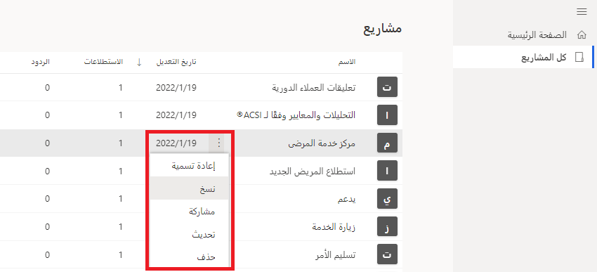
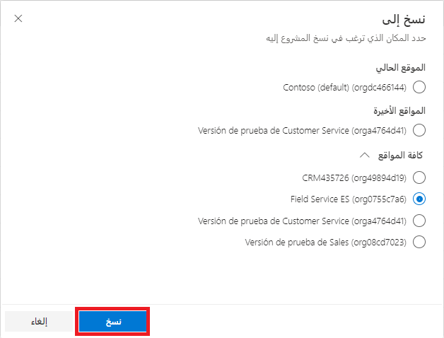
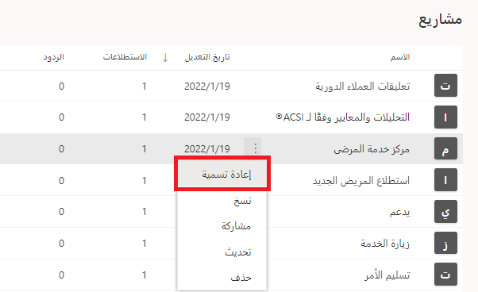

تتوفر لدى منشئي الاستطلاع طريقة للتأكد من احتواء الاستطلاعات ضمن المشاريع الصحيحة عن طريق نقلها، أو لديهم نقطة بداية جيدة لاستطلاع عن طريق تكراره وإضافة نسخة منه إلى المشروع. تسمح هذه الإجراءات بالنقل والنسخ داخل نفس موقع المشروع، مما يعني أنه لا يمكن إجراء هذه التغييرات إلا من مشروع إلى مشروع آخر يتم تخزينه في نفس البيئة. إذا كان من الضروري نقل الاستطلاعات من موقع إلى آخر، فيجب أن يتم ذلك على مستوى المشروع.

يؤدي نسخ مشروع إلى نسخ الاستطلاعات ومقاييس الرضا ومهام سير العمل في Power Automate وأي قوالب بريد إلكتروني تم تكوينها وربطها بالمشروع. للشروع في العمل، عليك تمرير الماوس فوق المشروع الذي تريد نسخه. ستظهر علامة قطع، وسيؤدي النقر فوقها إلى عرض قائمة تتضمن أيضاً خيار إعادة تسمية المشروع أو مشاركته أو تحديثه أو حذفه.

> [!div class="mx-imgBorder"]
> 

يؤدي تحديد الخيار **نسخ** إلى توفير قائمة بالبيئات. يمكننا رؤية الموقع الحالي الذي يقيم فيه المشروع الأصلي. ثم أي موقع أخير تم استخدامه، وأخيراً قائمة بجميع المواقع الأخرى التي تُظهر بيئات Dataverse الأخرى. بعد تحديد موقع المشروع الجديد، يمكن استخدام الزر **نسخ** لبدء عملية تكرار المشروع وإضافة نسخة جديدة منسوخة منه في الموقع الذي تم تحديده.

> [!div class="mx-imgBorder"]
> 

بعد نسخ المشروع، يمكننا رؤيته في القائمة. إنه يستخدم الاسم نفسه للمشروع الأصلي ولكنه يلحق كلمة "نسخة" به. باستخدام القائمة، يمكن إعادة تسمية اسم المشروع بسهولة لإزالة الكلمة "نسخة" وتعديله بحيث يكون اسماً مفهوماً.

> [!div class="mx-imgBorder"]
> 

إذا كان من الضروري نسخ الاستطلاعات إلى موقع مختلف وكانت موجودة في مشاريع مختلفة غير مطلوبة، فبإمكان المستخدم إنشاء نسخ من الاستطلاع ووضعها كلها في مشروع واحد سيتم نسخه بعد ذلك. سيؤدي ذلك إلى تسريع العملية بعض الشيء. بعد نسخ المشروع، يمكنك عندئذٍ نقل الاستطلاعات إلى المشاريع الصحيحة في الموقع الجديد إذا لزم الأمر.
