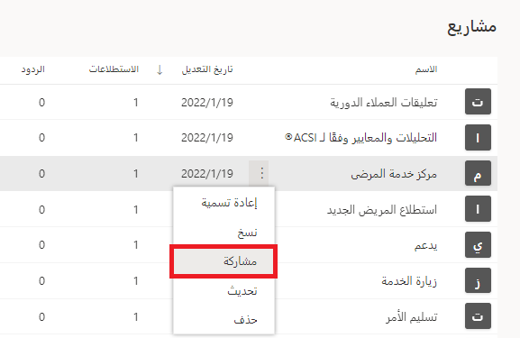
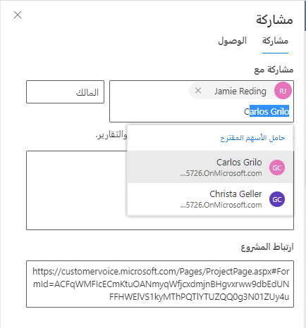
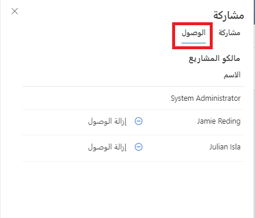

فيما يتعلق بمؤسسة تستخدم Dynamics 365 Customer Voice، من المتوقع أن تكون هناك حاجة إلى التعاون. بإمكان منشئ الاستطلاع إنشاء مشروع جديد وإضافة استطلاعات إلى قسم معين أو دورة عمل، ولكن قد يحتاج المستخدمون الآخرون إلى الوصول إلى التفاصيل لإجراء تغييرات أو رؤية الردود على الاستطلاع. يُعد الشخص الذي ينشئ المشروع مالك المشروع والاستطلاعات وبيانات الاستطلاعات ذات الصلة مثل الردود والدعوات. تؤدي مشاركة المشروع إلى تغيير مستوى الملكية، مما يؤدي إلى تعيينه إلى فريق Microsoft Dataverse (مجموعة Azure Active Directory) يسمى الفريق المالك لمشروع Customer Voice.

عندما يصبح من الضروري مشاركة المشروع، يمكن القيام بذلك مباشرة من أحد المشاريع في القائمة ضمن منطقة جميع المشاريع، أو باستخدام الزر **مشاركة‏‎** في المشروع من الجزء العلوي الأيسر منه.

> [!div class="mx-imgBorder"]
> 

تؤدي مشاركة المشروع إلى جعل كل من لديه حق الوصول إليه مالكاً شريكاً. ويؤدي ذلك إلى منح المالك الشريك مستوى الوصول نفسه الذي يتمتع به مالك المشروع، بما في ذلك القدرة على إنشاء استطلاعات جديدة أو تعديل المشروع بأي طريقة أو حذفه أو مشاركته مع الآخرين. ومع ذلك، يتعذر على المالك الشريك إزالة منشئ المشروع من الاستطلاع المشترك، كما يتعذر عليه حذف أي استطلاعات أنشأها مستخدم آخر في Dynamics 365 Customer Voice. لا يمكن نقل الاستطلاعات أو حذفها إلا بواسطة منشئها الأصلي.

بإمكان المستخدم الذي يشارك المشروع القيام بذلك عن طريق كتابة اسم مستخدم زميل. إذا تم العثور عليه، فسيظهر اسمه كاقتراح يمكن تحديده. يمكن إضافة رسالة اختيارية يمكن استخدامها للمساعدة في شرح الغرض من المشروع، وربما سبب مشاركته. بعد تحديد المستخدمين وإضافة رسالة (إذا رغبت في ذلك)، يمكن استخدام الزر **مشاركة** لإكمال الإجراء. سيظهر إعلام يشير إلى مشاركة المشروع بنجاح.

> [!div class="mx-imgBorder"]
> 

سيتم إرسال بريد إلكتروني ينشأ تلقائياً إلى المستخدمين الذين تم تحديدهم لمشاركة المشروع معهم. إذا تمت إضافة رسالة، فسيتم تضمينها كجزء من البريد الإلكتروني إلى جانب ارتباط لفتح المشروع فيه Dynamics 365 Customer Voice. بإمكان المستخدمين الذين مُنحوا حق الوصول بدء العمل على المشروع الآن. من الضروري أن نفهم أن الردود التي تم تلقيها بعد مشاركة المشروع هي وحدها التي ستكون مرئية للمالكين المشاركين. أما الردود التي وردت قبل هذا الإجراء، فستكون مرئية فقط لمنشئ المشروع الأصلي.

يمكن معرفة من هم الأشخاص الذين لديهم حق الوصول إلى المشروع بالانتقال إلى قائمة المشاركة والنقر فوق علامة تبويب الوصول. سيؤدي ذلك إلى عرض قائمة تتضمن مالكي المشروع. سيكون اسم المالك الأصلي في أعلى القائمة، مع إدراج جميع المالكين الشركاء أدناه. يتوفر خيار إزالة الوصول إلى جانب اسم كل مستخدم، مما يضفي السهولة والبساطة على إزالة حق الوصول إلى المشروع وجميع الاستطلاعات والردود عليها من كل شخص كما هو مطلوب.

> [!div class="mx-imgBorder"]
> 
