في هذا التمرين، ستقوم بإنشاء مشروع جديد في Customer Voice، ثم تنشئ نسخه منه لبيئة أخرى. وأخيراً، ستشارك مشروعك مع مستخدم آخر.

> [!IMPORTANT]
> يمكن إكمال هذا التمرين في بيئة تجريبية أو بيئة اختبار معزولة.
ستحتاج إلى بيئتين على الأقل لإكمال المهمة 2 ومستخدم آخر على الأقل في بيئتك لإكمال المهمة 3.

## المهمة 1: إنشاء مشروع جديد

في هذه المهمة، ستقوم بإنشاء مشروع جديد باستخدام قالب مشروع **الدعم** في Dynamics 365 Customer Voice.

1.  انتقل إلى [Dynamics 365 Customer Voice](https://customervoice.microsoft.com/?azure-portal=true) وسجّل الدخول باستخدام بيانات الاعتماد الخاصة بك.

1.  حدّد **الشروع في العمل**.

    > [!div class="mx-imgBorder"]
    > [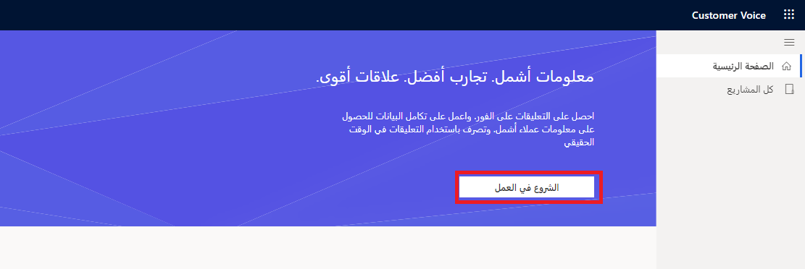](../media/get-started-new-project.png#lightbox)

1.  حدد قالب **الدعم** من قائمة خيارات قوالب المشروعات المتوفرة.

    > [!div class="mx-imgBorder"]
    > [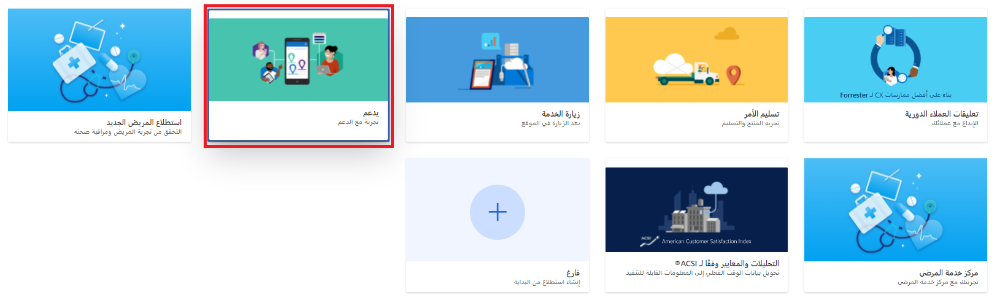](../media/support-template.png#lightbox)

1.  في الجزء السفلي للشاشة، حدد زر **التالي**.

    > [!div class="mx-imgBorder"]
    > [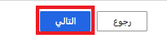](../media/next.png#lightbox)

1.  حدد **مراجعة جميع البيئات**.

    > [!div class="mx-imgBorder"]
    > [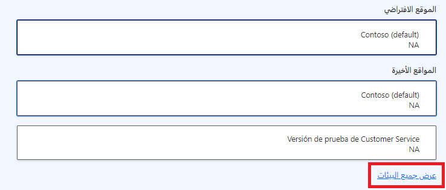](../media/see-all-environments.png#lightbox)

1.  من القائمة، حدد بيئة يمكنك الوصول إليها.
    في الزاوية اليمنى السفلية من الشاشة، عند عرض الرسالة **تم منح الإذن**، حدد الزر **تحديد وإغلاق**.

    > [!div class="mx-imgBorder"]
    > [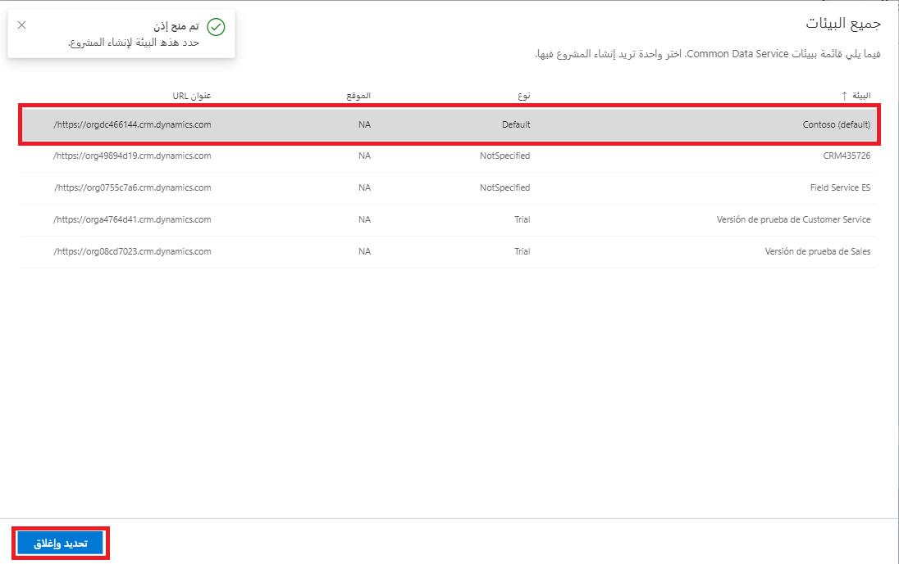](../media/sandbox.png#lightbox)

1.  حدد الزر **إنشاء**.

    > [!div class="mx-imgBorder"]
    > [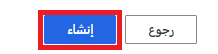](../media/create.png#lightbox)

1.  اكتمل المشروع الآن، وسيتم عرض استطلاع **ملاحظات خدمة العملاء** من قالب مشروع **الدعم**.

## المهمة 2: نسخ مشروع إلى بيئة أخرى

في هذه المهمة، ستقوم بنسخ المشروع الذي قمت بإنشائه في المهمة 1 إلى بيئة مختلفة في Dynamics 365 Customer Voice.

1.  من الشاشة الرئيسية في Dynamics 365 Customer Voice، حدد **جميع المشروعات**.

    > [!div class="mx-imgBorder"]
    > [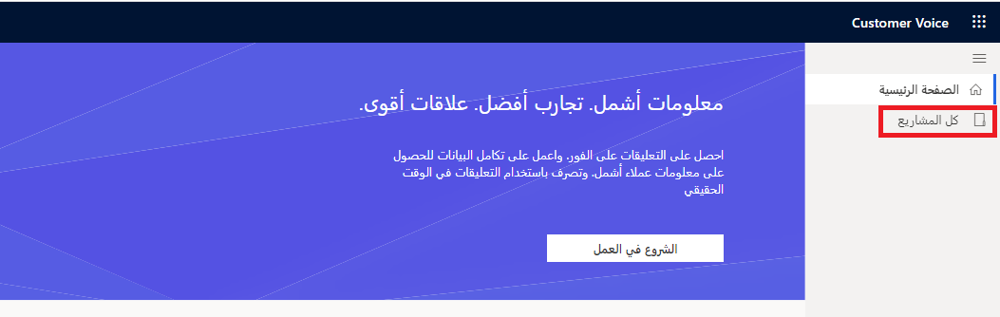](../media/all-projects.png#lightbox)

1.  مرر المؤشر فوق مشروع **الدعم** الذي تم إنشاؤه في المهمة 1 وحدد علامة الحذف (**...**) التي تظهر.

    > [!div class="mx-imgBorder"]
    > [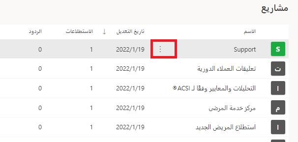](../media/projects.png#lightbox)

1.  من القائمة، حدد الخيار **نسخ**.

    > [!div class="mx-imgBorder"]
    > [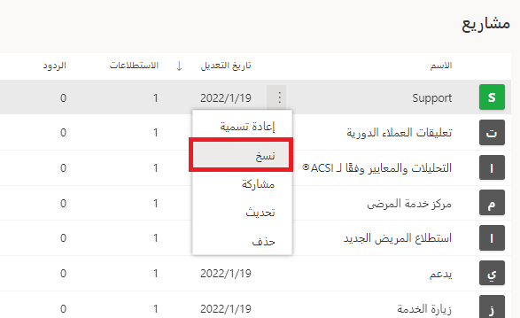](../media/copy-projects.png#lightbox)

1.  في النافذة **نسخ إلى**، حدد موقعًا جديدًا من قائمة **جميع المشروعات**. إذا لم يكن لديك موقع آخر، فيمكنك استخدام **الموقع الحالي**، مما سيؤدي إلى إنشاء نسخة في نفس الموقع حيث يتوفر المشروع في الوقت الحالي.
    حدد الزر **نسخ** للمتابعة.

    > [!div class="mx-imgBorder"]
    > [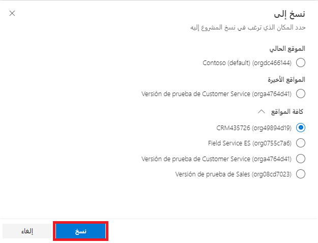](../media/copy-wizard.png#lightbox)

1.  سيظهر إعلام في الزاوية العلوية اليمنى في Customer Voice يشير إلى أنه يجري نسخ المشروع.

    > [!div class="mx-imgBorder"]
    > [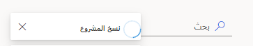](../media/copying-project.png#lightbox)

    بعد اكتمال عملية النسخ، سيظهر إعلام في الزاوية العلوية اليمنى في Customer Voice يشير إلى اكتمال عملية النسخ.

    > [!div class="mx-imgBorder"]
    > [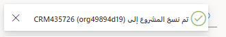](../media/project-copied.png#lightbox)

    سيظهر الآن مشروعك الأصلي والإصدار المنسوخ في قائمة جميع المشروعات.

    > [!div class="mx-imgBorder"]
    > [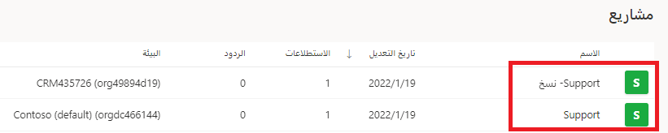](../media/projects-support.png#lightbox)

1.  مرر المؤشر فوق مشروع **الدعم - نسخ** وحدد علامة الحذف لفتح القائمة.

    > [!div class="mx-imgBorder"]
    > [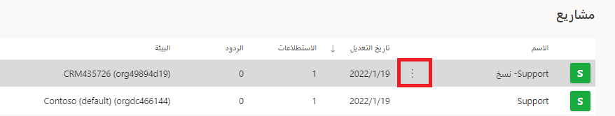](../media/support-copy-project.png#lightbox)

1.  حدد **إعادة تسمية**.

    > [!div class="mx-imgBorder"]
    > [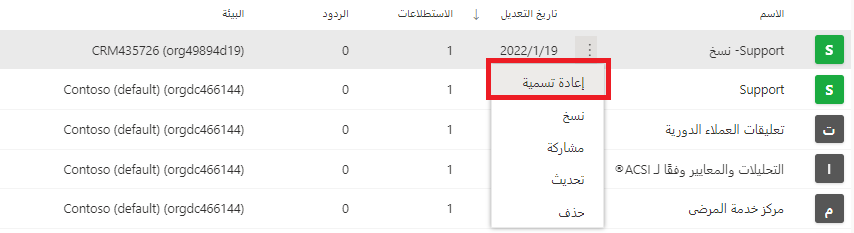](../media/rename-support-copy.png#lightbox)

1.  قم بإعادة تسمية المشروع إلى **الدعم المتميز** ثم حدد الزر **إعادة تسمية**.

    > [!div class="mx-imgBorder"]
    > [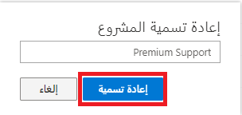](../media/rename-project.png#lightbox)

    ستُعاد تسمية المشروع وسيكون الاسم الجديد مرئياً على المشروع ضمن قائمة **جميع المشروعات**.

    > [!div class="mx-imgBorder"]
    > [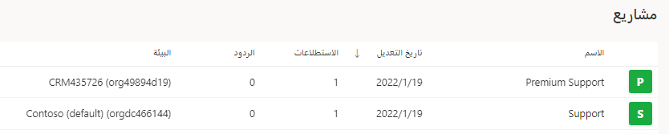](../media/projects-premium-support.png#lightbox)

## المهمة 3: مشاركة مشروع

في هذه المهمة، ستشارك المشروع الذي تم إنشاؤه في المهمة 1 مع مستخدم آخر داخل بيئتك.

1.  من الصفحة الرئيسية في Dynamics 365 Customer Voice، حدد **جميع المشروعات**.

    > [!div class="mx-imgBorder"]
    > 

1.  حدد اسم مشروع **الدعم** الذي تم إنشاؤه في المهمة 1 من هذا التمرين.

    > [!div class="mx-imgBorder"]
    > [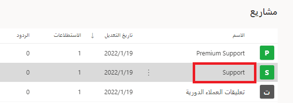](../media/support.png#lightbox)

1.  في الزاوية اليمنى العليا في المشروع، حدد الخيار **مشاركة**.

    > [!div class="mx-imgBorder"]
    > 

1.  في المربع **مشاركة مع**، ابدأ بكتابة اسم مستخدم آخر داخل بيئتك. يجب أن يظهر اسمه كمستخدم مقترح.

    > [!div class="mx-imgBorder"]
    > [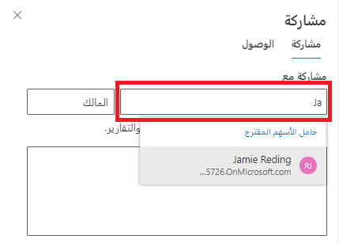](../media/share-user.png#lightbox)

1.  حدد اسم المستخدم.

    > [!div class="mx-imgBorder"]
    > [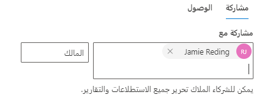](../media/share.png#lightbox)

1.  أضف النص التالي في حقل الرسالة: **لقد شاركت هذا المشروع معك. يُرجى المراجعة وإخباري إذا كان لديك أي أسئلة.**

    > [!div class="mx-imgBorder"]
    > [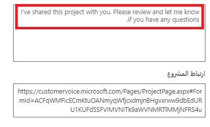](../media/text-message-share.png#lightbox)

1.  حدد الزر **مشاركة** لإكمال عملية مشاركة المشروع مع المستخدم.

    > [!div class="mx-imgBorder"]
    > [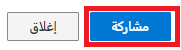](../media/share-button.png#lightbox)

1.  سيظهر إعلام عند مشاركة المشروع بنجاح.

    > [!div class="mx-imgBorder"]
    > [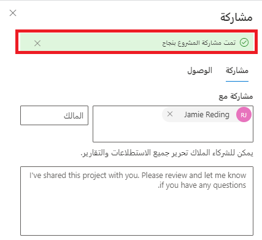](../media/project-shared-successfully.png#lightbox)

1.  إذا كان لديك حق الوصول إلى صندوق البريد الإلكتروني الخاص بالمستخدم الذي شاركت المشروع معه، فيجب أن ترى بريدًا إلكترونيًا تم إنشاؤه تلقائيًا بواسطة Customer Voice كإعلام بمشاركة المشروع معه.

    > [!div class="mx-imgBorder"]
    > [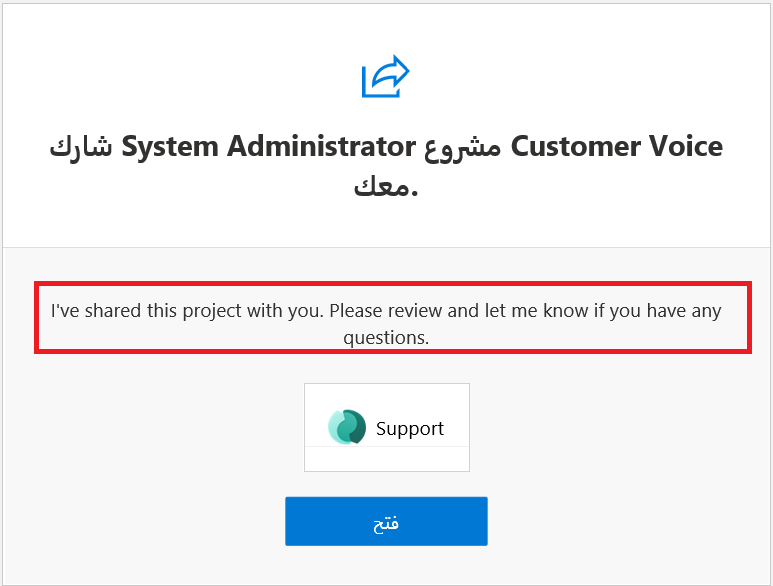](../media/shared-customer-project.png#lightbox)

1. في الزاوية اليمنى العليا من المشروع، حدد الخيار **مشاركة**.

    > [!div class="mx-imgBorder"]
    > 

1. حدد علامة التبويب **الوصول** من اللوحة **مشاركة**.

    > [!div class="mx-imgBorder"]
    > [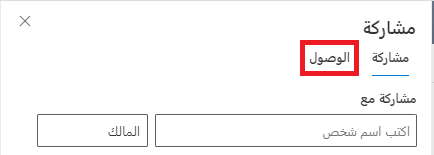](../media/access.png#lightbox)

يجب عرض اسم المستخدم الذي شاركت المشروع معه. يمكن أن تستغرق هذه العملية بضع دقائق للتحديث، لذلك إذا لم يكن المستخدم مدرجًا، فانتظر وقم بالتحديث، ثم حاول مرة أخرى.

> [!div class="mx-imgBorder"]
> [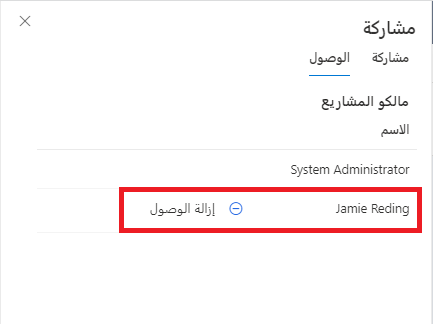](../media/remove-access.png#lightbox)
    
