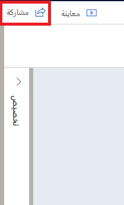

في هذا التمرين، ستقوم بإنشاء مشروع جديد في Customer Voice، ثم تنشئ نسخه منه لبيئة أخرى. وأخيراً، ستشارك مشروعك مع مستخدم آخر.

> [!IMPORTANT]
> يمكن إكمال هذا التمرين في بيئة تجريبية أو بيئة اختبار معزولة. ستحتاج إلى بيئتين على الأقل لإكمال المهمة 2 ومستخدم آخر على الأقل في بيئتك لإكمال المهمة 3.

## المهمة 1: إنشاء مشروع جديد

في هذه المهمة، ستقوم بإنشاء مشروع جديد باستخدام قالب مشروع الدعم في Dynamics 365 Customer Voice.

1.  انتقل إلى [Dynamics 365 Customer Voice](https://customervoice.microsoft.com/?azure-portal=true) وسجّل الدخول باستخدام بيانات اعتمادك.

1.  حدّد **الشروع في العمل**.

    > [!div class="mx-imgBorder"]
    > 

1.  حدد قالب **الدعم** من قائمة خيارات قوالب المشاريع المتوفرة.

    > [!div class="mx-imgBorder"]
    > 

1.  حدد زر **التالي** من أسفل الشاشة.

    > [!div class="mx-imgBorder"]
    > 

1.  حدد **عرض جميع البيئات**.

    > [!div class="mx-imgBorder"]
    > 

1.  حدد إحدى البيئات التي يمكنك الوصول إليها من القائمة. 
    بعد عرض الرسالة **تم منح الإذن**، حدد الزر **تحديد وإغلاق** في أسفل يسار الشاشة.

    > [!div class="mx-imgBorder"]
    > 

1.  حدد الزر **إنشاء**.

    > [!div class="mx-imgBorder"]
    > 

1.  اكتمل المشروع الآن، وسيتم عرض استطلاع **تعليقات خدمة العملاء** من قالب مشروع الدعم.

## المهمة 2: نسخ مشروع إلى بيئة أخرى

في هذه المهمة، ستقوم بنسخ المشروع الذي تم إنشاؤه في المهمة 1 إلى بيئة مختلفة في Dynamics 365 Customer Voice.

1.  من الشاشة الرئيسية المنتقل إليها في Dynamics 365 Customer Voice، حدد **كافة المشاريع**.

    > [!div class="mx-imgBorder"]
    > 

1.  مرر مؤشر الماوس فوق مشروع **الدعم** الذي تم إنشاؤه في المهمة 1 وحدد علامة القطع (ثلاث نقاط) التي تظهر.

    > [!div class="mx-imgBorder"]
    > 

1.  من القائمة، حدد الخيار **نسخ**.

    > [!div class="mx-imgBorder"]
    > 

1.  في النافذة **نسخ إلى**، حدد موقعاً جديداً من قائمة "كافة المواقع‬". إذا لم يكن لديك موقع آخر، فيمكنك استخدام الموقع الحالي، مما سيؤدي إلى إنشاء نسخة في نفس الموقع حيث يوجد المشروع في الوقت الحالي. 
    حدد الزر **نسخ** للمتابعة.

    > [!div class="mx-imgBorder"]
    > 

1.  سيظهر إعلام في الجزء العلوي الأيسر في Customer Voice يشير إلى أن نسخ المشروع جارٍ.

    > [!div class="mx-imgBorder"]
    > 

1.  عند اكتمال النسخ، سيظهر إعلام في الجزء العلوي الأيسر في Customer Voice يشير إلى اكتمال نسخ المشروع.

    > [!div class="mx-imgBorder"]
    > 

1.  سترى الآن مشروعك الأصلي والإصدار المنسوخ في قائمة كافة المشاريع.

    > [!div class="mx-imgBorder"]
    > 

1.  مرر مؤشر الماوس فوق مشروع **الدعم - نسخ** وحدد علامة القطع لفتح القائمة.

    > [!div class="mx-imgBorder"]
    > 

1.  حدد إعادة تسمية.

    > [!div class="mx-imgBorder"]
    > 

1.  غيّر تسمية المشروع إلى **الدعم المميز**. ثم حدد الزر الأزرق **إعادة تسمية**.

    > [!div class="mx-imgBorder"]
    > 

1.  ستُعاد تسمية المشروع وسيكون الاسم الجديد مرئياً على المشروع ضمن قائمة كافة المشاريع.

    > [!div class="mx-imgBorder"]
    > 

## المهمة 3: مشاركة مشروع

في هذه المهمة، ستشارك المشروع الذي تم إنشاؤه في المهمة 1 مع مستخدم آخر في بيئتك.

1.  من الشاشة الرئيسية المنتقل إليها في Dynamics 365 Customer Voice، حدد كافة المشاريع.

    > [!div class="mx-imgBorder"]
    > 

1.  حدد اسم مشروع **الدعم** الذي تم إنشاؤه في المهمة 1 من هذا التمرين.

    > [!div class="mx-imgBorder"]
    > 

1.  حدد الخيار "مشاركة" من أعلى يسار المشروع.

    > [!div class="mx-imgBorder"]
    > 

1.  في المربع **مشاركة مع**، ابدأ بكتابة اسم مستخدم آخر داخل بيئتك. يجب أن يظهر كمستخدم مقترح.

    > [!div class="mx-imgBorder"]
    > 

1.  حدد اسمه لتحديده.

    > [!div class="mx-imgBorder"]
    > 

1.  أضف النص التالي في حقل الرسالة: **لقد شاركت هذا المشروع معك. يُرجى المراجعة وإخباري إذا كان لديك أي أسئلة.**

    > [!div class="mx-imgBorder"]
    > 

1.  حدد الزر **مشاركة** لإكمال عملية مشاركة المشروع مع المستخدم.

    > [!div class="mx-imgBorder"]
    > 

1.  سيظهر إعلام بمجرد مشاركة المشروع بنجاح.

    > [!div class="mx-imgBorder"]
    > 

1.  إذا كان لديك حق الوصول إلى صندوق البريد الإلكتروني الخاص بالمستخدم الذي شاركت المشروع معه، فيجب أن ترى بريداً إلكترونياً تم إنشاؤه تلقائياً بواسطة Customer Voice كإعلام بمشاركة المشروع معه.

    > [!div class="mx-imgBorder"]
    > 

1. حدد الخيار "مشاركة" من أعلى يسار المشروع.

    > [!div class="mx-imgBorder"]
    > 

1. حدد علامة التبويب "وصول" من لوحة المشاركة.

    > [!div class="mx-imgBorder"]
    > 

1.  من المفترض أن يؤدي ذلك الآن إلى عرض اسم المستخدم الذي شاركت المشروع معه. قد يستغرق تحديث ذلك دقائق قليلة، لذا إذا لم يكن المستخدم مدرجاً، فانتظر وقم بالتحديث ثم حاول مرة أخرى.

    > [!div class="mx-imgBorder"]
    > 
    