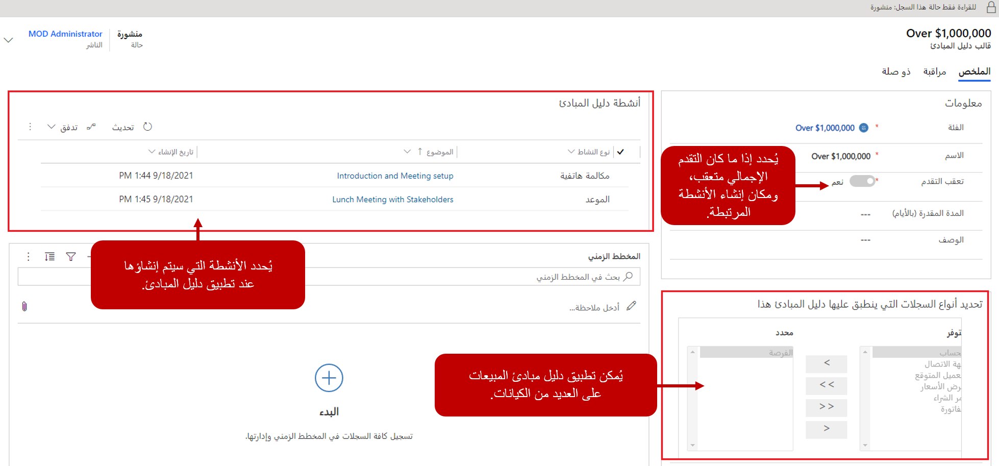
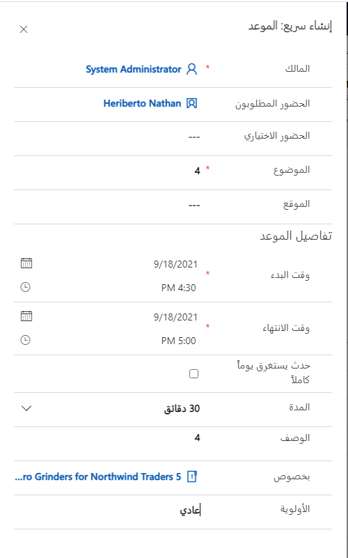
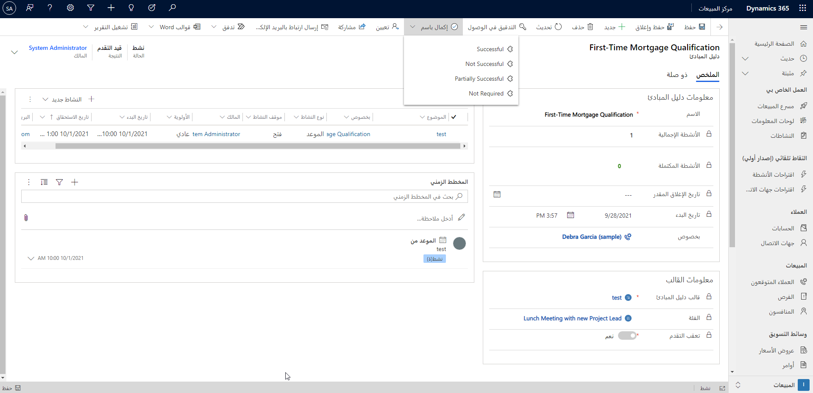

معظم مؤسسات المبيعات التي تحظى بمعدلات ربح مرتفعة تحقق ذلك بسبب خطط واستراتيجيات التعامل مع السيناريوهات المختلفة التي يحتمل حدوثها. على سبيل المثال، لنفترض أننا أوشكنا على بلوغ منتصف دورة المبيعات، عندما قرر بطلنا مغادرة الشركة. إذا لم يتم التصرف مع هذا الأمر ومعالجته بشكل صحيح، فقد يعرض عملية البيع بأكملها للخطر. قد تتضمن معالجة المشكلة عدة عناصر مثل:

- تحديد بديل للموظف الذي غادر.
- التعاون مع الموظف الجديد وتسهيل عملية تقديمه.

يشار غالبًا إلى خطة التعامل مع هذه الأحداث على أنها دليل مبادئ. يستطيع Microsoft Dynamics 365 Salesإنشاء أدلة مبادئ للمبيعات من خلال التطبيق. توفر أدلة المبادئ في Dynamics 365 Sales إرشادات لأعضاء الفريق بشأن الإجراءات التي يجب اتخاذها لأحداث مثل عدم تلقي الميزانية المتوقعة. كما يمكن كذلك أن تقوم بتنظيم وأتمتة المهام والاستجابات لأحداث خارجية. على سبيل المثال، يمكن أن يقوم دليل المبادئ بأتمتة خطوات تجديد العقود أو يمكنه تحديد الأنشطة التي يجب على عضو الفريق تنفيذها إذا قام عضو آخر في الفريق يعمل على إتمام الصفقة بمغادرة المؤسسة.

باستخدام أدلة المبادئ في Microsoft Dynamics365، تستطيع المؤسسات تنفيذ الآتي:

- تحديد مجموعة من المهام والأنشطة بهدف تنفيذها تلقائياً عند تشغيل دليل المبادئ.
- الاحتفاظ بالمكتبة القابلة للبحث والتي يمكن تشغيلها بسهولة في سيناريوهات معينة.
- تعقب الحالة وتقدم تشغيل أدلة المبادئ مقابل نتائجها، لتحديد ما إذا كانت ناجحة أم لا.

وتمت إضافة دورين جديدين للأمان إلى Dynamics 365 بهدف دعم أدلة المبادئ.

- **مدير دليل المبادئ:** يستطيع إنشاء قوالب دليل مبادئ لتشغيلها مقابل أنواع سجلات مختلفة في Dynamics 365.
- **مستخدم دليل المبادئ:** يستطيع بدء تشغيل قوالب دليل المبادئ التي تم إنشاؤها مقابل السجلات.

## إنشاء قوالب دليل المبادئ وإدارتها

قالب دليل المبادئ يحدد المهام والعناصر الأخرى التي سيتم تطبيقها عند تشغيل القالب مقابل سجل فردي. ويحدد تفاصيل مثل الأنشطة المطلوب تنفيذها والمخططات الزمنية لوقت تنفيذ هذه الأنشطة وكيفيه تعقب تلك الأنشطة. يمكن إنشاء أدلة المبادئ باستخدام إعدادات التطبيق في مركز المبيعات. بالإضافة إلى تحديد تفاصيل القالب، تتمكن المؤسسات من تحديد فئات دليل المبادئ للمساعدة على تجميع أدلة المبادئ مع بعضها لسهولة تحديد الموقع والتنفيذ. يجب إدراج التفاصيل الآتية في كل دليل مبادئ تم إنشاؤه:

- **فئة**: تربط القالب بالفئة التي تريد إنشاء قالب دليل مبادئ لها.
- **الاسم:** الاسم الذي سيتم استخدامه عند تطبيق القالب.
- **تعقب التقدم:** حدد ما إذا كنت تريد تعقب تقدم دليل المبادئ بإنشاء أنشطة ضمن دليل المبادئ.
- **المدة المقدرة** أدخل المدة المقدرة بالأيام للإشارة إلى الوقت الذي قد يستغرقه اكتمال قالب دليل المبادئ بمجرد تشغيله.

## استخدام دليل مبادئ 

> [!VIDEO https://www.microsoft.com/videoplayer/embed/RE2NFzA]

## تعقب التقدم

يتم تعقب الأنشطة التي تم إنشاؤها بواسطة دليل مبادئ بشكلٍ مختلف اعتمادًا على ما إذا كنت ستقوم بتحديد **تعقب التقدم**. يعتبر هذا الأمر ضروريًا ليس فقط لأنه يحدد ما إذا كان يتم قياس التقدم العام لدليل المبادئ، ولكن أيضًا لأنه يؤثر مباشرة في السجلات في Dynamics 365 التي يتم إنشاء الأنشطة من أجلها ومكان عرضها. على سبيل المثال، إذا كان لديك قالب تم إنشاؤه لفرصة وقمت بتعيين تعقب التقدم إلى **نعم**، فستكون جميع أنشطة دليل المبادئ التي تم إنشاؤها ضمن دليل المبادئ الذي تم تشغيله من سجل الفرصة بالتسلسل الهرمي الآتي: **سجل الفرصة** \> **سجل دليل المبادئ** \> **الأنشطة**. إذا قمت بتعيين هذا إلى **لا**، فسيتم إنشاء أنشطة دليل المبادئ مباشرة أسفل سجل الفرص في التسلسل الهرمي الآتي: **سجل الفرص** \> **الأنشطة**.

بمجرد حفظ قالب دليل المبادئ للمرة الأولى، يمكنك تحديد السجلات التي سيتم تطبيقه عليه. على سبيل المثال، قد يتم استخدام التغيير في دليل مبادئ القيادة فقط لسجلات الفرص، حيث قد يتم ربط الشخص الذي يركز على التأهيل بجدول العميل المتوقع.

اعتبارًا من منشور هذا المحتوى التعليمي، كانت أدلة المبادئ متاحة في الجداول الآتية فقط:

- عميل متوقع
- عرض أسعار
- الفرصة
- الأمر
- الفاتورة

يمكن تعيين دليل المبادئ إلى جداول متعددة إذا لزم الأمر. سيكون للتغيير في القيادة نفس التأثير في عرض الأسعار مثل الفرصة، لذلك سيكون من المفيد توفيره لكلا الجدولين.

## إضافة الأنشطة

أحد الأهداف الأساسية لدليل مبادئ المبيعات هو أتمتة إنشاء الأنشطة اللازمة للتعامل مع سيناريو محدد. من المهم تذكر أن التوقيت الذي يتم فيه تنفيذ هذه الأنشطة يمكن أن يكون مهمًا أيضًا. على سبيل المثال ، إذا ترك أحد حملة الأسهم الأساسيين مؤسسة، فإنه يتم الاتصال بالمؤسسة لتحديد الاستبدال الذي يجب أن يحدث في أسرع وقت ممكن. يجب عقد اجتماع وجهًا لوجه في غضون يومين. ويساعد تحديد هذه الأطر الزمنية في أثناء إنشاء الأنشطة على توفير تعقب تقدم أكثر دقة لدليل المبادئ بشكل عام.

يمكن إضافة الأنشطة من قسم أنشطة دليل المبادئ من خلال تحديد زر **إضافة نشاط**. نشاط دليل المبادئ يمكن أن يكون مهمة أو مكالمة هاتفية أو موعد.

في نموذج الإنشاء السريع للنشاط، ستحتاج إلى المعلومات الآتية:

- **الموضوع:** اكتب وصفًا قصيرًا حول الهدف من النشاط.
- **الوصف:** اكتب معلومات إضافية لوصف نشاط دليل المبادئ.
- **تاريخ الاستحقاق النسبي (بالأيام):** أدخل عدد الأيام التي يستحق بعدها النشاط. يتم احتساب عدد الأيام من تاريخ بدء دليل المبادئ. يتوفر هذا العمود فقط لأنشطة المهمة والمكالمة الهاتفية.
- **وقت الاستحقاق النسبي (بالساعات):** أدخل الوقت الذي يستحق بعده النشاط.
- **تاريخ البدء النسبي (بالأيام):** أدخل عدد الأيام التي يجب أن يبدأ بعدها النشاط. يكون هذا التاريخ نسبيًا عند بدء تشغيل دليل المبادئ.
- **وقت البدء النسبي:** أدخل الوقت الذي يجب أن يبدأ فيه النشاط خلال اليوم.
- **تاريخ الانتهاء النسبي (بالأيام):** أدخل عدد الأيام التي يجب أن ينتهي بعدها النشاط. يكون هذا التاريخ نسبيًا عند بدء تشغيل دليل المبادئ.
- **وقت الانتهاء النسبي:** أدخل الوقت الذي يجب أن ينتهي فيه النشاط خلال اليوم.
- **المدة:** إذا كنت تقوم بإنشاء مهمة أو مكالمة هاتفيه، فحدد مدة نشاط المهمة أو المكالمة الهاتفية.
- **الأولوية:** حدد أولوية النشاط.

بمجرد تحديد كافة الأنشطة الضرورية لدليل المبادئ، يجب عليك نشرها بهدف توفيرها للمستخدمين. يجب أن يحتوي قالب دليل المبادئ على نشاط واحد على الأقل وأن يكون مقترنًا بنوع سجل واحد على الأقل قبل أن يمكن نشره. يمكن نشر أدلة المبادئ بتحديد زر "نشر" من شريط الأوامر. وبمجرد نشر قالب دليل المبادئ، يكون متاحًا للقراءة فقط ولا يمكن تحريره. لإجراء تغييرات على قالب دليل مبادئ منشور، حدد الزر "مراجعة" من شريط الأوامر.

## تطبيق أدلة المبادئ

لضمان الاتساق في إجراءات العمل أو لمعرفة الخطوات التي يجب اتباعها في سيناريوهات أو أحداث معينة، اعتمد على أدلة المبادئ التي أعدها مديريك والتي ترشدك بالإجراءات التي يمكنك اتخاذها. يمكن أن تحتوي أدلة المبادئ أيضًا على أفضل الممارسات استنادًا إلى الممارسات التي نفذتها في مواقف مشابهة من قبل.

عند تحديد سيناريو حيث يجب استخدام دليل مبادئ، انتقل إلى السجل الذي تريد تشغيل دليل المبادئ منه. على سبيل المثال، إذا كنت في منتصف تطوير إحدى الفرص لعميل عندما يقوم راعي المشروع بالمغادرة، ستحتاج إلى بدء دليل المبادئ من سجل الفرصة.

يتم تشغيل أدلة المبادئ من شريط الأوامر عن طريق تحديد **تشغيل دليل مبادئ**. تظهر كافة قوالب دليل المبادئ المتوفرة لهذا الجدول. حدد القالب الذي تريد استخدامه وحدد "تشغيل". ستتلقى إخطارًا يفيد بنجاح تشغيل دليل المبادئ. عند تشغيل دليل المبادئ، يتم إنشاء كافة الأنشطة المرتبطة به تلقائياً وتظهر في المخطط الزمني للسجل.

> [!NOTE]
> يظهر زر "تشغيل دليل المبادئ" فقط في الجدول عندما يوجد ما لا يقل عن قالب دليل مبادئ منشور واحد لهذا الجدول. إذا لم تشاهد هذا الزر، فمن المحتمل ألا يكون هناك أي قالب دليل مبادئ منشور.

## تعقب أنشطة دليل المبادئ

عند إكمال كافة الأنشطة التي تم إنشاؤها لدليل المبادئ، يجب وضع علامة على دليل المبادئ تفيد بأنه مكتمل. يساعدك ذلك على معرفة مدى نجاح دليل المبادئ من عدمه.

لوضع علامة على دليل المبادئ تفيد بأنه مكتمل، انتقل إلى السجل الذي قمت بتشغيل دليل المبادئ منه (سجل الاستدعاء). في المثال الذي نتناوله، هذا هو سجل العميل المتوقع.

في سجل دليل المبادئ، في شريط الأوامر، حدد **مكتمل كـ**، ثم حدد أحد النتائج الآتية:

- ناجح
- غير ناجح
- ناجح جزئيًا
- غير مطلوب

في هذه الصورة، يمكنك رؤية عدد الأنشطة المكتملة والحالات قيد الانتظار قبل أن تتمكن من وضع علامة تفيد بأنه مكتمل. يمكنك أيضًا الاطلاع على وقت الأنشطة المرتبطة بدليل المبادئ هذا.
