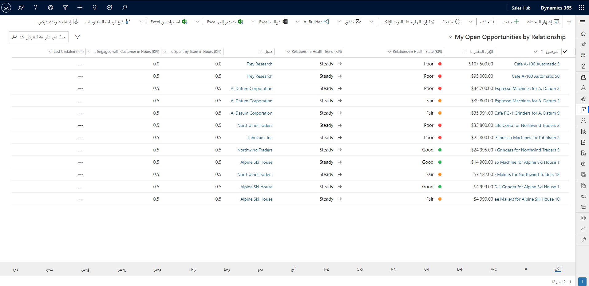
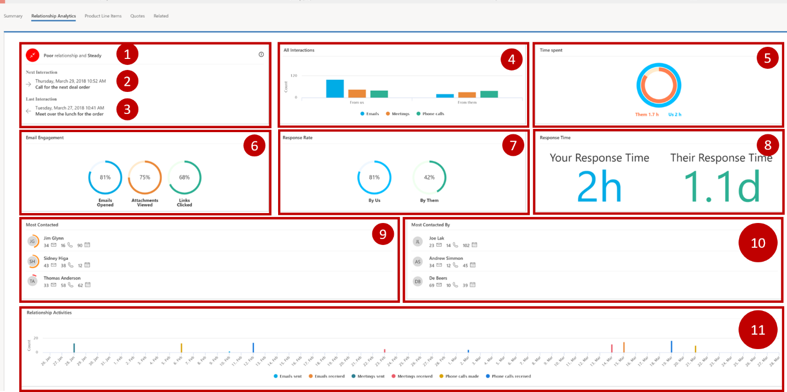
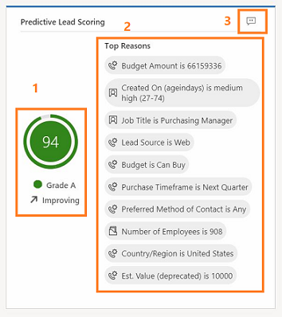
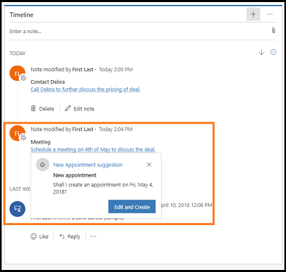
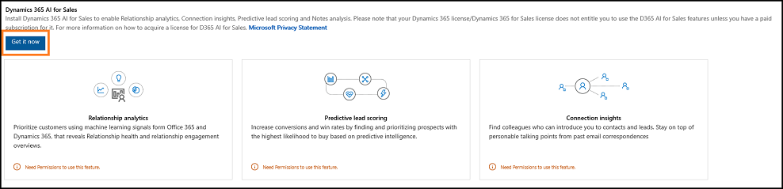
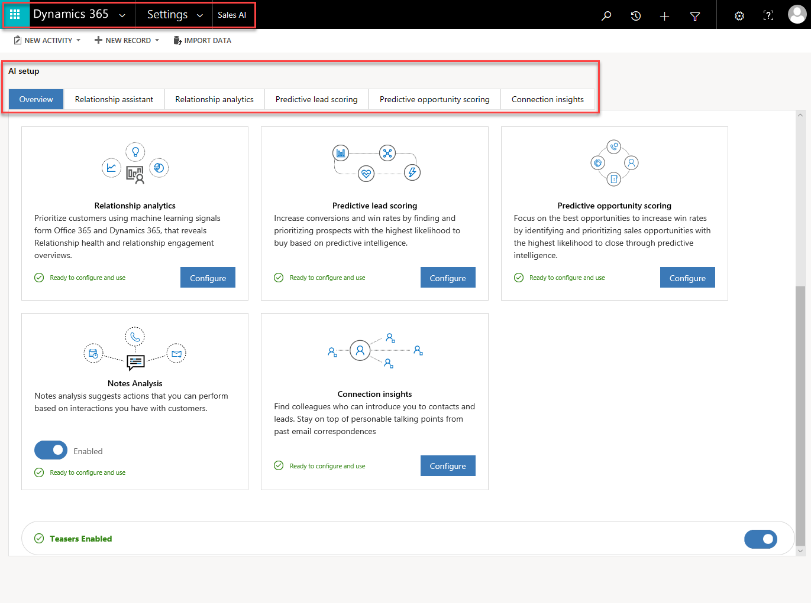
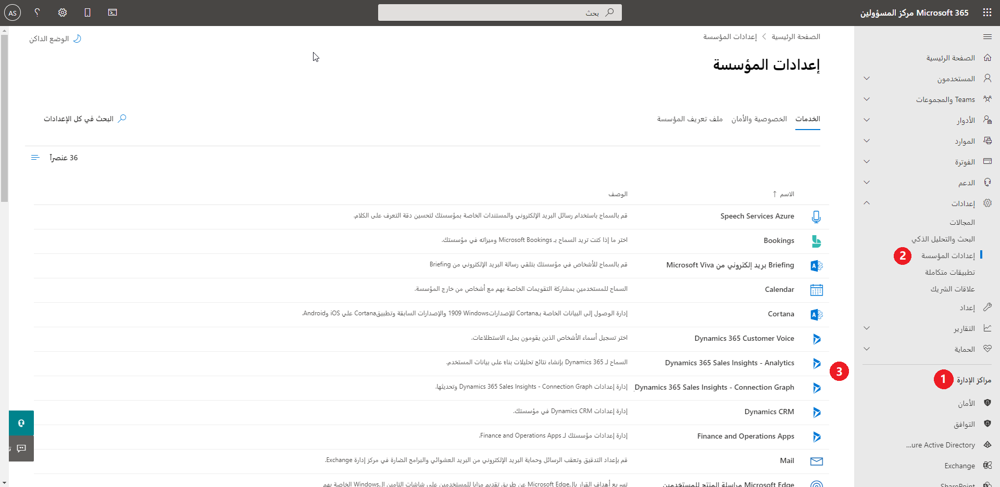
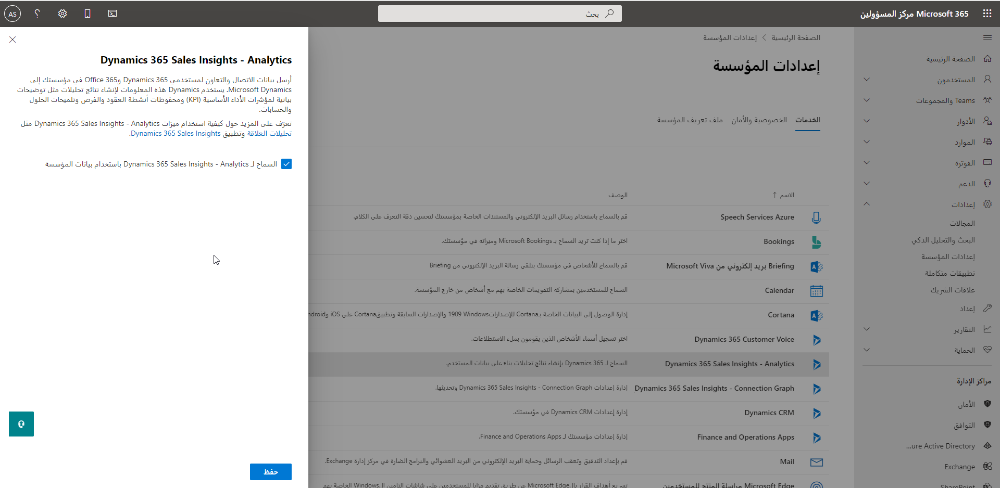

هل علاقتك جيدة بعملائك؟ قد تفاجئك إجابات العملاء عن هذا السؤال. في حين أنك قد تعتقد أن علاقتك بهم جيدة، قد يكون للعملاء رأي مختلف. هناك العديد من العوامل التي يمكن ان تؤثر في العلاقة مع العميل. هل تتواصل معهم في دورات المبيعات فقط؟ ما مدى سرعة عودتك إليهم؟ ما مدى سرعة عودتهم إليك؟ Dynamics 365 AI for Sales يتضمن العديد من الميزات التي يمكنها المساعدة على بناء تلك العلاقات والمحافظة عليها.

وإحدى الميزات الأساسية هي تحليلات العلاقة. وتقوم تحليلات العلاقة بفحص جميع الاتصالات التي تقوم بإجرائها مع عميلك، وكذلك الاتصالات التي يُجريها عميلك معك. وتفحص عدد رسائل البريد الإلكتروني والمواعيد والمكالمات الهاتفية والأنشطة الأخرى التي بدأها فريق المبيعات وأعضاء فريق العميل.

## تحليلات العلاقات

توفر تحليلات العلاقة سجل النشاط ومؤشرات الأداء الأساسية (KPIs) ودرجة السلامة واتجاهها لسجلات جهة الاتصال والفرصة والعميل المتوقع والحساب. تم عرض مؤشرات الأداء الأساسية الأكثر أهمية، مثل الأنشطة السابقة والتالية، في طريقة عرض القائمة لكل نوع من أنواع السجلات هذه بحيث يمكنك الحصول على نظرة عامة وفرز القائمة وفقًا لها.

تساعد تحليلات العلاقة موظفي ومديري المبيعات على الإجابة عن أسئلة مثل:

- هل علاقتنا جيدة بالعميل؟
- ما مقدار الوقت الذي قضيناه مع العميل؟
- متى كانت آخر مرة اتصلنا به؟
- متى ستكون المرة القادمة التي سنتصل فيها به؟
- كم عدد رسائل البريد الإلكتروني والاجتماعات التي تبادلناها؟
- ما هو معدل استجابة العميل؟
- ما عدد الأنشطة التي بدأها العميل؟
- ما المدة التي يستغرقها الفريق للرد؟
- ما الفرص التي يجب أن أقضي وقتي في العمل عليها؟

عند عرض سجل عميل أو فرصة، يمكنك مشاهدة التحليلات الكاملة للسجلات الفردية، بما في ذلك الرسوم البيانية ومؤشرات الأداء الأساسية وسجل التفاعل عبر البريد الإلكتروني وسجل النشاط بالكامل وسلامة العلاقة.

1. **سلامة العلاقة واتجاهها:** تعرض سلامة العلاقة مع العميل بصفة عامة ويشمل ذلك الاتجاه الأخير.
2. **التفاعل التالي:** يعرض تاريخ ووقت النشاط التالي الذي تمت جدولته للسجل. إذا توفر لك حق الوصول إلى ذلك النشاط، فستشاهد أيضاً اسمه أو موضوعه. ولا يتم عرض التفاعلات التالية والأخيرة إلا لجداول الفرص والعملاء المتوقعين.
3. **التفاعل الأخير:** يعرض تاريخ آخر نشاط أكملته للسجل ووقته. إذا توفر لك حق الوصول إلى ذلك النشاط، فستشاهد أيضاً اسمه أو موضوعه. ولا يتم عرض التفاعلات التالية والأخيرة إلا لجداول الفرص والعملاء المتوقعين.
4. **جميع التفاعلات:** تعرض إجمالي عدد الأنشطة التي بدأها أعضاء فريقك والتي بدأها العميل. يتم تقسيم الأنشطة حسب النوع العام، مثل بريد إلكتروني واجتماعات ومكالمات هاتفية.
5. **الوقت المستغرق:** يعرض المقدار النسبي للوقت المستغرق في أنشطة ذات صلة بالسجل، بما في ذلك فريقك والعميل. لكل نشاط شارك فيه أكثر من عضو في الفريق، يتم ضرب الوقت الذي يقضيه في هذا النشاط في عدد أعضاء فريقك الذين قاموا بالمشاركة. لكن يتم احتساب الوقت الذي قضاه العميل مرة واحدة فقط، حتى عند مشاركة أكثر من عضو واحد من فريق العميل.
6. **‏‫مشاركة البريد الإلكتروني:‬** يلخص كيف يتفاعل العميل مع رسائل البريد الإلكتروني الخاضعة للمتابعة التي أرسلها إليه فريقك. لا يتم تضمين رسائل البريد الإلكتروني غير الخاضعة للمراقبة، لذلك يجب تمكين ميزة مشاركة البريد الإلكتروني واستخدامها لمشاهدة أي معلومات هنا.
7. **معدل الاستجابة:** يوفر تفاصيل حول نسبة الاستجابة حسب فريقك وفريقه.
8. **وقت الاستجابة:** يوفر تفاصيل حول متوسط وقت الاستجابة من جانب فريقك وفريقه.
9. **‏‫الأكثر اتصالاً:** يوفر إحصاءات حول أعضاء فريقك الذين اتصلوا بالعملاء مرات أكثر. قد تتضمن جهات الاتصال هذه مستخدمي Dynamics 365 الذين يشاركون بشكل كبير مع العملاء حتى لو لم يكونوا جزءًا من مستخدمي السجل.
10. **‏‫الأكثر اتصالاً بواسطة:** يوفر إحصاءات حول أعضاء فريقك الذين اتصلوا بالعملاء مرات أكثر. قد تشمل جهات الاتصال هذه العملاء الذين يتعاملون مع فريقك كثيرًا، حتى إذا لم يكونوا جزءًا من مستخدمي السجل.
11. **أنشطة العلاقة** - يوفر نظرة تفصيلية على الأنشطة عبر 90 يومًا، مقسمة حسب التاريخ ونوع النشاط، مثل رسائل البريد الإلكتروني المرسلة، ورسائل البريد الإلكتروني المستلمة، والاجتماعات المرسلة، والاجتماعات المستلمة، والمكالمات الهاتفية التي تم إجراؤها، والمكالمات الهاتفية المستلمة.

## نقاط العميل المتوقع التنبؤية

يقوم هذا النموذج بتعيين درجة بين 0 و100 للعملاء المتوقعين استنادًا إلى الإشارات الواردة من العملاء المتوقعين والجداول المرتبطة مثل جهة الاتصال والحساب. وباستخدام هذه الدرجات، يمكن تحديد العملاء المتوقعين وتحديد أولوياتهم ذات الفرص الأكثر للتحويل إلى فرص المبيعات.

على سبيل المثال، لنفترض أن لديك عميلين متوقعين في البنية الأساسية لبرنامج ربط العمليات التجارية: العميل المتوقع "أ" و العميل المتوقع "ب". يقوم نموذج نقاط العميل المتوقع بتطبيق النتيجة 80 للعميل المتوقع "أ" و 50 للعميل المتوقع "ب". وبالنظر إلى النقاط، يمكنك التنبؤ بأن العميل المتوقع "أ" يتمتع بالمزيد من الفرص للتحويل إلى فرصة ويمكنك الاستفادة منها. كما يمكنك تحليل سبب ضعف درجة العميل "ب" عن طريق النظر إلى الأسباب الرئيسية التي تؤثر في الدرجة وتحديد ما إذا كان سيتم تحسين هذه الدرجة.

في النماذج، يمكنك استخدام عنصر واجهة مستخدم "درجة العميل المتوقع" للاطلاع على أهم 10 أسباب تؤثر في الدرجة. ومصدر هذه الأسباب هو سمات العميل المتوقع والسمات الخاصة بالجداول المرتبطة. يساعدك ذلك على تحليل العميل المتوقع والعمل عليه لتحسين النقاط وتحويلها إلى فرصة محتملة.

تعرض الشاشة الآتية عنصر واجهة مستخدم "نقطة عميل متوقع" نموذجي مع الأسباب التي تؤثر في نقاط العميل المتوقع.

- **المعلومات الأساسية:** تعرض المعلومات الأساسية للعميل المتوقع مثل نقاط العميل المتوقع ودرجة العميل المتوقع واتجاه نقاط العميل المتوقع، لمساعدتك على تجنب العودة إلى طريقه العرض "‏‫عملائي المتوقعين المفتوحين المسجلة نقاطهم‬" للاطلاع على المعلومات الأساسية.
- **أهم الأسباب:** تعرض قائمة الأسباب التي تؤثر في نقاط العميل المتوقع. يساعدك ذلك على تحليل العميل المتوقع والتفكير في تحويل إلى فرصة. يمكنك كذلك اتباع الإجراءات اللازمة لتحسين نقاط العميل المتوقع، مثل إعداد الاجتماعات وعمليات المتابعة.
- **التعليقات:** تعرض التعليقات التي قام المستخدم بتوفيرها لعميل متوقع. يمكنك تغيير التعليقات باستخدام نقاط العميل المتوقع المناسبة. لتقديم تعليقات، حدد أيقونة "دردشة" وأدخل النقاط والتعليقات المتوقعة. لحفظ التعليقات، حدد "إرسال".

> [!IMPORTANT]
> يجب أن يكون لديك ما لا يقل عن 100 عميل متوقع مؤهل و1,000 عميل متوقع غير مؤهل لإنشاء نموذج.

## نقاط الفرصة التنبؤية

يقوم هذا النموذج بتعيين درجة بين 0 و100 للفرص استنادًا إلى الإشارات الواردة من الفرص والجداول المرتبطة مثل جهة الاتصال والحساب. وباستخدام هذه النقاط، يمكن تحديد الفرص وتحديد أولوياتها ذات الاحتمالية الأكبر في التحويل إلى فرص المبيعات‬.

على سبيل المثال، لنفترض أن لديك فرصتين في البنية الأساسية لبرنامج ربط العمليات التجارية: الفرصة "أ" والفرصة "ب". يقوم نموذج نقاط الفرصة بتطبيق النتيجة 75 للفرصة "أ" و 55 للفرصة "ب". وبالنظر إلى النقاط، يمكنك التنبؤ بأن الفرصة "أ" تحظى بالمزيد من الفرص لتحويلها إلى فرصة ويمكنك الاستفادة منها. كما يمكنك تحليل سبب ضعف درجة الفرصة "ب" عن طريق النظر إلى الأسباب الرئيسية التي تؤثر في الدرجة وتحديد كيف سيتم تحسين هذه الدرجة.

> [!IMPORTANT] 
> يجب أن يكون لديك ما لا يقل عن 400 فرصة مؤهلة و600 فرصة غير مؤهلة لإنشاء نموذج.

## تحليلات الملاحظات

يتوفر ‏‫عنصر تحكم المخطط الزمني‬ في نماذج جهات الاتصال والفرص والعملاء المتوقعين والحسابات والحالات.

عند حفظ ملاحظة، يتم تمييز النص الموجود في الملاحظة، وعند تحديدها، يتم عرض الاقتراحات. تتضمن هذه الاقتراحات: إنشاء أنشطة ومهام وجهات اتصال واجتماعات وطلبات محتويات والكشف عن الإصدارات.

على سبيل المثال، قمت بإنشاء ملاحظه "قم بمقابلة العميل في 4 مايو في 4:00 مساء". عند تحديد هذا النص، يوفر Dynamics 365 اقتراحًا تلقائياً لإنشاء موعد.

عندما يكون لديك اقتراحات متعددة مقترنة بملاحظه، يقوم Dynamics 365 بعرض جميع الاقتراحات. يمكنك اتخاذ إجراء في الوقت المناسب وفقًا لمتطلباتك. على سبيل المثال، لقد قمت بإنشاء ملاحظة للاتصال بالعميل فيما يتعلق بالتسعير وتحديد موعد اجتماع لمزيد من المناقشة حول الصفقة. تعرض الملاحظة اقتراحات لإنشاء موعد وجدولة مكالمة هاتفية.

## معلومات الاتصال

يتم احتساب علاقات "من يعرف من" من المراسلات وأنماط التعاون الخاصة بالمستخدمين في بيئة Microsoft Exchange لديك. تساعدك هذه البيانات على توصيلك بالمستخدمين الآخرين داخل بيئة Microsoft Exchange التي يمكنها المساعدة على تسهيل الاتصال. يمكن الاستعلام عن جهات الاتصال أو العملاء المتوقعين من خارج مؤسسة Microsoft Exchange، وفي بعض الحالات، يمكن أيضًا الاستعلام عن المستخدمين الداخليين في مؤسسة Microsoft Exchange. على سبيل المثال، يكون ذلك ممكنًا في حالة قيام مستخدم داخل مؤسسة Microsoft Exchange بإضافة عنوان بريد إلكتروني داخلي لمستخدم إلى دفتر عناوين Microsoft Exchange.

تتوفر "من يعرف من" في نماذج جهات الاتصال والعملاء المتوقعين. عند فتح نموذج عميل متوقع أو جهة اتصال وتحديد طريقة العرض Sales Insights، يتم عرض الإطار المتجانب "من يعرف من".

## نقاط الحوار

تعرض نقاط الحوار أحدث المراسلات لكل موضوع في الإطار المتجانب. على سبيل المثال، لقد تلقيت رسالة بريد إلكتروني حول مباراة بيسبول أمس وتلقيت رسالة بريد إلكتروني أخرى اليوم حول كرة القدم. يتم تحديث موضوع الرياضة في نقاط الحوار بالبريد الذي تلقيته حول كرة القدم.

## التكوين

يساعدك تمكين ميزات Dynamics 365 AI for Sales وتكوينها على استخدام Dynamics 365 AI for Sales بطريقة فعالة. Dynamics 365 AI for Sales يشمل الميزات الآتية:

- تحليلات العلاقات
- نقاط العميل المتوقع التنبؤية
- نقاط الفرصة التنبؤية
- تحليل الملاحظات
- نقاط الحوار
- من يعرف من

## المتطلبات الأساسية

- يجب شراء ترخيص Dynamics 365 AI for Sales لاستخدام ميزات Dynamics 365 AI for Sales.
- يجب أن تكون مسؤول Dynamics 365.
- يجب تكوين خادم Exchange للبريد الإلكتروني وتمكين صندوق البريد باستخدام تكوينات "البريد الإلكتروني" في "الإعدادات".
- إذا كنت تريد استخدام بيانات LinkedIn لتحليلات العلاقة، فتحقق من تثبيت حل LinkedIn في Dynamics 365 Sales وتمكين إعادة الكتابة من LinkedIn Sales Navigator.

## تمكين ميزات Dynamics 365 AI for Sales

ينبغي أن يحق لك الوصول إلى **إعدادات Dynamics 365** و **إعدادات Dynamics 365** \> **وخدماته ووظائفه الإضافية**.

## إعدادات Dynamics 365

تحتاج إلى أذونات مسؤول Dynamics 365 لتمكين Dynamics 365 AI for Sales.

يوجد الذكاء الاصطناعي للمبيعات ضمن الإعدادات في Dynamics 365.

حدد زر **احصل عليه الآن** الذي يمكن رؤيته أدناه.

قدِّم موافقة على كل صورة أدناه.

## إعدادات Microsoft 365

تحتاج إلى أذونات مسؤول Microsoft 365 لتمكين وظائف Microsoft 365 الإضافية من أجل Dynamics 365 AI for Sales.

لتكوين الرسم البياني والتحليلات الخاصين بالاتصال في Dynamics 365 AI for Sales، اتبع هذه الخطوات:

1. الانتقال إلى مركز "المسؤول".

    

2. حدد **الإعدادات \> الخدمات والوظائف الإضافية**.
3. توجد وظيفتين إضافيتين يمكنك تنشيطهما للسماح باستخدام المعلومات الخاصة بـ Microsoft 365 في Dynamics 365:

    - Dynamics 365 AI for Sales- الرسم البياني للاتصال
    - Dynamics 365 AI for Sales – التحليلات

    يمكن تشغيل الوظيفتين الإضافيتين.

    

4. اختياري: إذا كنت لا ترغب في تجميع معلومات حول أي مجموعة من المستخدمين في مؤسستك، فقم بإضافة معرف المجموعة في مربع النص.

للحصول على تحديثات ومزيد من المعلومات، راجع [تمكين إمكانات Dynamics 365 AI for Sales وتكوينها من أجل البائعين](/dynamics365/ai/sales/prereq-sales-insights-app).
