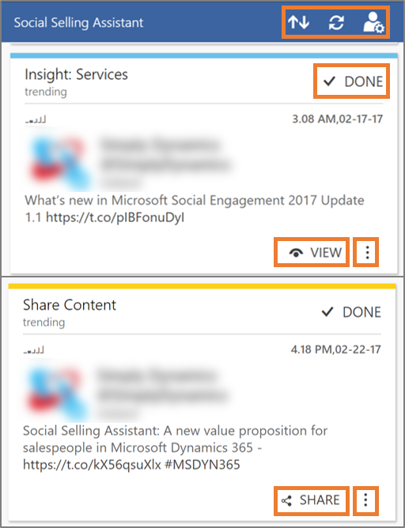
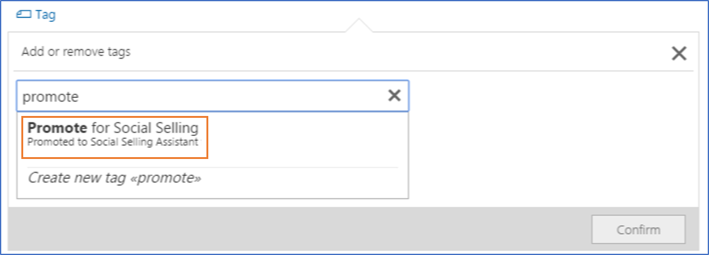

مع Microsoft Dynamics 365 Sales - يُمكِّن Social Selling Assistant موظفي وفرق المبيعات من البيع أكثر من خلال الاستفادة من وسائل التواصل الاجتماعي بتوصيات ذكية مخصصة وقابلة للتنفيذ.

غالبا ما تتأثر قرارات الشراء بالمعلومات المتوفرة على الإنترنت وتزداد انتشاراً على وسائل التواصل الاجتماعي. يستطيع مندوبو المبيعات البيع أكثر من خلال الاستفادة من وسائل التواصل الاجتماعي. ولفعل ذلك، يجب أن يكونوا قادة فكر وأن يزيدوا من حضورهم الاجتماعي بالمشاركة في المناقشات عن منتجاتهم أو خدماتهم. يمكّن Social Selling Assistant مندوبي المبيعات من بيع المزيد عن طريق اكتساب الثقة وتوسيع شبكة العلاقات والتواصل عبر وسائل التواصل الاجتماعي.

كل ما تحتاجه بضع دقائق يومياً لمواصلة المحادثات وتوسيع شبكتك. بغض النظر عن الجهاز ومكان العمل، ستحصل دائماً على المعلومات المطلوبة بين يديك. مع تسخير إمكانات التعلم الآلي، يقدم Social Selling Assistant توصيات ذكية ومخصصة للمحتوى القابل للمشاركة بناءً على البيانات الاجتماعية التي جُمِعت باستخدام Microsoft Social Engagement.

وبصفتك مندوب مبيعات، يساعدك Social Selling Assistant على فعل ما يلي:

- **كسب الثقة:** شارك المعرفة وشارك في المحادثات الاجتماعية لتكون من قادة الفكر.
- **تنمية شبكتك:** ابحث عن شركات وأشخاص جدد وتواصل معهم لزيادة جهات الاتصال والحصول على عملاء متوقعين جدد.
- **التواصل:** استمر في متابعة جميع أصحاب المصلحة لتبقى على اطلاع بآخر التطورات.

## تثبيت الحل

يجب أن يكون لديك من يقوم بدوري الأمان مسؤول النظام أو مخصِّص النظام في Dynamics 365 Sales لتنفيذ الإعداد. انتقل إلى **AppSource** واحصل على Social Selling Assistant وثبّته باستخدام بيانات الاعتماد. أضف عنوان URL لـ Customer Engagement في مؤسستك إذا لزم الأمر.

توصيل Dynamics 365 Sales مع Microsoft Social Engagement من [Power Apps](https://make.powerapps.com/). كجزء من عمليه التثبيت، يتم تثبيت **لوحة معلومات Social Selling Assistant** المتوفرة حالياً فقط في الواجهة التقليدية.

يجب تكوين Microsoft Social Engagement للتعرف على المحتوى الذي امتلكته شركتك. إضافة إلى ذلك، يُمكنك مشاركة ملفات التعريف في وسائل التواصل الاجتماعي مع المستخدمين الآخرين وتكوين العلامات التي تساعد على ترقية منشور معين لمستخدمي Social Selling Assistant.

يُمكنك تخصيص Social Selling Assistant باختيار موضوعات البحث المتعلقة بك وبإضافة ملفات تعريف وسائل التواصل الاجتماعي. يُمكنك مشاركة ملفات التعريف طوعاً لتمكين المستخدمين الآخرين في مؤسستك من النشر نيابة عنك.

بعد تخصيص Social Selling Assistant لحالة الاستخدام الفردية، يُمكنك البدء في استخدامه لاكتشاف المشاركات التي تهم جمهورك ومشاركتها.

يُعد **المشاركة** هو الاجراء الرئيسي للتوصيات حسب إعدادات تخصيص "مشاركة المحتوى". لديك إمكانيه الاختيار من ملفات التعريف في وسائل التواصل الاجتماعي ومشاركة الرابط مع المنشور المحدد.

يُعد **العرض** هو الاجراء الرئيسي للتوصيات حسب إعدادات تخصيص "الحصول على تحليلات". ويفتح تفاصيل المنشور ويظهر معلومات إضافية. مزيد من المعلومات: [انشر وتفاعل مع المنشورات](/dynamics365/customer-engagement/social-engagement/publish-react-posts).

يشير النقر فوق **تم** إلى أنك لا تخطط لأي إجراء إضافي في هذا المنشور. سوف يُزال من قائمه النشر في Social Selling Assistant. يوفر **المزيد من الإجراءات** خيارات إضافية للعمل مع هذا المنشور مثل الإشارة إلى إذا لم تكن مهتما أو تبدأ إعادة التغريد.

## أنواع التوصية

هناك أربعه أنواع من التوصيات في Social Selling Assistant. قد تتطابق المنشورات في تغذية المساعد مع أكثر من نوع واحد. تُرتَّب المنشورات افتراضياً على النحو التالي.

- **تم الترقية:** يمكن للمستخدمين الموجودين في Microsoft Social Engagement أصحاب الأدوار المناسبة (مثال، إدارة المجتمعات) ترقيه المنشورات في Social Selling Assistant بوضع علامة عليها في Social Engagement. فكّر في الأمر على أنه اختيار محرر تم بعناية. إذا تطابق منشور تم الترويج له مع مشاركة المحتوى والتحليلات، فسوف يُعرض لمشاركة المحتوى. وبخلاف ذلك، سوف يتم إظهاره للتحليلات.
- **مملوكة:** منشورات من ملفات التعريف التي تمتلكها مؤسستك. ترقب الإعلانات الإخبارية المهمة وساعد في نشرها. نوع التوصية غير متوفر حالياً للتحليلات.
- **المتداول:** المنشورات الرائجة المطابقة لموضوعات البحث المحددة. عادةً ما تُنشر هذه المنشورات أكثر من غيرها.
- **موصى به:** تبحث خوارزمية التعلم الآلي المخصصة في المنشورات التي تشاركها والتي لا تهتم بها. وبمرور الوقت سوف يتكيف وينقح توصياته بناءً على أنماط استخدامك الشخصية.

## ترويج منشور لـ Social Selling Assistant

عندما يتم تكوين علامة للترويج لمنشور في Social Selling Assistant، يمكنك إضافة هذه العلامة إلى أي منشور ترغب في الترويج له في Social Selling Assistant.

لمزيد من المعلومات، راجع [دمج Social Engagement مع Dynamics 365 من أجل تطبيقات Customer Engagement](/dynamics365/customer-engagement/social-engagement/integrate-social-engagement-dynamics-365).
