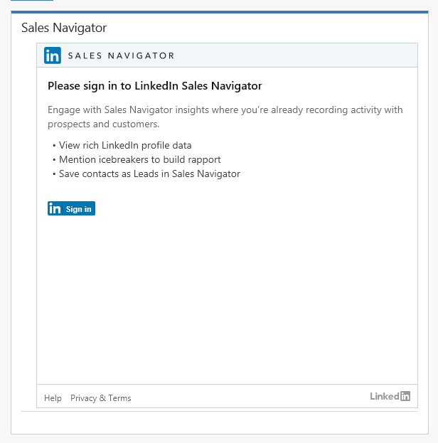
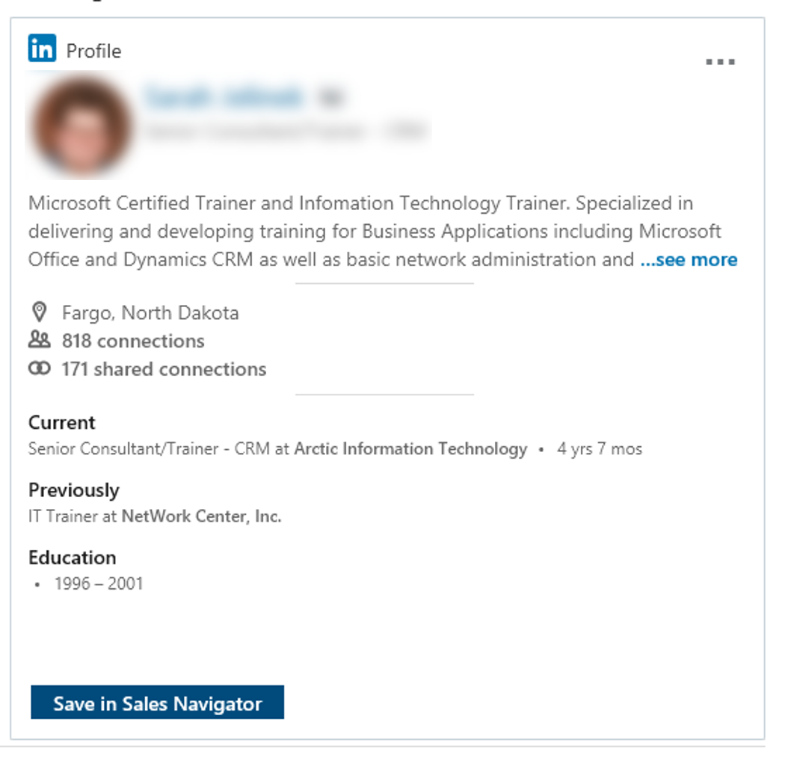
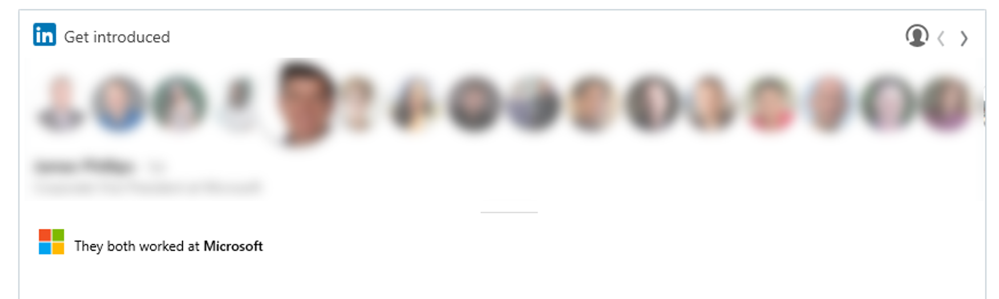
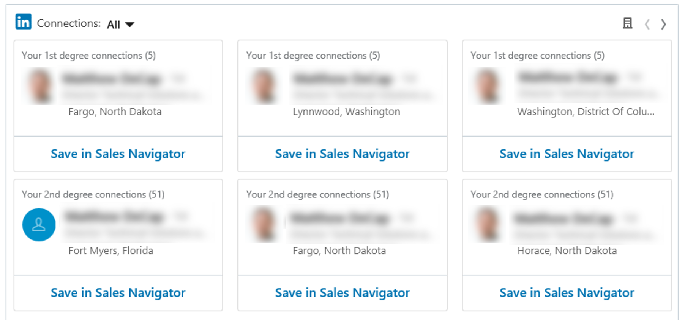

LinkedIn Sales Navigator عبارة عن أداة يمكن لموظفي المبيعات استخدامها لتعزيز الجانب الاجتماعي لمبيعاتهم. يمكنك إضافة Sales Navigator إلى تنفيذ Dynamics 365 Sales من أحد التطبيقات من خلال AppSource. يوفر التطبيق العديد من عناصر واجهة مستخدم التي يمكنك وضعها على نماذج مختلفة متعلقة بالمبيعات. توفر عناصر واجهة المستخدم هذه نظرة ثاقبة لمساعدة sales professional على إجراء اتصالات أفضل تلبي توقعاتهم.

يحتوي LinkedIn Sales Navigator على العديد من الأدوات التي يمكنك استخدامها لإشراك المشترين المحتملين مع المحتوى الشخصي وتسهيل المقدمات معهم. يتطلب الأمر الحصول على اشتراك إضافي أهم من اشتراكك في Dynamics 365. يتعين على كل مستخدم سيستفيد من خاصية LinkedIn Sales Navigator في Dynamics 365 أن يكون مستخدماً في كلا التطبيقين ويجب أن يحصل على المصادقة باستخدام ملف تعريف LinkedIn لديك.

> [!IMPORTANT]
> حتى بعد إجراء اتصال بـ Dynamics 365 Sales، فإن LinkedIn Sales Navigator لا يعد مصدر بيانات لـ Dynamics. استناداً إلى اتفاقيات المستخدم، تظل البيانات داخل LinkedIn. يعتمد الاستثناء الوحيد لذلك على التفاعلات التي تستخدم أدوات المراسلة من LinkedIn حيث يمكن مزامنتها عبر كلا النظامين.

## عناصر واجهة المستخدم المتوفرة

يمكن وضع عناصر واجهة المستخدم في النماذج باستخدام عناصر التحكم المخصصة. يظهر جزء من خاصية Sales Navigator في Dynamics 365. عند إضافة عناصر واجهة المستخدم هذه إلى النماذج، يجب مراعاة مقدار التأثير على جميع المستخدمين. على سبيل المثال، عند إضافة عنصر واجهة مستخدم إلى نموذج جهة الاتصال الرئيسي الافتراضي، سيتمكن جميع المستخدمين من الاطلاع على عنصر واجهة المستخدم. ومع ذلك، لن يتمكن سوى المستخدمون المرخصون لكلا المنتجين من المصادقة. سيتمكن مستخدمون آخرون من الاطلاع على طلب بيانات الاعتماد ببساطة. يمكنك التخفيف من ذلك عن طريق إضافة أدوار أمان إلى النماذج والاحتفاظ بنموذج واحد لمستخدمي Sales Navigator مع تخصيص نموذج آخر لغير مستخدمي Sales Navigator.

يتوفر العديد من عناصر واجهة المستخدم المختلفة المتوفرة استناداً إلى الجدول المحدد الذي ترغب في العمل عليه.

بالنسبة إلى جهات الاتصال أو سجلات الأشخاص، فسيتوفر لديك عناصر واجهة المستخدم التالية:

- البطاقة العليا
- الأخبار (كاسحات الجليد)
- الاتصالات (التقديم)
- العملاء المتوقعين ذو الصلة

بالنسبة للحسابات أو الشركات، فسيتوفر لديك عناصر واجهة المستخدم التالية:

- البطاقة العليا
- الأخبار (كاسحات الجليد)
- الاتصالات (التقديم)
- العملاء المتوقعين الموصى بهم

## أمثلة على عناصر واجهة المستخدم:

**بطاقة جهة الاتصال العليا**

**اتصالات جهة الاتصال (التقديم)**

**حساب العملاء المتوقعين الموصى بهم**

## مزامنة الأنشطة

باستخدام ترخيص الفرق المناسب، تتم مزامنة الأنشطة الواردة من LinkedIn مع سجلات Dynamics. تتم إضافة الأنشطة المخصصة لـ InMails والرسائل إلى سجل جهة الاتصال ذي الصلة. واعتباراً من بدء هذا المستند، لا يمكن أن تأتي الأنشطة إلا من أنشطة LinkedIn، كما لا تبدأ في Dynamics.

بالإضافة إلى عناصر واجهة المستخدم هذه المتوفرة للاستخدام، يوجد تطبيق Sales Navigator يستهدف تجربة الويب الكلاسيكية. تعد محتويات عناصر واجهة المستخدم هي نفسها، ولكنها مجتمعة في عنصر تحكم واحد مخصص لكل من الأشخاص والشركات.
