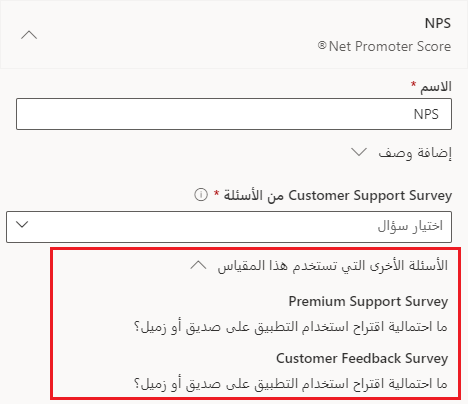

توفر مقاييس الرضا لمحة عامة عالية المستوى عن مدى رضا العملاء. يمكنك عرض كل استجابة استطلاع على حدة لمراجعة الإجابات والنص المقدم. يمكن أن تستغرق هذه العملية وقتاً طويلاً، حيث تقوم بالتمرير خلال كل إجابة وفتحها على حدة. سيؤدي استخدام مقاييس الرضا إلى تبسيط عملية عرض، على مستوى عالٍ، نوع التعليقات التي يتم تقديمها.

Dynamics 365 Customer Voice يوفر ثلاثة مقاييس قياسية للرضا يمكنك إعدادها.
يتم شرح مقاييس الرضا المخصصة لاحقاً في هذه الوحدة.

- **Net Promoter Score ‏(NPS)** - مقياس لقياس ولاء العملاء. يتم حساب النتيجة من السؤال من نوع NPS باستخدام مقياس من 0 إلى 10. يتم تجميع المستجيبين على النحو التالي:

  - **المنتقدون** - حصلوا على نتيجة من 0 إلى 6.

  - **السلبيات** - أعطت درجة 7 أو 8.

  - **المروّجون** - حصلوا على نقاط 9 أو 10.

- **التوجه** - مقياس لتحديد معنويات العميل تجاه منتج أو خدمة. ستجمع المشاعر الردود على الأسئلة النصية على أنها إيجابية أو سلبية أو محايدة.

- **رضا العملاء (CSAT)** - مقياس لقياس مستوى الرضا عن منتج أو خدمة. إنه مرتبط بالإجابات لأسئلة نوع التصنيف. يتم حساب درجة CSAT على مقياس من 1 إلى 5. إذا قمت بإنشاء سؤال على مقياس بخلاف 1 إلى 5، فسيتم تسوية درجة CSAT وفقاً للمقياس من 1 إلى 5.

> [!div class="mx-imgBorder"]
> 

إذا أنشأت مشروعاً من قالب، فقد تكون هناك عدة مقاييس موجودة بالفعل. على الرغم من إضافة المقاييس من مستوى الاستطلاع، إلا أنها مدرجة كجزء من المشروع بأكمله. يمكنك إضافة ما يصل إلى 10 مقاييس إلى المشروع. ضع هذا العامل في الاعتبار عند التخطيط لمشروع ما والنظر في عدد المقاييس التي تحتاج إلى تتبعها وعدد الاستطلاعات التي تحتاج إلى إضافتها إلى المشروع. لإضافة مقاييس الرضا، افتح قائمة التخصيص من داخل استطلاع، ثم حدد الخيار **مقاييس الرضا**.

سيتم ملء اسم المقياس باسم افتراضي بناءً على نوع المقياس الذي تم اختياره، ولكن يمكنك تغيير هذا الاسم كما هو مطلوب. يمكنك إضافة وصف قد يساعد المستخدمين الآخرين على فهم الغرض منه. بعد اختيار نوع المقياس، ستتمكن فقط من تحديد الأسئلة التي تتوافق مع هذا النوع من المقاييس.
لذلك، إذا تم اختيار Net Promoter Score كنوع جديد من المقياس المراد إضافته، فستظهر فقط الأسئلة التي هي عبارة عن سؤال Net Promoter Score في قائمة أسئلة الاستطلاع لتعيينها إليها.

> [!div class="mx-imgBorder"]
> 

بعد إضافة مقياس الرضا إلى المشروع، على الرغم من إضافته من استطلاع معين، يمكنك إضافته من استطلاع آخر إذا لزم الأمر. بدلاً من إضافة مقياس آخر من نفس النوع، يمكنك اختيار مقياس موجود.
على سبيل المثال، يمكن ربط مشروع به ثلاثة استطلاعات تتضمن سؤال Net Promoter Score بنفس المقياس.
حدد المقياس الحالي من القائمة، ثم اختر السؤال الصحيح لتعيينه إليه. سيعرض القسم السفلي من المقياس الأسئلة الأخرى التي تم تعيينها له من الاستطلاعات الأخرى.

> [!div class="mx-imgBorder"]
> 
