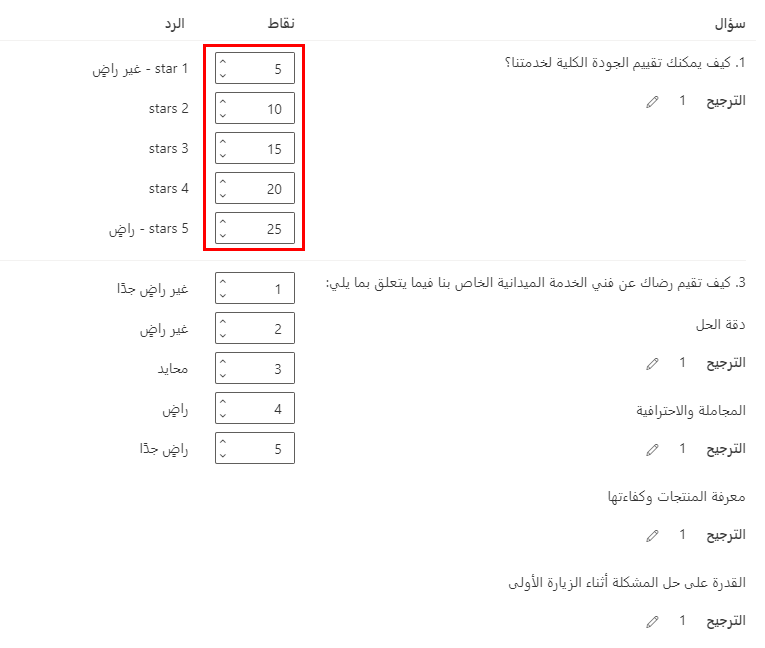

يعد استخدام مقاييس الرضا طريقة فعالة للحصول على نظرة عامة عالية المستوى على جميع الاستجابات لأحد المشروعات والاستطلاعات الفردية ذات الصلة في Dynamics 365 Customer Voice. يعد إعداد مقاييس Net Promoter Score والتوجه و‏‫رضا العميل (CSAT) أمراً بسيطاً.
ومع ذلك، إذا كنت تحتاج إلى شيء أكثر تعقيداً وترغب في فهم مدى إيجابية الردود من وجهة نظر عامة، يمكنك تطبيق تسجيل النقاط المخصص. يمكنك تحقيق النقاط عن طريق تعيين قيم نقاط محددة لخيارات إجابة محددة، استناداً إلى نوع الأسئلة التي يتم طرحها في الاستطلاع. 

استخدم أنواع الأسئلة التالية كجزء من مقياس نقاط مخصص:

- Net Promoter Score (NPS)

- التصنيف (الرقم والنجمة والابتسامة)

- سؤال الاختيار المفرد (زر الخيار والقائمة المنسدلة)

- Likert

لإنشاء مقياس نقاط مخصص، افتح استطلاعاً في Dynamics 365 Customer Voice ثم افتح القائمة تخصيص من الجانب الأيمن. حدد **مقاييس مستوى الرضا** ثم أضف مقياس نقاط مخصص. يجب تسمية المقياس، لذا تأكد من أن هذا الاسم منطقي لمساعدة المستخدمين الآخرين على فهم الغرض. بالإضافة إلى ذلك، يمكنك تقديم وصف لمشاركة مزيد من التفاصيل. ستتوفر أنواع الأسئلة المذكورة سابقاً في قائمة منسدلة. حدد أي أسئلة يجب تضمينها لتكوين النتيجة الإجمالية للاستطلاع.

> [!div class="mx-imgBorder"]
> 

سيؤدي تحديد الخيار **تحرير النتائج** إلى فتح لوحة مختلفة، حيث يمكنك إعداد العديد من المكونات التي ستحدد كيفية حساب النقاط.
مجموع النقاط الأساسي هو العدد الإجمالي للنقاط المحتملة التي يمكن تخصيصها لاستجابة الاستطلاع الخاص بالقياس. تتضمن القائمة المنسدلة **مجوع النقاط الأساسي** خيارات لقاعدة من 5 أو 10 أو 100 نقطة.
القيمة الافتراضية هي **10**، ولكن يمكنك تغيير هذا الرقم ليتوافق مع متطلبات المؤسسة لهذا المقياس.

> [!div class="mx-imgBorder"]
> 

يتم تعيين وزن لكل سؤال، وهو ما يسمح لك بقياس أهمية سؤال واحد على أنه أعلى من الأسئلة الأخرى أو أقل منها.
والنتيجة النهائية هي المتوسط ​​المرجح للأسئلة ضمن مقياس النقاط المخصص. الوزن الافتراضي المخصص هو **1**، ولكن يمكنك زيادة هذا الرقم إلى **2** أو **3** على سؤال للإشارة إلى أنه أعلى أهمية. كلما زاد الوزن المحدد، زادت الأهمية.

> [!div class="mx-imgBorder"]
> 

عدد النقاط الذي يظهر لكل استجابة هو القيمة التي يجب تعيينها لمختلف الخيارات المتاحة لسؤال معين. لا يمكن تعيين أكثر من 100 نقطة لأي إجابة واحدة. يتم حساب النقاط الخاصة بإجابة إجابة السؤال بضرب الوزن بقيمة النقطة الموحدة. تتم إضافة جميع نتائج إجابات السؤال لإنشاء نقاط على مستوى الاستطلاع. إذا أجاب أحد المستجيبين على جميع الأسئلة ذات المستوى الأعلى من النقاط الممنوحة للإجابات التي قدموها، فسيصلون إلى أعلى درجة أساسية ممكنة. سيتم تعيين نقاط معينة محسوبة للاستجابات الأخرى.

يساعدك تسجيل النقاط المخصص على إنشاء مقاييس الرضا التي ستوفر مقاييس فريدة وخاصة بالمؤسسة على مستوى المشروع والاستطلاع كما هو مطلوب. يمكن أن يكون مقياس النقاط المخصص بسيطاً أو تم إعداده لتلبية مزيداً من المتطلبات الأكثر تعقيداً.
