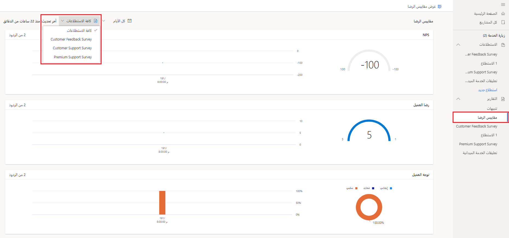
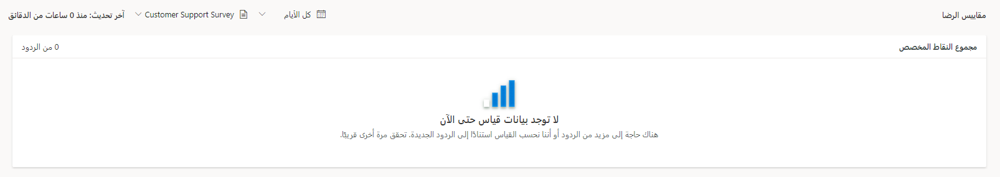
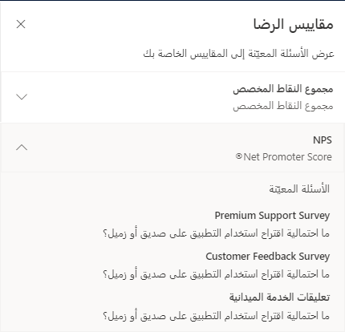

بعد إعداد جميع مقاييس الرضا المطلوبة لمشروع معين، يمكنك مشاركة أي استطلاعات في المشروع مع العملاء أو العملاء المتوقعين لبدء جمع التعليقات. عندما تعود الردود على الاستطلاع إلى Dynamics 365 Customer Voice، يمكنك الوصول إلى تفاصيل كل رد في تقرير الردود على الاستطلاع المناظر. يمكنك العثور على التقارير في قسم **التقارير** الخاص بالمشروع ذي الصلة.

سيتم عرض مقاييس الرضا في مكان واحد في المشروع. يمكنك الوصول إلى لوحة معلومات **مقاييس الرضا** من منطقة **التقارير**. بشكل افتراضي، تعرض لوحة المعلومات بيانات لجميع الاستطلاعات داخل المشروع. يؤدي تحديد القائمة المنسدلة **كافة الاستطلاعات‬** إلى السماح للمستخدم بتبديل طريقة العرض إلى تقرير مختلف لاستطلاع معين بدلاً من المشروع بأكمله. يسمح لك عنصر تحكم التقويم بتصفية البيانات لجميع الأيام أو آخر سبعة أيام أو آخر 28 يوماً أو آخر 90 يوماً، أو نطاق تاريخ مخصص.

> [!div class="mx-imgBorder"]
> 

يظهر كل مقياس مع رسوم مرئية للمخطط:

-   **Net Promoter Score** - يُظهر مخطط عدّاد مجموعة نقاط المقياس.
    يعرض المخطط المساحي الموجود إلى يمين مخطط العدّاد اتجاه Net Promoter Score للفترة الزمنية المحددة.

-   **التوجه** - يعرض مخطط دائري توزيع التوجه الإيجابي والحيادي والسلبي. يعرض المخطط العمودي المكدس إلى يمين المخطط الدائري توزيع التوجه الإيجابي والحيادي والسلبي للفترة الزمنية المحددة.

-   **CSAT** - يُظهر مخطط عدّاد مجموعة نقاط المقياس. يعرض المخطط المساحي الموجود إلى يمين مخطط العدّاد اتجاه نقاط CSAT للفترة الزمنية المحددة.

-   **مجموع النقاط المخصص‬** - يُظهر مخطط عدّاد مجموعة نقاط المقياس. يعرض المخطط المساحي الموجود إلى يمين مخطط العدّاد اتجاه مجموع النقاط المخصص‬ للفترة الزمنية المحددة.

بالنسبة للاستطلاعات التي لا تتضمن ردوداً لمقياس معين، ستظهر رسالة تشير إلى عدم توفر أي بيانات حتى الآن. بالنسبة لبعض الاستطلاعات، إذا لم يتم ربط المقياس عن طريق تعيينه إلى سؤال محدد، فلن تكون البيانات موجودة لهذا المقياس على الإطلاق.

> [!div class="mx-imgBorder"]
> 

يفتح الزر **عرض مقاييس الرضا** في الزاوية العلوية اليمنى من تقرير **مقاييس الرضا** لوحة تعرض جميع المقاييس الخاصة بالمشروع.
يؤدي فتح أحد المقاييس إلى عرض الأسئلة التي تم تعيينها له. هذه المنطقة للقراءة فقطـ، لذا لن تتمكن من ضبط المقاييس. لضبط أحد المقاييس، انتقل إلى استطلاع ضمن المشروع وأدخل التغييرات من هناك.

> [!div class="mx-imgBorder"]
> 

شاهد الفيديو التالي للاطلاع على عرض توضيحي.

> [!VIDEO https://www.microsoft.com/videoplayer/embed/RWQSv6]
