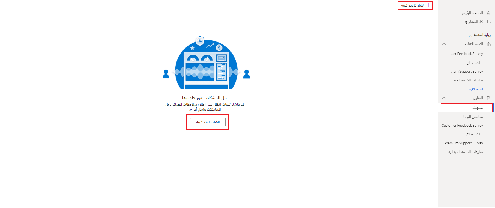

راجعت الوحدة السابقة تقرير **مقاييس الرضا** ولوحة المعلومات التابعة لها.
يُعد إعداد المقاييس طريقة فعالة لمراجعة الردود على استطلاع داخل مشروع على مستوى عالٍ. إلى جانب مراجعة البيانات، يُعد إعلامك عندما تحتوي الردود على أنواع معينة من التعليقات أمراً بالغ الأهمية من ناحية التأكد من حل المشاكل على الفور. يمكنك تحقيق هذا الهدف عن طريق إنشاء قواعد تنبيه داخل المشروع. من داخل المشروع في منطقة **التقارير**، حدد **التنبيهات**، مما يؤدي إلى توجيهك إلى منطقة حيث يمكنك إنشاء قواعد جديدة.
لإنشاء قاعدة جديدة، حدد أي زر من الزرين **إنشاء قاعدة تنبيه**.

> [!div class="mx-imgBorder"]
> 

كخطوة تالية، عليك إدخال اسم للقاعدة. في هذا المثال، يمكنك إنشاء قاعدة تنشئ تنبيهاً عندما يتضمن رد على استطلاع ستة أو أقل على سؤال Net Promoter Score ‏(NPS) يرتبط بمقياس الرضا NPS. يشير هذا المقياس إلى إنشاء منتقد، وبالتالي فإن إطلاق اسم **المنتقد** على التنبيه اختيار منطقي. ستعرض القائمة المنسدلة **مقياس الرضا** جميع مقاييس الرضا التي تمت إضافتها إلى المشروع. تتوقف قيم الشروط التي ستتوفر على نوع مقياس الرضا الذي تختاره. بالنسبة إلى **التوجه**، الخيارات هي **إيجابي** و **سلبي** و **حيادي**؛ بالنسبة إلى **NPS**، الخيارات هي **المنتقدون** و **الخاملون** و **المروجون**. لتصنيف الأسئلة المرتبطة بمقاييس رضا العملاء (CSAT)، تنتقل خيارات قيمة التنبيه فقط من 1 إلى 5، حتى لو كان السؤال يستخدم ما يصل إلى 10 نجوم.

> [!div class="mx-imgBorder"]
> 

تسمح لك قائمة **الشروط** بالتحديد من الشروط التالية:

- يساوي

- أقل من

- أقل من أو يساوي

- أكبر من

- أكبر من أو يساوي

يمكنك إنشاء تنبيهات تنشئ أنشطة متابعة لسيناريوهات إيجابية أو سلبية مثل الاتصال بعميل عندما قدم تصنيفاً منخفضاَ لشيء ما أو سؤال جهة اتصال ما إذا كانت ترغب في أن تكون مرجعاً عندما قدمت تصنيفاً من 9 أو 10 على أسئلة Net Promoter Score. يتم تخزين قواعد التنبيه في Microsoft Dataverse، كي تتمكن من مراجعتها في Microsoft Dynamics 365 Customer Engagement أو تطبيق يستند إلى نموذج.

> [!div class="mx-imgBorder"]
> 

كلما قدم المستجيب للاستطلاع إجابة على سؤال يفي بشرط قاعدة التنبيه، ينشئ نشاط تنبيه جديداً.
ستقوم الوحدة التالية بمراجعة إدارة أنشطة التنبيه وإكمالها.

شاهد الفيديو التالي للاطلاع على عرض توضيحي.

> [!VIDEO https://www.microsoft.com/videoplayer/embed/RWQPWB]
