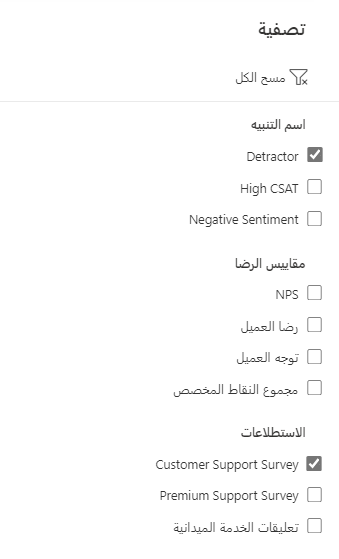
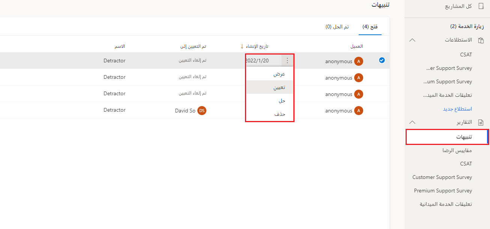
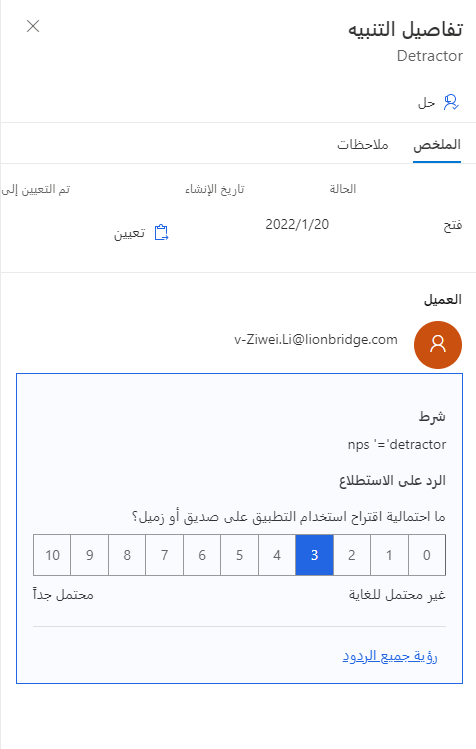
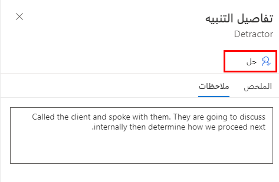
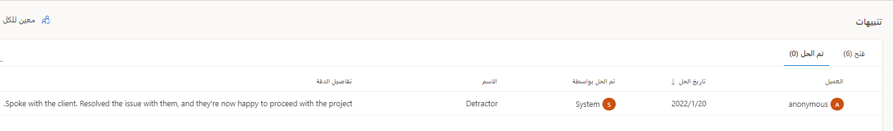

تعرض **منطقة التنبيهات** في المشروع التنبيهات التي تم إنشاؤها من استجابات الاستطلاع لأي استطلاع داخل المشروع قيد المراجعة. ستعرض شبكة من جميع التنبيهات المفتوحة العميل المرتبط بالتنبيه، أو ستعرضه مدرجًا على أنه مجهول إذا لم يكن الرد مرتبطًا بجهة اتصال في Dataverse. تعرض القائمة أيضًا تاريخ الإنشاء والشخص الذي تم تعيين التنبيه له واسم قاعدة التنبيه التي أدت إلى إنشائه. تتيح لك أيقونة المرشح، الموجودة في الزاوية العلوية اليمنى من لوحة معلومات التنبيهات، إمكانية التصفية استنادًا إلى اسم التنبيه، ومقياس الرضا المحدد، واستطلاع محدد.

> [!div class="mx-imgBorder"]
> 

حرك المؤشر فوق تنبيه لعرض علامة الحذف (**...**). حدد علامة الحذف لفتح قائمة، حيث يمكنك عرض تنبيه أو تعيينه أو إعادة تعيينه أو حله أو إعادة فتحه وحذفه. يمكنك أيضًا عرض تنبيه عن طريق تحديد اسم العميل.
يتيح لك تحديد أنشطة التنبيه المتعددة من القائمة حلها أو إعادة تعيينها أو إعادة فتحها أو حذفها بشكل مجمّع.

> [!div class="mx-imgBorder"]
> 

سيتم فتح جزء **تفاصيل التنبيه** عند عرض أحد التنبيهات.
تعرض علامة التبويب **الملخص** الحالة الحالية وتاريخ إنشائها والشخص الذي تم تعيين التنبيه إليه. سيتم عرض اسمه والبريد الإلكتروني، إذا كان التنبيه مرتبطًا باستجابة يُعرف بها العميل. تعرض علامة التبويب **الملخص** أيضًا الحالة التي أدت إلى تشغيل التنبيه والاستجابة للسؤال ذي الصلة.
عن طريق تحديد **عرض جميع الردود** دون الحاجة إلى التنقل بعيدًا عن التنبيه، يمكنك مراجعة جميع الردود الأخرى لنفس استجابة الاستطلاع من علامة التبويب هذه.

> [!div class="mx-imgBorder"]
> 

قم بتعيين استجابة عن طريق تحديد الخيار **تعيين** من قائمة الحذف على الشبكة أو عند عرض تفاصيل التنبيه. أدخل اسم المستخدم أو البريد الإلكتروني لبدء البحث عن شخص داخل المؤسسة يجب أن يكون مسؤولاً عن التصرف في التنبيه.
لا يتم إرسال الإعلامات إلى المستخدم بشكل افتراضي. يمكنك استخدام Microsoft Power Automate لإنشاء إعلام عبر البريد الإلكتروني أو طرق أخرى إذا لزم الأمر. على سبيل المثال، يمكنك إنشاء سير عمل للتحقق من درجة NPS من استجابة الاستطلاع ثم إخطار صاحب العمل ذي الصلة عند وجود درجة NPS منخفضة ([راجع مثال الاستطلاع](https://community.dynamics.com/365/b/webinars/posts/dynamics-365-customer-voice-automating-follow-up-actions-from-customer-voice-survey/?azure-portal=true)). بدلاً من ذلك، قد تستخدم المؤسسة التي تعمل بـ Microsoft Teams هذا الأسلوب كطريقة لإدارة تنبيهات Customer Voice وتعيينها ([راجع أحد الأمثلة](https://meganvwalker.com/managing-d365-customer-voice-alerts-via-microsoft-teams/?azure-portal=true)).

يمكنك إضافة تفاصيل أو تعليقات حول كيفية معالجة المشكلة والتقدم المحرز في الموقف، وذلك في علامة التبويب **"الملاحظات"** في التنبيه. يمكنك إضافة هذه الملاحظات في أي وقت بينما لا يزال التنبيه مفتوحًا. عندما تكون جاهزًا لحل تنبيه ما، حدد الزر **حل** من أعلى التنبيه، أو حدد الخيار **حل** من قائمة علامات الحذف في الشبكة. سيتم فتح مربع تعليقات كبير، حيث يمكنك إضافة تفاصيل كاملة حول المشكلة والحل المقدم.
يمكنك استخدام الزر **حل** لإكمال النشاط.

> [!div class="mx-imgBorder"]
> 

بعد ذلك، سيتم نقل أنشطة التنبيه المكتملة إلى علامة التبويب **تم الحل**، والتي ستُظهر تاريخ حلها ومن قام بحلها وتفاصيل الحل من مربع التعليقات في شاشة الحل. يمكنك إعادة فتح التنبيه وتعديله ثم حله مرة أخرى، إذا تم إغلاق التنبيه عن طريق الخطأ، أو إذا كنت بحاجة إلى إضافة مزيد من المعلومات. يتم تخزين نشاط التنبيه في Dataverse وربطه بالمشروع والاستطلاع واستجابة الاستطلاع ذات الصلة وقاعدة التنبيه وسجلات مقياس الرضا.

> [!div class="mx-imgBorder"]
> 
