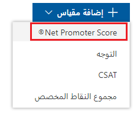

ستقوم في هذا التمرين بإعداد مقاييس الرضا والتنبيهات لأحد المشروعات في Dynamics 365 Customer Voice.

> [!NOTE]
> يمكنك استكمال تلك المهام في أي إصدار تجريبي أو بيئة اختبار معزولة.

## المهمة 1: إنشاء مشروع جديد

في هذه المهمة، ستقوم بإنشاء مشروع جديد باستخدام قالب المشروع **زيارة الخدمة** في Dynamics 365 Customer Voice..

1. انتقل إلى [Dynamics 365 Customer Voice](https://customervoice.microsoft.com/?azure-portal=true) وسجّل الدخول باستخدام بيانات الاعتماد الخاصة بك.

1. حدّد **الشروع في العمل**.

   > [!div class="mx-imgBorder"]
   > 

1. حدد القالب **زيارة الخدمة** من قائمة خيارات قوالب المشروعات.

   > [!div class="mx-imgBorder"]
   > 

1. من الجزء السفلي للشاشة، حدد زر **التالي**.

1. حدد **مراجعة جميع البيئات**.

   > [!div class="mx-imgBorder"]
   > 

1. حدد بيئة من القائمة. في الزاوية اليمنى السفلية من الشاشة، عند عرض الرسالة **تم منح الإذن**، حدد الزر **تحديد وإغلاق**.

   > [!div class="mx-imgBorder"]
   > 

1. حدد الزر **إنشاء**.

اكتمل المشروع الآن، وسيتم عرض استطلاع **ملاحظات الخدمة الميدانية** من قالب المشروع **زيارة الخدمة**.

## المهمة 2: إنشاء مقياس رضا

في هذه المهمة، ستقوم بإنشاء مقياس رضا للمشروع الذي أنشأته في المهمة 1.

1. من الصفحة الرئيسية في Dynamics 365 Customer Voice، حدد **جميع المشروعات**.

   > [!div class="mx-imgBorder"]
   > 

1. حدد المشروع **زيارة الخدمة** الذي قمتَ بإنشائه في المهمة 1 لفتحه.

   > [!div class="mx-imgBorder"]
   > 

1. قم بالتمرير لأسفل الاستطلاع‬، ثم حدد الزر **إضافة جديد**.

   > [!div class="mx-imgBorder"]
   > 

1. حدد السهم ثم حدد **Net Promoter Score** من القائمة.

   > [!div class="mx-imgBorder"]
   > 

1. حدد القائمة **تخصيص** من الجانب الأيمن للاستطلاع.

   > [!div class="mx-imgBorder"]
   > 

1. حدد **‏‫مقاييس الرضا** من القائمة.

   > [!div class="mx-imgBorder"]
   > 

1. يوجد بالفعل مقياسان للرضا. تم تضمين هذه المقاييس كجزء من قالب المشروع. حدد **إضافة مقياس** لإنشاء واحد جديد.

   > [!div class="mx-imgBorder"]
   > 

1. حدد **Net Promoter Score** من القائمة.

   > [!div class="mx-imgBorder"]
   > 

1. قم بتغيير اسم المقياس إلى **NPS**.

   > [!div class="mx-imgBorder"]
   > 

1. حدد السؤال الجديد الذي قمتَ بإضافته إلى الاستطلاع في هذه المهمة ثم حدد الزر **حفظ**.

   > [!div class="mx-imgBorder"]
   > 

يجب أن يظهر إعلام للإشارة إلى أنه تم حفظ المقياس، وسيكون مقياس NPS الجديد مرئيًا في القائمة.

   > [!div class="mx-imgBorder"]
   > 

## المهمة 3: إنشاء تنبيهات‬ جديدة

في هذه المهمة، ستقوم بإنشاء تنبيهين جديدين للمشروع الذي قمت بإنشائه في المهمة 1.

1. من الصفحة الرئيسية في Dynamics 365 Customer Voice، حدد **جميع المشروعات**.

   > [!div class="mx-imgBorder"]
   > 

1. حدد المشروع **زيارة الخدمة** الذي قمتَ بإنشائه في المهمة 1 لفتحه.

   > [!div class="mx-imgBorder"]
   > 

1. من قائمة المشروع الموجودة على الجانب الأيسر، حدد **التنبيهات‬‬**.

   > [!div class="mx-imgBorder"]
   > 

1. حدد **إنشاء قاعدة تنبيه** من منتصف الشاشة.

   > [!div class="mx-imgBorder"]
   > 

1. قم بإطلاق الاسم التالي على قاعدة التنبيه: **التوجه السلبي**.
   حدد **توجه العميل** من القائمة **مقاييس الرضا**.

   > [!div class="mx-imgBorder"]
   > 

1. قم بتعيين الشرط إلى **يساوي** والقيمة إلى **سلبي**.
   حدد الزر **حفظ**.

   > [!div class="mx-imgBorder"]
   > 

1. من منطقه التنبيهات الأساسية، حدد **إنشاء قاعدة تنبيه**.

   > [!div class="mx-imgBorder"]
   > 

1. قم بتسمية القاعدة **المنتقص** وحدد **NPS** من القائمة **مقياس الرضا**.

   > [!div class="mx-imgBorder"]
   > 

1. قم بتعيين الشرط إلى **يساوي** والقيمة إلى **منتقصون**.
   حدد الزر **حفظ**.

   > [!div class="mx-imgBorder"]
   > 

1. من قائمة المشروع الرئيسية، حدد الاستطلاع **ملاحظات الخدمة الميدانية‬**.

   > [!div class="mx-imgBorder"]
   > 

1. حدد الزر **معاينة** من أعلى الاستطلاع.

   > [!div class="mx-imgBorder"]
   > 

1. املأ الأسئلة الموجودة في الاستطلاع. بالنسبة للسؤال 4، أدخل النص التالي:

   **كانت الخدمة سيئة للغاية، ولم نكن سعداء بطريقة التعامل مع مشكلتنا.**

   بالنسبة للسؤال 5، حدد الرقم 6 أو أقل ثم **إرسال** الاستطلاع.

## المهمة 4: تعيين أحد التنبيهات وحلها

في هذه المهمة، ستقوم بمراجعة التنبيهات التي قمت بإنشائها في المهمة 3 ثم تعيين أحد التنبيهات وحلها.

1. حدد الخيار **التنبيهات** من قائمة المشروع الرئيسية من المشروع الذي قمت بإنشائه في المهمة 1.

   > [!div class="mx-imgBorder"]
   > 

1. حدد كلمة **مجهول** للتنبيه الأول في القائمة.

   > [!div class="mx-imgBorder"]
   > 

1. حدد الزر **تعيين‬**.

   > [!div class="mx-imgBorder"]
   > 

1. ابدأ كتابة اسم أحد المستخدمين في بيئة Dataverse لديك.
   يمكنك إدخال اسم المستخدم الخاص بك في حال عدم وجود مستخدمين آخرين. بعد العثور على المستخدم، حدده من القائمة المقترحة.

   > [!div class="mx-imgBorder"]
   > 

1. حدد الزر **تعيين‬**.

   > [!div class="mx-imgBorder"]
   > 

   يجب أن يظهر التنبيه الآن على أنه تم تعيينه للمستخدم الذي حددتَه.

   > [!div class="mx-imgBorder"]
   > 

1. حدد علامة التبويب **ملاحظات** في شاشة **تفاصيل التنبيه**. أدخل النص التالي في الحقل:

   **اتصلتُ بالعميل ولم أتلقَّ ردًا. سأتابع مرة أخرى الأسبوع القادم.**

   > [!div class="mx-imgBorder"]
   > 

1. حدد الزر **حفظ**.

1. حدد شبكة التنبيهات، ثم قم بتمرير المؤشر فوق نشاط التنبيه الآخر الذي لم يتم تعيينه بعد. حدد علامة الحذف (**...**) ثم حدد الخيار **تعيين**.

   > [!div class="mx-imgBorder"]
   > 

1. ابدأ كتابة اسم أحد المستخدمين في بيئة Dataverse لديك.
   يمكنك استخدام اسم المستخدم لديك في حال عدم وجود مستخدمين آخرين. بعد العثور على المستخدم، حدده من القائمة المقترحة.

   > [!div class="mx-imgBorder"]
   > 

1. حدد الزر **تعيين‬**.

   > [!div class="mx-imgBorder"]
   > 

1. حدد قائمة علامة الحذف مرة أخرى، وفي هذه المرة حدد الخيار **حل**.

   > [!div class="mx-imgBorder"]
   > 

1. أضف النص التالي في المربع **التعليقات**:

   **تم التحدث مع العميل. وتم حل المشكلة معه، وأصبح الآن مسرورًا بمتابعة العمل في المشروع.**

   في الجزء السفلي من اللوحة، حدد الزر **حل**.

   > [!div class="mx-imgBorder"]
   > 

1. حدد علامة التبويب **تم الحل**.

   > [!div class="mx-imgBorder"]
   > 

سيظهر الآن التنبيه الذي قمت بحله مع تفاصيل من قام بحل المشكلة، بالإضافة إلى وقت حلها وتفاصيل الحل.

   > [!div class="mx-imgBorder"]
   > 
