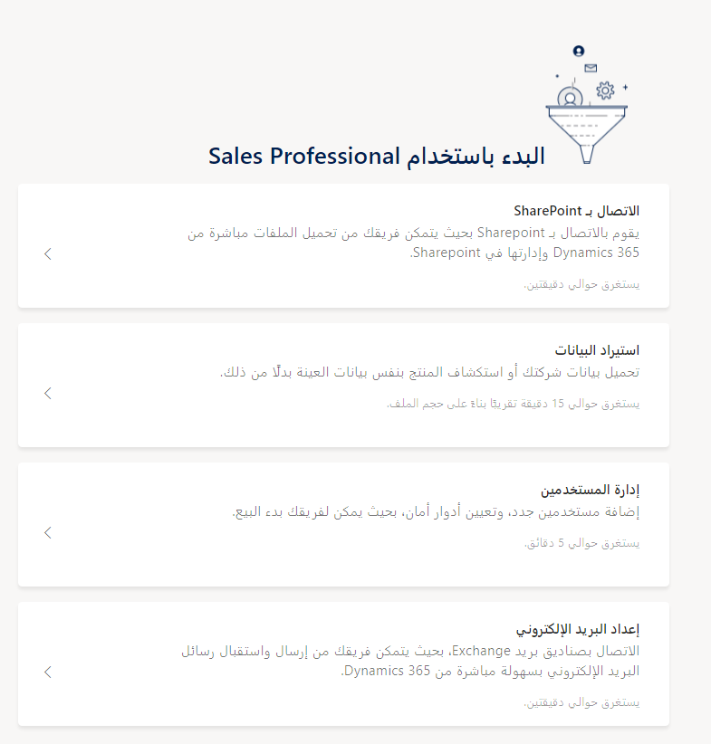

مرحباً بك في Dynamics 365 Sales Professional. إذا لم تكن بحاجة إلى تطبيق مؤسسة كامل لمؤسستك، فإن تطبيق Dynamics 365 Sales Professional الجديد يناسبك. 

يحتوي هذا العرض على مجموعة مستهدفة من إمكانات المبيعات لتنشيط مؤسستك وتشغيلها بسرعة. تم تصميمه مع مراعاة إمكانية الوصول، ويستخدم مبادئ تصميم الويب سريع الاستجابة لتوفير تجربة عرض وتفاعل مثالية لأي حجم شاشة أو جهاز أو اتجاه.

يأتي Dynamics 365 Sales Professional مصحوباً بصفحة البدء التي تعرض لك الأشياء الأساسية التي تحتاج إلى إعدادها لبدء المستخدمين لديك، مثل توصيل البريد الإلكتروني ومشاركة المستندات واستيراد البيانات.

لمعرفة المزيد حول زيادة الإنتاجية بسرعة وإبراز ميزات Dynamics 365 Sales Professional، راجع [نظرة عامة على Dynamics 365 Sales professional](/dynamics365/customer-engagement/sales-professional/sales-professional-overview).
