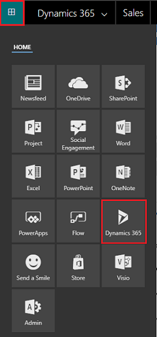
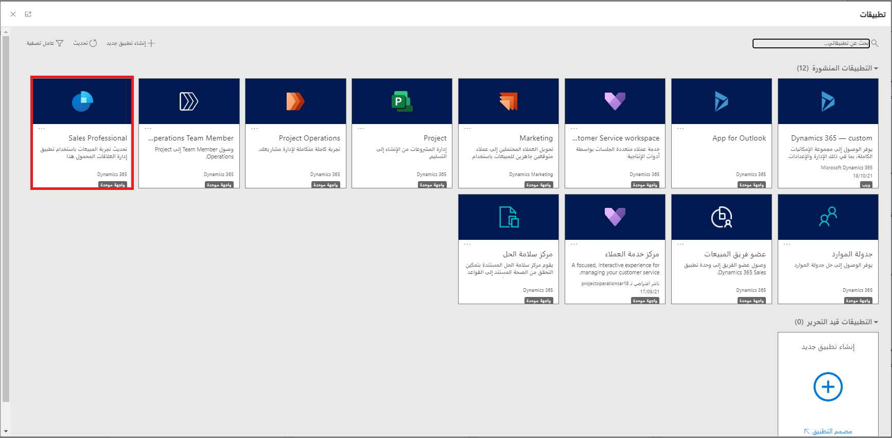

إذا كنت تريد الوصول إلى Dynamics 365 Professional، فيمكنك تسجيل الدخول إلى Microsoft 365، وتحديد مشغل تطبيقات Microsoft 365، ثم تحديد Dynamics 365. في صفحة Dynamics 365 الرئيسية، حدد Sales Professional.

في صفحة Dynamics 365 الرئيسية، حدد Sales Professional.

لمزيد من المعلومات حول التنقل وفهم التطبيق، راجع [بدء استخدام Dynamics 365 Sales Professional](/dynamics365/customer-engagement/sales-professional/learn-basics-sales-professional). 
