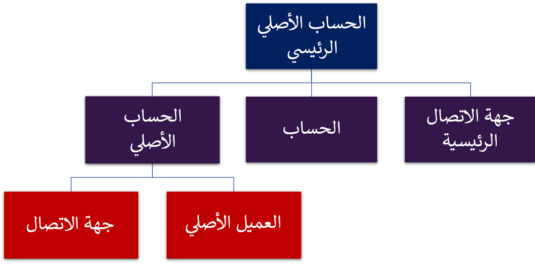

يمكن تعقب عملاؤك في وسط جميع البيئات. في Dynamics 365، تتم الإشارة إلى العملاء على أنهم حسابات وجهات اتصال. ما الفرق بين الاثنين؟ حسنًا، يمثل الحساب بشكل عام شركة أو مؤسسة. بمعنى آخر، يمثل الحساب مجموعة من الأشخاص. 
 
تمثل إحدى جهة الاتصال شخصًا ما. قد تقرر المؤسسة التي تستخدم حسابات داخل Microsoft Dynamics 365ربط جهة اتصال واحدة أو أكثر بحساب. كيف يمكن ربط الحسابات وجهات الاتصال معًا؟ حسناً، إن أول شيء يجب معرفته هو أنه يمكننا الحصول على ما يسمى بالحسابات الأصلية. في كثير من الأحيان عندما يتم ربط جهة اتصال مباشرة بأحد الحسابات، كما هو الحال عندما تحاول الإشارة إلى أن شخصاً ما هو موظف الحساب، فستتم الإشارة إلى الحساب على أنه حساب أصلي. بالإضافة إلى ذلك، يمكن استخدام الحسابات الأصلية لربط حسابين مختلفين معًا كما هو الحال عندما يمثل أحد الحسابات قسمًا أو شركة تابعة للحساب الأصلي. 
 
هناك طريقة أخرى يمكن من خلالها ربط الحسابات وجهات الاتصال معًا تتمثل في استخدام عمود جهة الاتصال الرئيسية. يمكنك اعتبار جهة الاتصال الرئيسية كجهة اتصال أساسية مع إحدى المؤسسات التي كنت على اتصال بها في إحدى الشركات. قد يكون هذا الشخص هو الشخص الذي تتعامل معه عند تحرير الفواتير أو المبيعات أو خدمة العملاء أو أي وظيفة تجارية أخرى لديك باستخدام هذا الحساب.

> [!div class="mx-imgBorder"]
> 

من المهم معرفة الفرق بين جهة الاتصال الرئيسية وجهة الاتصال العادي. باستخدام جهة اتصال عادي، لا يمكن أن يكون لها سوى حساب أصلي واحد، بينما عند استخدام جهة اتصال رئيسية، يمكن ربطها بحسابات متعددة. تخيل أن لديك شركة تمتلك حسابات بيع متعددة وأن تلك الشركة والأفرع التابعة لها هي عميلك. الآن، ربما تكون جهة الاتصال، بغض النظر عما إذا كنت تتحدث عن المقر الرئيسي أو أي من الأفرع الأخرى، هي الشخص الرئيسي الذي تتعامل معه عندما يتعلق الأمر بالمبيعات أو الأسئلة المتعلقة بالفواتير. في هذه الحالة، بالنسبة لكل حساب وحساب فرعي، قد يكون لديك نفس جهة الاتصال الرئيسية بالضبط. يتيح لك الحساب الأصلي ربط جهة اتصال بالحساب الأصلي كما هو الحال عندما تريد تعقب عمل شخص ما في شركة.

لمزيد من المعلومات حول إدارة العملاء، راجع [إدارة العملاء](/dynamics365/customer-engagement/sales-professional/manage-accounts-contacts). 
