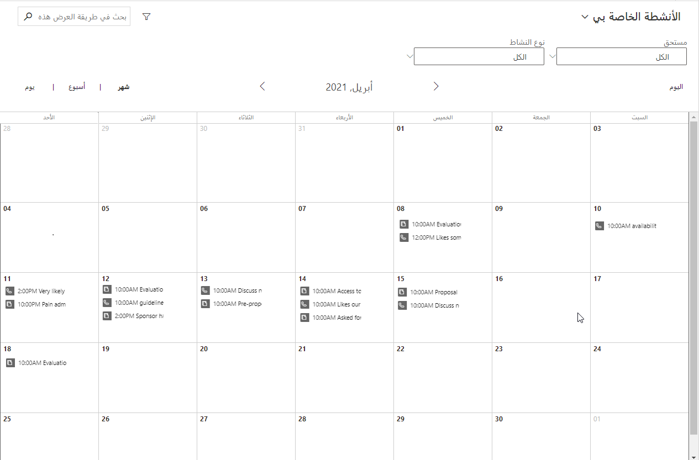

الأنشطة هي آلية لتعقب التفاعلات ذات الصلة بين المؤسسة وعملائها. وتتوفر الأنشطة التالية في Dynamics 365 Sales Professional:

- **مهام** - يمكن استخدام أنشطة المهام لتعقب المتابعات أو العناصر التي يجب أن يقوم المستخدم بإكمالها. بالنسبة إلى المستخدمين الذين يستخدمون Microsoft Outlook، يمكن إنشاء المهام داخل Outlook. ويمكن تعقب هذه المهام وربطها بسجل حالي في Microsoft Dynamics 365 بنفس طريقة رسائل البريد الإلكتروني. 

- **مواعيد** - المواعيد تمثل تفاعلًا مخططًا مرة واحدة حيث يحضر شخصًا واحدًا أو أكثر. وتتوفر إمكانية تكرار المواعيد أيضًا.

- **رسائل بريد إلكتروني** - يمكن تعقب رسائل البريد الإلكتروني وربطها بسجلات Microsoft Dynamics365 الحالية.

- **مكالمات هاتفية** - أنشطة المكالمات الهاتفية لتعقب المكالمات الهاتفية الواردة والصادرة ذات الصلة بجهود إدارة علاقات العملاء الخاصة بالشركة. بالإضافة إلى ذلك، عند إنشاء سجلات المكالمات الهاتفية وتحديد تاريخ استحقاق، إذا كان يقوم مستخدم Microsoft Dynamics 365 أيضاً باستخدام Microsoft Outlook، فستظهر هذه المكالمات الهاتفية كمهام داخل تطبيق Outlook.

> [!div class="mx-imgBorder"]
> 

لمزيد من المعلومات حول إدارة المهام والمواعيد ورسائل البريد الإلكتروني والمكالمات الهاتفية، راجع [إدارة المهام أو المواعيد أو رسائل البريد الإلكتروني أو المكالمات الهاتفية في Dynamics 365 Sales Professional](/dynamics365/customer-engagement/sales-professional/manage-activities). 
