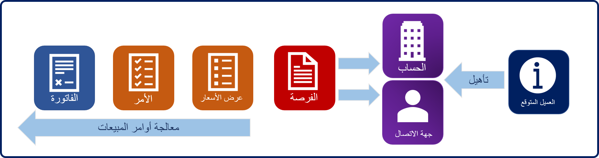

يتيح لك Dynamics 365 إدارة عملية دورة حياة المبيعات الخاصة بالمؤسسة بأكملها، بداية من الحصول على العملاء المتوقعين وصولاً إلى إدارة أوامر الشراء ومعالجة الفواتير. المقدار الذي تختار المؤسسة استخدامه اعتمادًا على المؤسسة. تمتلك العديد من المؤسسات نظامًا أساسيًا لبرامج تخطيط موارد المؤسسة (ERP) الذي يتم استخدامه للمحاسبة وإدارة المخزون وعمليات الشراء. وفي هذه الحالة، من الشائع أن تتكامل إمكانات معالجة أوامر المبيعات في Dynamics 365 مع تطبيق خارجي.

وعند تكامل Dynamics 365 Sales مع تطبيق خارجي، ستتم معالجة إدارة العملاء المتوقعين والفرص بشكل عام في Dynamics
365. وسيكون من المحتمل إنشاء عروض الأسعار والأوامر والفواتير في التطبيق الخارجي. ومع ذلك، قد تختار المؤسسات أحيانًا استخدام عروض الأسعار في Dynamics 365 وتكامل الأوامر والفواتير فقط.

ويصح هذا الأمر سواء كنت تخطط لاستخدام معالجة أوامر المبيعات بالكامل من Dynamics 365 أو تكامل مكونات محددة فقط، مثل الأوامر والفواتير. ومن الضروري فهم المكونات التي تشكل معالجة أوامر المبيعات وكيفية تدفقها مع بعضها والأشياء المتوفرة لكل منها.

تظهر الصورة الآتية تدفقًا نموذجيًا.

1.  **عميل متوقع**- العميل المتوقع بعض الأنواع المحتملة. ويعد هذا الأمر اهتمامًا محتملاً في منتج أو خدمة، أو احتمالية أن يصبح عميلاً. وعادةً ما يكون العملاء المتوقعون بداية عملية المبيعات.
    لا توجد أحيانًا علاقات سابقة مع عميل متوقع، ويستخدم العملاء المتوقعون أحيانًا مع العملاء الحاليين. على سبيل المثال، قد يقوم بائع بإنشاء عميل متوقع لشخص التقى به في معرض تجاري أو عميل متوقع قام بالشراء والاستيراد في Dynamics 365. بمجرد تحديد إمكانية أن يصبح العميل المتوقع عميلاً، يتم تأهيل العملاء المتوقعين أو استبعادهم.

2.  **فرصة** الفرصة هي بيع محتمل مع شخص يمكن أن يصبح عميلاً. يتم ربط سجلات الفرص بسجل حساب أو جهة اتصال. يتم غالبًا إنشاء الفرص من العملاء المتوقعين المؤهلين، ولكن يمكن أن تمثل بداية عملية مبيعات أيضًا. وتشتمل الفرص على تقديرات الإيرادات والجداول الزمنية. نحن نستخدم الفرص لتأهيل مسار المبيعات الخاصة بالمؤسسة، بحيث يمكنها قياس قيمة المبيعات المحتملة والموعد المحدد لإقفال المبيعات.

3.  **عرض أسعار** - عرض الأسعار هو عرض رسمي لمنتجات أو خدمات مقدم للعميل بأسعار محددة وشروط سداد ذات صلة.
    على سبيل المثال، إذا طلب أحد العملاء تكلفة تقديرية لأجهزة الكمبيوتر الجديدة في مكتب، فسيتم إنشاء عرض أسعار لتعقب هذه المعلومات. قد يكون هناك، في عرض الأسعار، عدة أصناف بنود حيث يتم حساب كل من المنتجات والكميات والأسعار وتعقبها. في Dynamics 365، تتم الإشارة إلى أصناف البنود هذه على أنها منتجات عرض الأسعار.

4.  **الأمر** طلب مؤكد لتسليم السلع والخدمات بناء على بنود محددة أو عرض أسعار وافق عليه العميل. بالإضافة إلى عرض الأسعار، يمكن أن يتضمن الأمر أصناف بنود متعددة مرتبطة به، حيث يمكن تعقب الكمية والسعر والمنتجات التي يتم بيعها. بالإضافة إلى ذلك، بالنسبة إلى المؤسسات التي تمتلك Microsoft Dynamics ‏365 متكاملاً مع تطبيقات المحاسبة، تعد الأوامر هي نقطة التكامل الشائعة. ويكون هذا الأمر شائعًا في السيناريوهات التي يقوم فيها البائع بإرسال أمر لعميل وسيقوم فريق المحاسبة بمعالجة الفواتير بداية من هذه النقطة فصاعدًا.

5.  **فاتورة** الفاتورة عبارة عن أمر تم إرسال فاتورة به إلى العميل. كما أنها تُعد سجلاً للبيع في الحساب، بما في ذلك تفاصيل حول المنتجات أو الخدمات التي تم شراؤها. بالنسبة إلى المؤسسات التي تمتلك Microsoft Dynamics ‏365 متكاملاً مع تطبيق محاسبة، تعد هذه نقطة تكامل شائعة أيضًا. ومع ذلك، في السيناريوهات المتكاملة، يتم إرسال الفواتير من تطبيق المحاسبة إلى Microsoft Dynamics ‏365. وذلك نظرًا إلى أن الفوترة الصحيحة للعميل هي جزء من عملية إدارة علاقات العملاء الإجمالية، فإنها وظيفة مرتبطة بالمحاسبة بشكل أساسي. ومع ذلك، من المهم حتى الآن أن يكون هؤلاء المسؤولين على دراية بديون العملاء وما قاموا بسداده.
