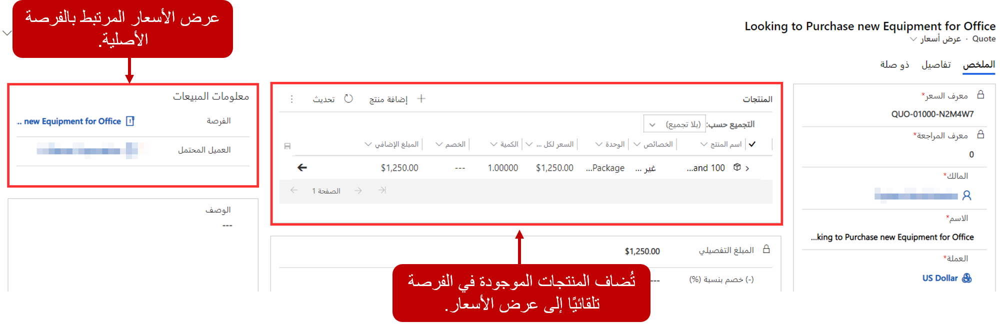
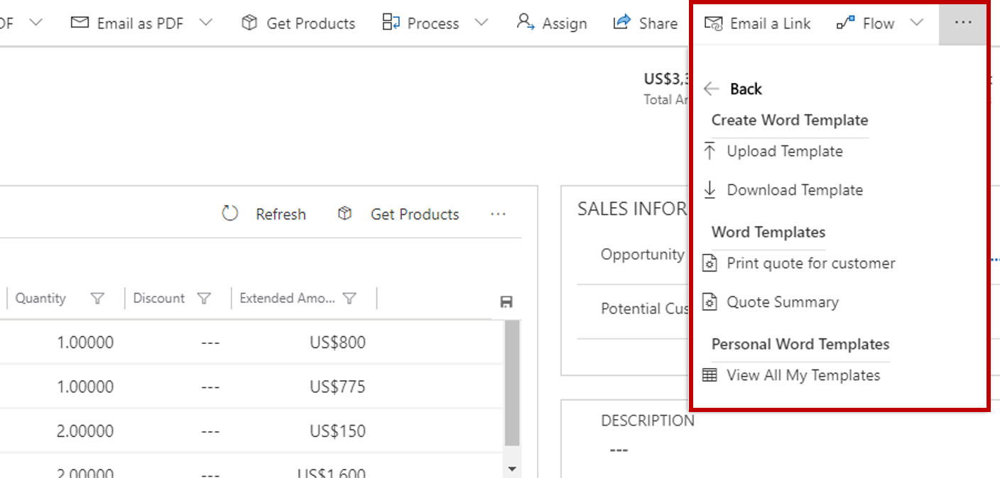
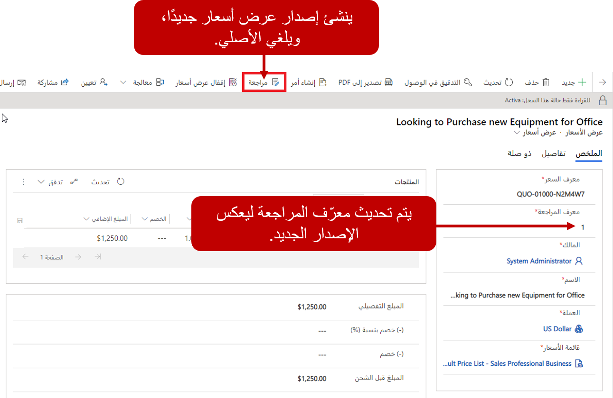
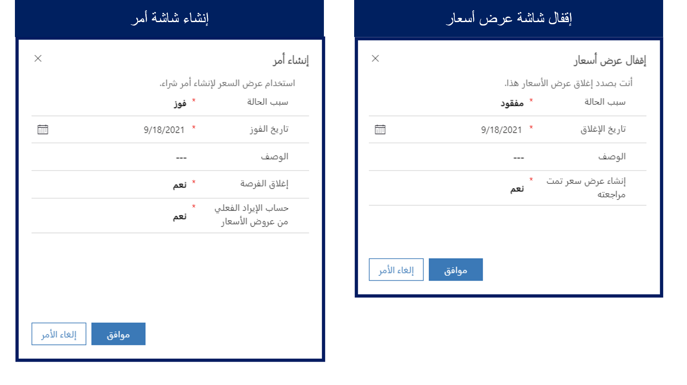

توفر الفرص للمديرين التنفيذيين للحساب وفرق المبيعات مكانًا للعمل مع تفاصيل معينة بشأن الحل المقترح لعميل. عندما يكون عميل جاهزًا لعرض رسمي فيه أحدث معلومات التسعير وكميات المنتجات الحالية، عادة ما تُعرض مع عرض أسعار.

### جارٍ إنشاء عروض أسعار...

يُمكن إنشاء عروض الأسعار يدويًا، والأسهل إنشائها مباشرة من إحدى الفرص. يُمكن إضافة عروض الأسعار من علامة التبويب **عروض الأسعار** في سجل الفرص الموجود. ومن بين المزايا الأساسية لإنشاء عرض أسعار من فرصة، أنه سوف يُملأ عرض السعر مسبقًا بالتفاصيل المهمة من سجل الفرص، مثل معلومات التسعير وأي أصناف مرفقة.

> [!VIDEO https://www.microsoft.com/videoplayer/embed/RE2NIb8]

### العمل مع منتجات عروض الأسعار

كما ذكرنا سابقًا، عند إنشاء عروض الأسعار لإحدى الفرص للمرة الأولى، سوف تُضاف بنود سطر المنتج الموجودة في الفرصة إلى عروض الأسعار. سوف تُعرض جميع المنتجات المرفقة مع عروض الأسعار في الشبكة الفرعية للمنتجات. يُمكن إضافة بنود سطر المنتج الفردي وإزالتها حسب الحاجة. يُمكن إضافة المنتجات يدويًا بتحديد علامة الحذف (...) واختيار إضافة منتج عرض سعر جديد. وهذا بدوره يفتح نموذج **الإنشاء السريع** حيثُ يمكن إضافة المنتج من أجل فرصة ما.

وفي بعض الأحيان قد من السهل إضافة منتج من سجل فرص موجود. مثال، قد يكون لمؤسسة ما فرصتان منفصلتان مفتوحتان لعميل. قد يطلب العميل عروض أسعار لكلا الفرصتين معًا. في هذا المثيل، يُمكن إضافة المنتجات من الفرصة الثانية إلى عرض الأسعار الموجود. لإضافة منتجات من الفرصة إلى عرض الأسعار، حدد **الحصول علي منتجات** من شريط الأوامر الموجود في نموذج **عرض الأسعار**. عندما تفتح صفحة **الحصول علي المنتجات**، يُمكنك تحديد الفرصة التي تحتوي على المنتجات التي تريد إضافتها.

> [!IMPORTANT]
> وببساطه تنسخ صفحة **الحصول على المنتجات** خط المنتج من فرصة إلى عرض الأسعار. ولا تتحقق الصفحة لمعرفه ما إذا كان منتج موجودًا بالفعل في عرض الأسعار. يمكن إضافة بند سطر المنتج عدة مرات. بعد إضافة المنتجات، ينبغي التحقق مرتين للتأكد من عدم وجود أي عناصر مدرجة مرتين لأن ذلك مخالف.

يُمكن تحرير بنود السطر من الشبكة الفرعية للمنتجات بتحديد الصنف واختيار التحرير. إضافة إلى ذلك، يُمكن إزالة المنتجات بتحديد علامة الحذف (...) ثم تحديد **حذف منتج عرض الأسعار**.

> [!NOTE] 
> وبمجرد إضافة بنود سطر، تأكد من أن عرض الأسعار وجميع بنود السطر يستخدمون العملة ذاتها. مثال، عند تعيين العملة إلى عرض أسعار بالدولار الأمريكي، فيجب استخدام العملة ذاتها لعناصر قائمه الأسعار التي تضيفها إلى عرض الأسعار. لا يُمكنك تغيير عملة عرض الأسعار إلا إذا أزلت جميع بنود السطر المرتبطة بالسجل. وبالمثل، عند إنشاء عرض الأسعار من الفرصة، فيجب استخدام العملة ذاتها المستخدمة للفرصة.

عندما يكون عرض الأسعار جاهزًا للإرسال إلى العميل، يُمكن تنشيطه باستخدام زر **تنشيط عرض الأسعار**.

### إرسال عروض الأسعار

عند إنشاء عرض أسعار، يكون له حالة "مسودة". يُمكن تعديل عروض الأسعار التي في حالة المسودة من حيث إضافة المنتجات أو إزالتها. عندما يكون عرض الأسعار جاهزًا للتقديم إلى عميل، فيجب تنشيطه. إن عرض الأسعار الذي تم تنشيطه يكون للقراءة فقط. وهذا جزء من المبيعات العادي ويمكن استخدامه للتأكد من أن شروط عرض الأسعار مفهومة بوضوح عند الطرفين في المعاملة المحتملة.

بعد تنشيط عرض الأسعار، يصبح جاهزًا لتقديمه إلى العميل.
يُمكن إنشاء عروض الأسعار في مستندات بتنسيق Microsoft Word. لإنشاء عرض أسعار للعميل، حدد **قوالب Word** من شريط الأوامر، وحدد **طباعه عرض أسعار لعميل**. سوف يتم إنشاء مستند Word يُمكن طباعته أو حفظه بتنسيق PDF، وإرساله إلى العميل.

### مراجعة عرض أسعار

عادةً ما يكون الإصدار الأول لعرض الأسعار المقدم إلى العميل ليس الإصدار النهائي للتوقيع. من الشائع جدًا أن يطلب العميل إزاله منتج بعينه أو تعديل الكميات. مثال، قد يتضمن عرض الأسعار عشر كاميرات أمان، ولكن يقرر العميل شراء خمس كاميرات فقط.

عند تنشيط عرض أسعار، لا يمكن تحريره. يجب إجراء أي تغييرات مطلوبة على أنها مراجعات. تتم المراجعات بتحديد **زر المراجعة** في شريط الأوامر. عند مراجعة عرض أسعار، يُغلق الإصدار الأصلي لعرض الأسعار، ويُنشئ إصدار جديد برقم مراجعة محدّث. ويضمن ذلك إمكانيه الوصول إلى جميع الإصدارات السابقة لعرض الأسعار في أي وقت. بعد إجراء التغييرات اللازمة، يُمكن تنشيط عرض الأسعار المحدّث كي يُمكن تقديمه إلى العميل.

### غلق عروض الأسعار

بعد قبول عرض الأسعار، يُمكن إنشاء أمر. يُساعد الأمر على استيفاء اتفاقيه البضائع أو الخدمات المقدمة في عرض الأسعار. تُجرى عملية تحويل عرض أسعار إلى أمر بتحديد الزر **إنشاء أمر** في شريط الأوامر. عند إنشاء الأمر، تُضاف محتويات عرض الأسعار إلى سجل الأمر ويُغلق عرض الأسعار. إضافة إلى ذلك، عند إنشاء عرض الأسعار من إحدى الفرص، يُمكنك تحديد إغلاق الفرصة أيضًا. من المهم ملاحظة أنه بعد قبول عرض الأسعار، لن تتمكن من مراجعته.

كما يُمكن إغلاق عروض الأسعار دون إنشاء أمر. عادةً ما يحدث ذلك في السيناريوهات التي تخسر فيها المؤسسة الصفقة لسبب ما. كما يُمكن فعل ذلك من شريط الأوامر، وذلك بتحديد زر **إغلاق علامة الاقتباس**.
