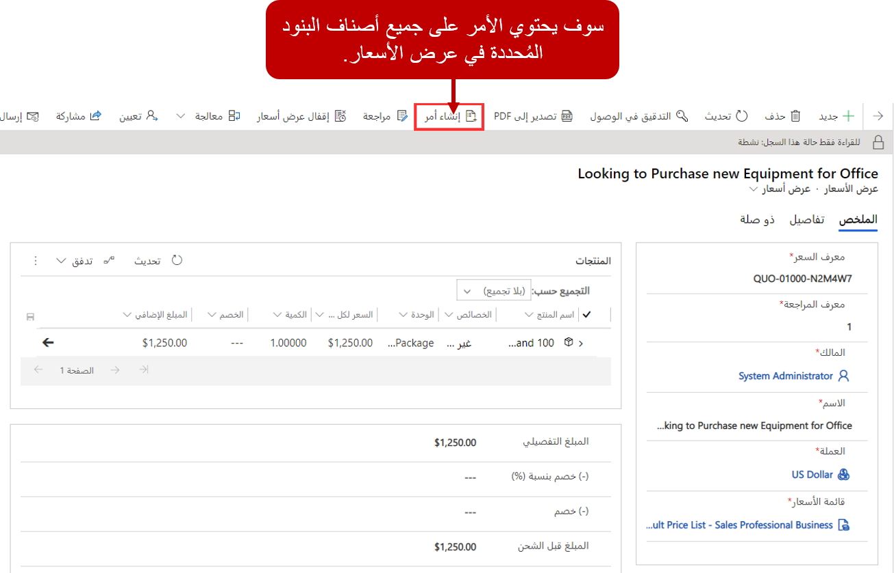
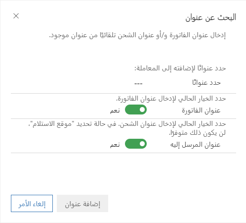
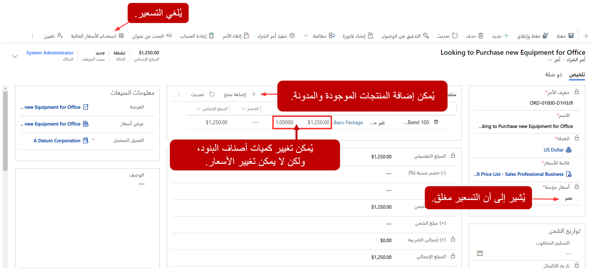
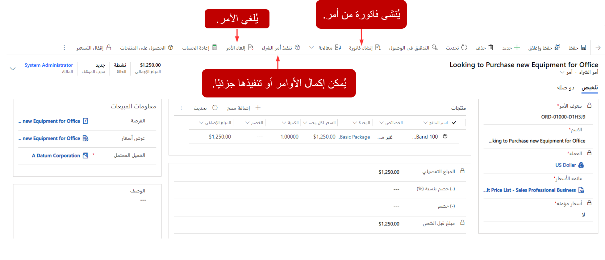
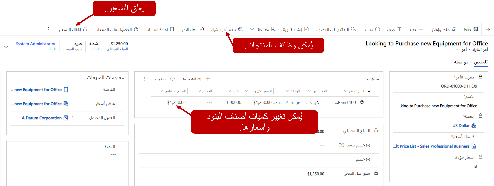

بعد دورة حياة عرض الأسعار، إذا كان العميل مستعدًا للتقدم، فمن المحتمل أن يقدم أمرًا إلى مؤسستك. الأمر هو طلب يقدمه أحد العملاء لشراء منتجات أو خدمات. وفي العادة، عروض الأسعار المقبولة تصبح أمرًا. ومع ذلك، قد يلزم أحيانًا إنشاء أمر غير مرتبط بعرض الأسعار.

> [!VIDEO https://www.microsoft.com/videoplayer/embed/RE2NNoU]

### إنشاء أمر من عرض أسعار

تُجرى عملية تحويل عرض أسعار إلى أمر بتحديد الزر **إنشاء أمر** في شريط الأوامر. عند إنشاء الأمر، تُضاف محتويات عرض الأسعار إلى سجل الأمر ويُغلق عرض الأسعار. يمكنك تحرير المنتجات والأصناف الموجودة في الأمر حسب الحاجة.

### الإنشاء اليدوي للأمر

لا توجد أي متطلبات توضح الحاجة إلى عرض أسعار قبل إنشاء أمر. إذا أبلغ العميل أنه مستعد لتقديم أمر الآن، فيمكنك تخطي عملية عرض الأسعار وإنشاء أمر.

عند إنشاء أمر يدويًا، ستحتاج إلى تحديد معلومات العميل المحتمل واسمه وقائمة الأسعار. ستحتاج كذلك إلى توفير معلومات العنوان. حدد زر **‏‫البحث عن عنوان‬** لتحديد عنوان العملاء المراد استخدامه في الأمر . إذا كان للعميل عدة عناوين، فيمكنك تحديد العناوين التي سيتم استخدامها للأمر.
بعد تحديد العمودين **عنوان الفاتورة** و **عنوان الشحن**، انقر فوق **إضافة عنوان**.

إذا كان للأمر عنوان فاتورة مختلف عن عنوان الشحن، فيمكنك تكرار العملية أو كتابة العنوان يدويًا في سجل الأمر في قسم العناوين.

### التعامل مع المنتجات

يمكن إضافة منتجات إلى أحد الأوامر بنفس طريقة إضافتها إلى فرصة أو عرض أسعار. وعلى عكس الفرص وعروض الأسعار ، هناك بعض سلوكيات الأسعار الإضافية التي تنطبق على الأوامر والفواتير فقط. نظرًا إلى أن الأوامر والفواتير تمثل عادةً المرحلة الأخيرة من عملية المبيعات، تود المؤسسات التأكد من صحة معلومات الأسعار المرتبطة بها. ويمكن التعامل مع ذلك عن طريق تحديد المنتجات والأسعار التي يمكن إضافتها.

### التعامل مع الأسعار

لضمان استخدام الأسعار الصحيح، يمكن إقفال الأسعار وإلغاء قفله حسب الحاجة. يستخدم إقفال الأسعار لضمان استخدام المنتجات الموجودة فقط مع نموذج الأسعار الحالي. عند عرض أحد الأوامر، يشير العمود **تم إقفال الأسعار** إلى ما إذا كان الأسعار مُقفلاً حاليًا. يمكن إقفال الأسعار عن طريق تحديد زر **إقفال الأسعار**.

### إقفال الأسعار

بشكلٍ افتراضي، عند إنشاء أمر من عرض أسعار ، يتم إقفال الأسعار. عندما يكون الأسعار مُقفلاً، لا يمكن استبدال معلومات الأسعار الموجودة في الأمر. يمكن تعديل الكميات ولكن لا يتعذر ذلك مع الأسعار. يمكن إضافة المنتجات المدونة والحالية كأصناف بنود، ولكن لا يمكن تغيير أسعار الأصناف الحالية. يمكن أن تكون المنتجات المدونة قد تم تحديد سعرها عند إضافتها ، ولكن لا يمكن تحديث الكميات عندما يكون الأسعار مُقفلاً.

### فتح قفل الأسعار

إذا كنت تطلب القدرة على الحصول على مرونة إضافية في الأسعار، فيمكنك فتح قفل الأسعار الموجودة في الأمر. ويتم إجراء ذلك بتحديد زر **استخدام الأسعار الحالية**. سيؤدي ذلك إلى فتح قفل الأسعار والسماح لك باستخدام ميزة **الحصول على منتجات** لإضافة منتجات. عندما يتم فتح قفل الأسعار، يمكنك الكتابة فوق أي عمود من أعمدة الأسعار، حسب الحاجة.

### تسليم أوامر المبيعات

بمجرد إعداد الأمر، يتم تنفيذ الخطوة التالية، والتي تتضمن تقديم الخدمات أو المنتجات التي طلبها العميل في الأمر. Microsoft Dynamics 365يسمح للمستخدمين بإمكانية تعقب ما إذا كان قد تم تنفيذ الأوامر. قد يتم تمييز التنفيذ بأنه مكتمل أو جزئي.

Microsoft Dynamics 365يوفر القدرة على إلغاء أمر حالي. عند تقديم أمر بواسطة عميل، تكون حالته هي "مفتوح". ومن غير الشائع أن يطلب العميل إلغاء أمر، والذي يمكن إكماله مباشرة من سجل الأوامر.

والخيار الآخر أنه يمكنك إنشاء فاتورة من أحد الأوامر.
عند تحديد **إنشاء فاتورة**، سيتم إنشاء فاتورة جديدة من الأمر. ستحتوي الفاتورة الجديدة على جميع المنتجات التي تم تحديدها في الأمر.

### الفواتير

الفواتير هي طلبات الدفع التي تقدمها شركة إلى عملائها.
يمكن أن تكون الفواتير مرتبطة بالأوامر، ولكن لا يلزم ذلك.
وفقًا لشروط الدفع، يمكن إنشاء فاتورة من أمر بعد تنفيذه أو عند تقديمه.

توجد طريقتان شائعتان لإنشاء الفواتير في Dynamics 365:

- إنشاء فاتورة جديدة يدويًا.
- إنشاء فاتورة من أمر حالي.

والطريقة الأكثر شيوعا لإنشاء فاتورة هي إنشائها مباشرة من الأمر. عند إنشاء الفاتورة، ستتم إضافة جميع المنتجات المرتبطة بالأمر تلقائياً إلى الفاتورة. يمكن إضافة منتجات أو خدمات إضافية أو إزالتها من الأمر بعد إنشائها.

بعد إنشاء فاتورة، يمكن إضافة أصناف البنود الفردية وتحريرها حسب الحاجة، بنفس طريقة الأوامر. يمكن أيضًا إقفال معلومات الأسعار أو فتح قفلها حسب الحاجة بنفس طريقة الأوامر.

### إقفال الفواتير

بعد قيام العميل بدفع الفاتورة، يمكنك وضع علامة على الفاتورة تفيد بأنها مدفوعة. عند وضع علامة على الفاتورة تفيد بأنها مدفوعة‬، يمكنك تحديد أحد الخيارين التاليين:

- **مكتملة** - قام العميل بدفع الفاتورة بالكامل.
- **جزئية** - قام العميل بدفع جزء فقط من الفاتورة.

