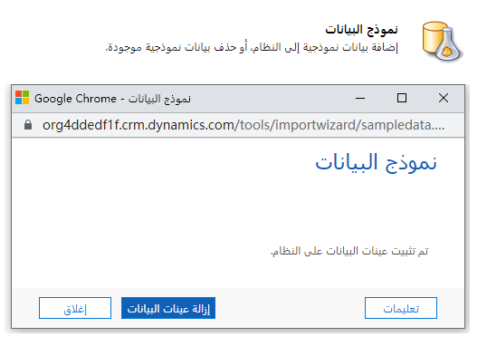

يمكن للمؤسسات استخدام Dynamics 365 Sales لتقديم وظائف معالجة أوامر المبيعات.

الغرض من هذا المعمل العملي هو تقديم العمل مع إمكانات معالجة أوامر المبيعات في Dynamics 365 بما في ذلك، العمل مع عروض الأسعار والأوامر والفواتير.

## الأهداف التعليمية

في نهاية هذه التمارين، ستتمكن من تحقيق الأهداف التالية:

-   ‏‏إنشاء عرض أسعار من الفرص.
-   إدارة دورة حياة عرض الأسعار.
-   إنشاء طلب من عرض أسعار.
-   إنشاء فاتورة من طلب.

## عينات البيانات

>[!IMPORTANT]
> قبل أن تبدأ، لتحقيق أقصى تأثير لهذا المعمل والمعامل الأخرى، من المستحسن أن يكون لديك بعض عينات البيانات للعمل بها. إذا كان المثيل الذي تعمل معه لا يحتوي على أي بيانات نموذجية، يمكنك استخدام الخطوات التالية لإضافة بيانات عينة المخزون إلى نظامك.

1.  في المثيل الذي تستخدمه من Dynamics 365، انتقل إلى **إعدادات** > **إدارة البيانات**.

1.  انقر فوق **عينات البيانات**.

1.  إذا لم يتم تثبيت نموذج البيانات، فانقر فوق **تثبيت نموذج البيانات**. (لاحظ أن ظهور البيانات قد يستغرق بضع دقائق، ولكن يمكنك الاستمرار في استخدام التطبيق أثناء تثبيته.) 

1.  انقر فوق **إغلاق**.

    

## كتالوج المنتج العامل

يوصى أيضاً بتكوين كتالوج المنتج وأن يكون لديك بعض قوائم أسعار العمل التي يمكنك استخدامها لأغراض هذه المعامل. ترشدك الخطوات التالية خلال إعداد بعض منتجات كتالوج المنتجات الأساسية وقوائم الأسعار التي يمكنك استخدامها لبقية معامل معالجة أوامر المبيعات.

## إنشاء منتج جديد

السيناريو: تحمل شركتك عدة طرز مختلفة من طابعات Proseware.
يجب إضافة كل نموذج تبيعه إلى Dynamics 365 بحيث يمكن استخدامه لفرص المبيعات والأوامر المستقبلية. من الضروري تحديث كتالوج المنتجات لإدراج هذا المنتج الجديد وإتاحته للآخرين.

### الخطوات عالية المستوى

1.  أضف ثلاث طابعات جديدة إلى كتالوج المنتجات.

    -   طابعة ضخ الحبر الكل في واحد IJ300
    -   اوفس جيت الكل في واحد OJ 4500
    -   ليزر جيت الكل في واحد LJ8900

2.  أنشئ قائمة أسعار جديدة "للبيع بالتجزئة".

3.  أضف الطابعات الجديدة إلى قائمة أسعار البيع بالتجزئة.

### الخطوات التفصيلية

1.  استخدم شريط التنقل لفتح **مركز المبيعات** من القائمة المنسدلة في Dynamics 365.
2.  في **خريطة الموقع**، انقر فوق علامة الحذف (...)، وحدد **إعدادات التطبيق**.
3.  ضمن **كتالوج المنتج**، حدد **عائلات و** **منتجات،** ثم انقر فوق **إضافة زر المنتج** على شريط الأوامر.
4.  في قسم **ملخص المنتج** أدخل معلومات للأعمدة المطلوبة التالية والمعلومات الخاصة بالأعمدة الأخرى بالشكل المناسب:

    -   **الاسم** - SOP Ink Jet 300: 3-in-1
    -   **معرف المنتج** - INKJET-300
    -   **مجموعة الوحدات** - الوحدة الافتراضية
    -   **الوحدة الافتراضية** - الوحدة الأساسية
    -   **الأرقام العشرية المعتمدة** - 2

5.  انقر **حفظ وإغلاق**.
6.  في قائمة **المنتجات** في **صفحة العائلات والحزم**، انقر فوق الزر **إضافة منتج** مجدداً.

7.  في قسم **ملخص المنتج** أدخل معلومات للأعمدة المطلوبة التالية والمعلومات الخاصة بالأعمدة الأخرى بالشكل المناسب:

    -   **الاسم** - SOP Office Jet 4500: 3-in-1
    -   **معرف المنتج** - OFFJET-4500
    -   **مجموعة الوحدات** - الوحدة الافتراضية
    -   **الوحدة الافتراضية** - الوحدة الأساسية
    -   **الأرقام العشرية المعتمدة** - 2
8.  انقر **حفظ وإغلاق**.
9.  في قائمة **المنتجات** في صفحة **العائلات والحزم** >، انقر فوق الزر **إضافة منتج** مجدداً.
10. في قسم **ملخص المنتج** أدخل معلومات للأعمدة المطلوبة التالية والمعلومات الخاصة بالأعمدة الأخرى بالشكل المناسب:
    -   **الاسم** - SOP Laser Jet 8900 3-in-1
    -   **معرف المنتج** - LASJET-8900
    -   **مجموعة الوحدات** - الوحدة الافتراضية
    -   **الوحدة الافتراضية** - الوحدة الأساسية
    -   **الأرقام العشرية المعتمدة** - 2
11. انقر **حفظ وإغلاق**.
12. في قائمة **المنتجات** في **صفحة العائلات والحزم**، حدد طابعة **Ink Jet 300 3-in-1**.
13. انقر فوق الزر **نشر** لنشر المنتج.
14. حدد الطابعة **Office Jet 4500 3-in1**.
15. انقر فوق الزر **نشر** لنشر المنتج.
16. حدد طابعة **Laser Jet 8900 3-in-1**.
17. انقر فوق الزر **نشر** لنشر المنتج.

### قم بإنشاء قائمة أسعار التجزئة

1.  استخدم شريط التنقل لفتح **مركز المبيعات** من القائمة المنسدلة في Dynamics 365.
2.  في **خريطة الموقع**، انقر فوق علامة الحذف (...)، ثم حدد **إعدادات التطبيق**.
3.  ضمن **كتالوج المنتج**، حدد **قوائم الأسعار**، ثم انقر فوق الزر **جديد** في شريط الأوامر.
4.  أكمل قائمة الأسعار على النحو التالي:
    - **الاسم** - البيع بالتجزئة
    - **تاريخ البدء** - بداية الشهر الجاري
    - **تاريخ الانتهاء** - نهاية العام
5.  انقر **حفظ وإغلاق**.

### أضف منتجات إلى قائمة أسعار البيع بالتجزئة

1.  إذا لزم الأمر، افتح قائمة أسعار **البيع بالتجزئة**.
2.  في الشبكة الفرعية **عناصر قائمة الأسعار** انقر فوق الزر **إضافة سجل عنصر قائمة الأسعار**.
3. ادخل التالي الخاص بعنصر قائمه الأسعار:
    -   **قائمة الأسعار** - البيع بالتجزئة
    -   **المنتج** - SOP Ink Jet 300: 3-in-1
    -   **الوحدة** - الوحدة الأساسية
    -   **طريقة التسعير** - مبلغ العملة
    -   **المبلغ** - $250.00
4.  انقر **حفظ وإغلاق**.
5.  في الشبكة الفرعية **عناصر قائمة الأسعار** انقر فوق الزر **إضافة سجل عنصر قائمة الأسعار**.
6.  ادخل التالي الخاص بعنصر قائمه الأسعار:
    -   **قائمة الأسعار** - البيع بالتجزئة
    -   **المنتج** - SOP Laser Jet 8900: 3-in-1
    -   **الوحدة** - الوحدة الأساسية
    -   **طريقة التسعير** - مبلغ العملة
    -   **المبلغ** - $475.00
7.  انقر **حفظ وإغلاق**
8.  في الشبكة الفرعية **عناصر قائمة الأسعار** انقر فوق الزر **إضافة سجل عنصر قائمة الأسعار**.
9.  ادخل التالي الخاص بعنصر قائمه الأسعار:
    -  **قائمة الأسعار** - البيع بالتجزئة
    -  **المنتج** - SOP Office Jet 4500: 3-in-1
    -  **الوحدة** - الوحدة الأساسية
    -  **طريقة التسعير** - مبلغ العملة
    -  **المبلغ** - $350.00
10. انقر **حفظ وإغلاق**.

### استخدام كتالوج المنتج مع فرصة

السيناريو: أنت تعمل كمسؤول مبيعات لـ Contoso، وتتلقى مكالمة هاتفية من Nancy Anderson في Adventure Works. إنها مهتمة بالعديد من طابعاتك. من المحتمل أنها تبحث في العناصر التالية:

-   15 طابعة انك جيت
-   10 طابعات ليزر جيت
-   طابعات بنسبه 20 Office Jet

#### الخطوات عالية المستوى

-   إنشاء فرصة جديدة لـ Adventure Works.
-   أضف الطابعات الجديدة إلى قائمة أسعار البيع بالتجزئة.
-   أضف طابعات Ink Jet و Laser Jet و Office Jet إلى الفرصة.
-   قم بإنشاء وتفعيل عرض أسعار بناءً على فرصة Adventure Works.
-   مراجعة وتحرير كميات المنتج وإعادة تنشيط عرض الأسعار.
-   أغلق عرض الأسعار وقم بتحويله إلى أمر.
-   تحويل الطلب إلى فاتورة.
-   أكمل الفاتورة.

#### الخطوات التفصيلية

### إنشاء فرصة جديدة لـ Adventure Works
1.  في **خريطة الموقع**، انقر فوق علامة الحذف (...)، وحدد **المبيعات**.
2.  تحديد **الحسابات**.
3.  افتح حساب **Adventure Works**.
4.  حدد علامة التبويب **ذات الصلة** من القائمة التي تظهر، حدد **الفرص**.
5.  أدخل الفرصة على النحو التالي:
    -   **الموضوع** - 45 طابعة
    -   **جهة اتصال** - نانسي أندرسون (نموذج)
    -   **الحساب** - Adventure Works (نموذج)
    -   **مبلغ الموازنة** - $20،000.00
    -   **Est. تاريخ الاغلاق** - نهاية الشهر الحالي
6.  انقر فوق **حفظ**.

### قم بتعيين قائمة أسعار التجزئة لفرصة وإضافة منتجات إلى الفرصة

1.  افتح فرصة **45 طابعة** التي أنشأتها للتو.
2.  قم بالتمرير إلى قسم **عناصر سطر المنتج**.
3.  اضبط عمود **قائمة الأسعار** على **البيع بالتجزئة**.
4.  اضبط عمود **الإيرادات** إلى **تم احتساب النظام**.
5.  انقر فوق أيقونة **حفظ** في الجزء السفلي من النموذج لحفظ التغييرات.
6.  في الشبكة الفرعية **عناصر سطر المنتج**، انقر فوق الزر **إضافة منتج فرصة**.
7.  حدد **المنتج الموجود**.
8.  انقر فوق أيقونة **عدسة مكبرة** ثم حدد **SOP Ink Jet 300: 3-in-1**.
9.  انقر في العمود **الكمية** واكتب **15**.
10. في الشبكة الفرعية **عناصر سطر المنتج**، انقر فوق الزر **إضافة منتج فرصة**
11. حدد **المنتج الموجود**.
12. انقر فوق أيقونة **عدسة مكبرة** ثم حدد **SOP Laser Jet 8900: 3-in-1‎</2>**.
13. انقر في العمود **الكمية** واكتب **10**.
14. في الشبكة الفرعية **عناصر سطر المنتج**، انقر فوق الزر **إضافة منتج فرصة**
15. حدد **المنتج الموجود**.
16. انقر فوق أيقونة **عدسة مكبرة** ثم حدد **SOP Office Jet 4500: 3-in-1**.
17. انقر في العمود **الكمية** واكتب **20**.
19. لاحظ أن العنصر **الإيرادات المقدرة** في رأس الفرصة هي **\$15،500.00**.
20. قم بتغيير كمية **SOP Laser Jet 8900 3-in-1** إلى **15**.
21. يجب تغيير عمود **الإيرادات المقدرة** إلى **\$17،875.00**.

### إنشاء وتنشيط عرض الأسعار

بعد العمل في البداية خلال عملية الفرصة مع Adventure Works، أنت الآن جاهز لإنشاء عرض أسعار وتقديمه إلى العميل.

1.  في فرصة **45 طابعة** قم بالتمرير إلى علامة التبويب **عروض أسعار**.
2.  انقر فوق الزر **إضافة سجل عرض الأسعار**. سيتم إنشاء سجل عرض أسعار جديد استناداً إلى الفرصة.
3.  في **شريط الأوامر**، انقر فوق الزر **تنشيط عرض الأسعار**. سيؤدي ذلك إلى جعل عرض الأسعار للقراءة فقط والتأكد من أنه جاهز للتسليم إلى العميل.

### مراجعة وإعادة تنشيط عرض الأسعار

لقد سلمت عرض الأسعار إلى نانسي، لكنها كانت مهتمة بعدد طابعات الليزر التي تمت إضافتها إلى عرض الأسعار. إنها ترغب في تقليل عدد طابعات الليزر إلى 10.

1.  باستخدام عرض الأسعار **45 طابعة** انقر فوق الزر **مراجعة**. سيتم إلغاء النسخة الأصلية من عرض أسعار 45 طابعة. سيقوم Dynamics 365 بنسخ عرض الأسعار الملغى وإنشاء عرض أسعار جديد بمعرف المراجعة 1.
2.  في الشبكة الفرعية **المنتج** قم بتغيير كمية طابعات الليزر النفاثة من **15** إلى **10**.
3.  في شريط الأوامر، انقر فوق الزر **تنشيط عرض الأسعار**.

### أغلق عرض الأسعار والفرصة وقم بالتحويل إلى أمر

بعد إجراء المراجعات وتسليم الاقتباس إلى نانسي، تكون مستعدة للمضي قدماً. تحتاج إلى التأكد من إغلاق كل من عرض الأسعار والفرصة التي استند إليها عرض الأسعار عند إنشاء الأمر.

1.  مع فتح عرض الأسعار **45 طابعة** انقر فوق الزر **إنشاء طلب**.
2.  أدخل الآتي في شاشة **إنشاء طلب**:
    -   **سبب الحالة** - فاز
    -   **تاريخ الفوز** - تاريخ اليوم
    -   **إغلاق الفرصة** - نعم
    -   **حساب الإيرادات الفعلية من عروض الأسعار** - نعم
3.  انقر فوق **موافق**.

### تنفيذ الطلب وإنشاء ودفع الفاتورة

بعد بضعة أسابيع، تمكنت مؤسستك من إكمال طلب Adventure Works وتنفيذه. تحتاج إلى ملاحظة أنه تم الوفاء بالطلب وإنشاء فاتورة الطلب.

1.  في ترتيب **45 طابعة**، انقر فوق الزر **تنفيذ الطلب**.
2.  أدخل ما يلي في شاشة **تنفيذ الطلب**:
    -   **سبب الحالة** - اكتمل
    -   **تاريخ الفوز** - تاريخ اليوم
3.  انقر فوق **تنفيذ**.
4.  في شريط الأوامر، انقر فوق الزر **إنشاء فاتورة**.
5.  بعد ظهور **فاتورة طابعات 45** انقر فوق الزر **فاتورة مدفوعة**.
6.  اضبط **سبب الحالة** إلى **مكتمل**، ثم انقر فوق **موافق**.
