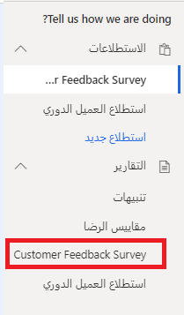
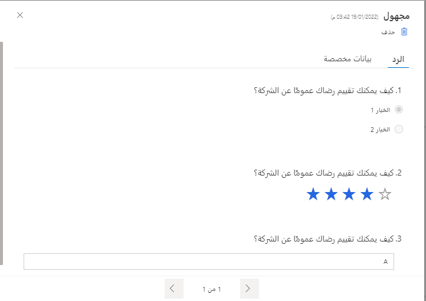

عند إنشاء مشروع في Dynamics 365 Customer Voice، يتم إنشاء استطلاع واحد على الأقل بشكل افتراضي. ويتضمن كل استطلاع منطقة تقرير مناظرة يتم إنشاؤها في الوقت نفسه. يؤدي إنشاء استطلاعات في مشروع إلى إنشاء تقرير جديد للردود على الاستطلاع يتماشى معه. يتم سرد الاستطلاعات والتقارير أبجدياً مما يسهل العثور على التقرير الصحيح للاستطلاع الجاري مراجعته.

> [!div class="mx-imgBorder"]
> 

بعد النقر فوق اسم التقرير، تظهر الردود على الاستطلاع باستخدام تمثيلات رسومية لجميع الردود في هذا التقرير المعين. يتم تضمين كل سؤال في الاستطلاع، ويتم سرد الأسئلة رقمياً بنفس الترتيب المستخدم لإضافتها في منطقة تصميم التقرير. يتم عرض العدد الإجمالي للردود على الاستطلاع التي تم تلقيها في الزاوية العليا اليمنى، وتشمل جميع الردود بغض النظر عن كيفية إنشائها. هذا يعني أنه يتم تضمين الردود المجهولة مع أي ردود أتت من دعوة استطلاع شخصية حيث يكون المستجيب معروفاً وموجوداً كجهة اتصال في بيئة Microsoft Dataverse المرتبطة.

ستظهر أي متغيرات مستخدمة في الاستطلاع في نص السؤال كاسم متغير محاط بأقواس متعرجة. يوضح هذا المكان الذي تم فيه استخدام التخصيص داخل الاستطلاع. يتم تمثيل أنواع الأسئلة المختلفة باستخدام أنواع مختلفة من الرسومات. على سبيل المثال، يتم استخدام المخطط الدائري للأسئلة متعددة الاختيارات، ويتم استخدام مقياس لسؤال من النوع Net Promoter Score. تستخدم الأسئلة النصية رقماً للإشارة إلى عدد الردود التي تم تلقيها مع تعبئة هذا السؤال، ويتم عرض نص من الردود الأخيرة. يتم عرض أسئلة التصنيفات على شكل مخططات شريطية مع عرض متوسط التصنيف باستخدام نجمة أو رقم أو وجه مبتسم بحسب الرمز المحدد عند إنشاء الاستطلاع وإضافة سؤال التصنيف.

> [!div class="mx-imgBorder"]
> 

يمكن الوصول إلى الردود الفردية من قائمة المستجيبين على الجانب الأيسر من تقرير الردود على الاستطلاع. يمكن عرض الردود باعتبارها مجهولة إذ لم يتم ربط أي جهة اتصال بها، أو إذا تم إرسال الرد من دعوة استطلاع شخصية فريدة، فسيتضمن اسم المستجيب وبريده الإلكتروني. توفر علامة تبويب **الرد** جميع أسئلة الاستطلاع مع الردود المقدمة لهذا المستجيب المحدد. كما هو الحال مع التقرير الرئيسي للردود على الاستطلاع، فإن أي أسئلة تضمنت متغيراً ستعرض فقط اسم المتغير بين أقواس متعرجة ولن تعرض القيمة الفعلية التي ربما تم تمريرها إلى المتغير.

> [!div class="mx-imgBorder"]
> 

يؤدي تحديد علامة التبويب "بيانات مخصصة" من رد فردي على استطلاع إلى توفير تفاصيل أي قيم متغيرة تم تخزينها. يمكن تمرير هذه القيم بعدة طرق:

-   تعيين قيمة كقيمة افتراضية على متغير قبل مشاركة ارتباط الاستطلاع.

-   المرور عبر ارتباط الاستطلاع باستخدام وظيفة الارتباطات المخصصة.

-   تحميل ملف CSV باستخدام قالب متقدم يحتوي على متغيرات.

-   إنشاء سير عمل في Power Automate والمرور عبر المتغيرات باستخدام إجراء إنشاء دعوة من موصل Dynamics 365 Customer Voice.

> [!div class="mx-imgBorder"]
> 
