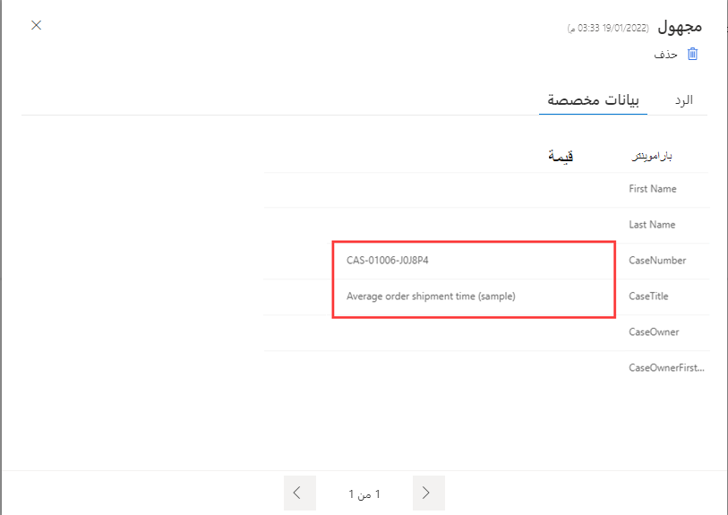

عند إنشاء مشروع في Dynamics 365 Customer Voice، يتم إنشاء استطلاع واحد على أقل تقدير بشكل افتراضي. ويتضمن كل استطلاع منطقة تقرير مناظرة تم إنشاؤها في الوقت نفسه.
يؤدي إنشاء استطلاعات في مشروع إلى إنشاء تقرير جديد للردود على الاستطلاع يتماشى معه. يتم سرد الاستطلاعات والتقارير أبجدياً، مما يساعدك في العثور بسهولة أكبر على التقرير الصحيح للاستطلاع الذي تتم مراجعته.

> [!div class="mx-imgBorder"]
> 

بعد تحديد اسم التقرير، سيتم عرض استجابات الاستطلاع باستخدام تمثيلات رسومية لجميع الاستجابات لهذا التقرير المحدد. تم تضمين كل سؤال في الاستطلاع، ويتم سرد الأسئلة رقمياً بنفس الترتيب المستخدم لإضافتها في منطقة تصميم التقرير. يتم عرض العدد الإجمالي للردود المستلمة للاستطلاع في الزاوية العلوية اليسرى وتتضمن جميع الردود، بغض النظر عن كيفية إنشائها. بشكل أساسي، يتم تضمين الردود المجهولة مع الردود التي تأتي من دعوة استطلاع شخصية، حيث يكون المستجيب معروفاً وموجوداً كجهة اتصال في بيئة Microsoft Dataverse المرتبطة.

سيتم عرض المتغيرات المستخدمة في الاستطلاع في نص السؤال كاسم متغير محاط بأقواس معقوفة **{}**، مما يوضح مكان استخدام التخصيص في الاستطلاع.
يتم تمثيل أنواع الأسئلة المختلفة باستخدام أنواع متنوعة من الرسومات. على سبيل المثال، يتم استخدام المخطط الدائري للأسئلة متعددة الاختيارات، ويتم استخدام مقياس لسؤال من النوع Net Promoter Score. تستخدم الأسئلة النصية رقماً للإشارة إلى عدد الردود التي تم تلقيها مع سؤال معين مأهول، ويتم عرض نص من أحدث الردود. يتم عرض أسئلة التقييمات كمخططات شريطية، مع عرض متوسط التصنيف باستخدام نجمة أو رقم أو مؤشر مبتسم، اعتماداً على الرمز الذي حددته عند إنشاء الاستطلاع وإضافة سؤال التصنيف.

> [!div class="mx-imgBorder"]
> 

يمكنك الوصول إلى الردود الفردية من قائمة **المستجيبون** على الجانب الأيمن من تقرير استجابة الاستطلاع. سيتم عرض الردود على أنها مجهولة فر حالة عدم ربطها بأي جهة اتصال. بدلاً من ذلك، إذا تم إرسال الرد من دعوة استطلاع شخصية فريدة، فستتضمن اسم المستجيب والبريد الإلكتروني الخاص به.
توفر علامة التبويب **الاستجابة** جميع أسئلة الاستطلاع مع الردود التي تم تقديمها لهذا المستجيب المحدد. كما هو الحال مع تقرير استجابة الاستطلاع الرئيسي، فإن الأسئلة التي تتضمن متغيراً ستعرض فقط اسم المتغير بين الأقواس **{}** ولن تعرض القيمة الفعلية التي ربما تم تمريرها إلى عامل.

> [!div class="mx-imgBorder"]
> 

يؤدي تحديد علامة التبويب **بيانات مخصصة** من رد فردي على استطلاع إلى توفير تفاصيل أي قيم متغيرة تم تخزينها. يمكنك تمرير هذه القيم بعدة طرق:

-   قم بتعيين قيمة كقيمة افتراضية على متغير قبل مشاركة ارتباط الاستطلاع.

-   قم بالمرور عبر ارتباط الاستطلاع باستخدام وظيفة الارتباطات المخصصة.

-   قم بتحميل ملف CSV باستخدام نموذج متقدم يحتوي على متغيرات.

-   قم بإنشاء تدفق في Microsoft Power Automate وقم بالمرور عبر المتغيرات باستخدام إجراء **إنشاء دعوة** من موصل Dynamics 365 Customer Voice.

> [!div class="mx-imgBorder"]
> 

قم بمشاهدة الفيديو التالي للاطلاع على عرض توضيحي سريع.

> [!VIDEO https://www.microsoft.com/videoplayer/embed/RWQBcB]
