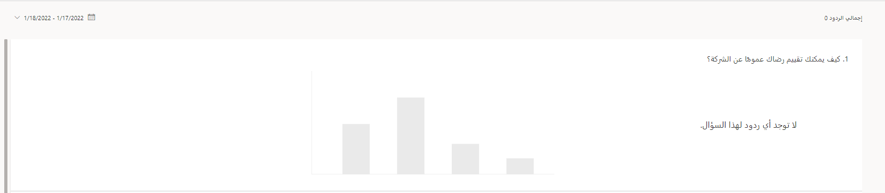
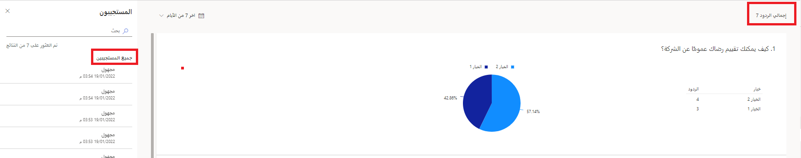
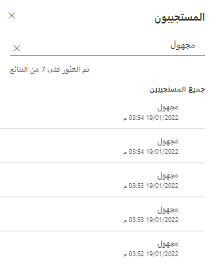

إذا قمت بمراجعة تقرير استجابة استطلاع Customer Voice في مشروع ما، سيعرض التقرير بشكل افتراضي الاستجابات من وقت تلقي الاستجابة الأولى. تساعدك طريقة العرض الافتراضية هذه على مراجعة العدد الإجمالي للاستجابات لتقرير بشكل سريع. في النهاية، ستنتج بعض التقارير مئات أو آلاف الاستجابات، مما يجعل التمرير عبرها والعثور على ما هو مطلوب أمراً صعباً. وقد يحصل الاستطلاع أيضاً على متوسطات استجابات مختلفة بالاستناد إلى فترة زمنية محددة، لذا فإن القدرة على تضييق البيانات إلى إطار زمني محدد يمكن أن تشكل عاملاً مساعداً عند تحليل المعلومات.

يتم توفير عامل تصفية التاريخ في الزاوية العلوية اليسرى من تقرير الردود على الاستطلاع. سيوفر لك تحديد عنصر التحكم خيارات لمراجعة الردود في آخر سبعة أيام وآخر 28 يوماً وآخر 90 يوماً.
يتوفر أيضاً خيار مخصص، مع القدرة على تحديد تاريخ البدء وتاريخ الانتهاء، لإنشاء إطار زمني يصل إلى 90 يوماً.

> [!div class="mx-imgBorder"]
> 

إذا تم تحديد إطار زمني من دون تلقي أي ردود خلال تلك الفترة، فستختفي المخططات وستظهر رسالة مفادها أن السؤال ليس له ردود.

> [!div class="mx-imgBorder"]
> 

سيؤدي التصفية إلى إطار زمني مختلف حيث تم استلام النتائج إلى تحديث الصور الرسومية، وتغيير العدد الإجمالي للردود في الزاوية العلوية اليمنى من التقرير، وستقوم بتصفية قائمة المستجيبين تلقائياً لإظهار الردود ذات الصلة.

> [!div class="mx-imgBorder"]
> 

يمكنك تصفية قائمة المستجيبين مباشرةً باستخدام حقل البحث في لوحة **المستجيبون** على يسار تقرير الردود على الاستطلاع. استخدم اسم المستجيب أو عنوان بريده الإلكتروني لقيم البحث. بعد إدخال القيمة، سيتم تحديث قائمة الردود تلقائياً وتصفيتها بناءً على الردود المتطابقة. الردود الواردة ان يتم تحديثها في التقرير لأن مربع البحث يعمل فقط في قائمة الردود التي تمت تصفيتها بالفعل حسب النطاق الزمني في التقرير.

> [!div class="mx-imgBorder"]
> 

قم بمشاهدة الفيديو التالي للاطلاع على عرض توضيحي سريع.

> [!VIDEO https://www.microsoft.com/videoplayer/embed/RWQLmL]
