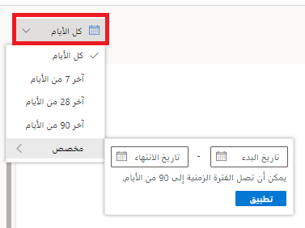

تودي مراجعة تقرير الردود على الاستطلاع في Dynamics 365 Customer Voice لاستطلاع ما في مشروع إلى إظهار الردود من الوقت الذي تم فيه تلقي الرد الأول، بشكل افتراضي. يعمل ذلك على تسهيل رؤية عدد الردود الإجمالي في تقرير ما بسرعة. مع مرور الوقت، ستنتج بعض التقارير مئات أو آلاف الردود، مما يجعل التمرير عبرها والعثور على ما هو مطلوب أمراً صعباً. وقد يحصل الاستطلاع أيضاً على متوسطات ردود مختلفة بالاستناد إلى فترة زمنية محددة، وبالتالي بإمكان القدرة على تضييق نطاق البيانات إلى إطار زمني محدد أن تشكل عاملاً مساعداً عند تحليل المعلومات.

يتم توفير عامل تصفية التاريخ في الجزء العلوي الأيسر من تقرير الردود على الاستطلاع. يؤدي النقر فوق عنصر التحكم إلى توفير خيارات لمراجعة الردود في آخر سبعة أيام وآخر 28 يوماً وآخر 90 يوماً. يتوفر أيضاً خيار مخصص، مع القدرة على تحديد تاريخ بدء وتاريخ انتهاء، مما يؤدي إلى إنشاء فترة زمنية تصل إلى 90 يوماً.

> [!div class="mx-imgBorder"]
> 

إذا تم تحديد إطار زمني من دون تلقي أي ردود خلال تلك الفترة، فستختفي المخططات، وستظهر رسالة مفادها أن السؤال ليس لديه أي ردود.

> [!div class="mx-imgBorder"]
> 

ستؤدي التصفية إلى إطار زمني مختلف حيث تم استلام النتائج إلى تحديث الصور الرسومية، وتغيير العدد الإجمالي للردود في أعلى يسار التقرير، وستقوم أيضاً بتصفية قائمة المستجيبين تلقائياً لإظهار الردود ذات الصلة.

> [!div class="mx-imgBorder"]
> 

يمكن تصفية قائمة المستجيبين مباشرةً باستخدام حقل البحث أعلى لوحة المستجيبين إلى يسار تقرير الردود على الاستطلاع. يمكن استخدام اسم المستجيب أو عنوان بريده الإلكتروني لقيم البحث. بعد كتابة القيمة، سيتم تحديث قائمة الردود تلقائياً، وستتم التصفية بناءً على أي ردود تتطابق. لن يتم تحديث الردود الواردة في التقرير لأن مربع البحث يعمل فقط في قائمة الردود التي تمت تصفيتها بالفعل حسب النطاق الزمني في التقرير.

> [!div class="mx-imgBorder"]
> 
