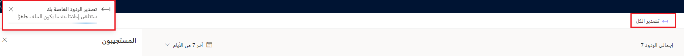
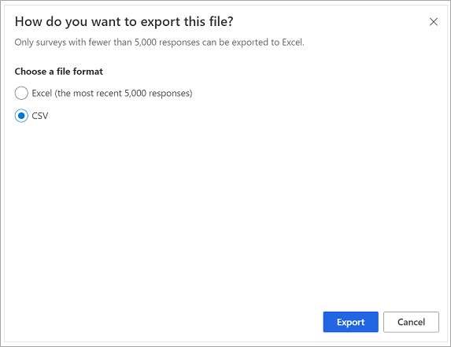
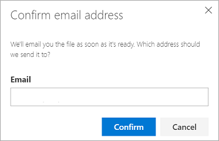

يمكن استخدام تقارير الردود على الاستطلاع في Dynamics 365 Customer Voice بسرعة وسهولة، مما يوفر للمستخدمين نظرة عامة على جميع الردود والوصول إلى ردود فردية على الاستطلاع حيث يمكن فتح كل رد على حدة. على الرغم من أن هذا الأسلوب قد يصلح لإجراء مراجعة سريعة، إلا أن القدرة على الوصول إلى البيانات دفعة واحدة وفرزها وتصفيتها بالاستناد إلى ردود معينة على أسئلة مختلفة قد تكون مطلوبة. من أجل ذلك، بإمكان تصدير الردود أن يوفر المزيد من المرونة للتحليل.

يوجد الزر "تصدير الكل" في أعلى يمين تقرير الردود على الاستطلاع. بالنسبة إلى الاستطلاعات التي تحتوي على أقل من 5,000 رد، يتم تصدير الردود تلقائياً إلى Excel. يؤدي الضغط على الزر إلى بدء التصدير، ويظهر إعلام في أعلى اليسار. بعد اكتمال التنزيل، يمكن الوصول إليه من مجلد التنزيلات على الجهاز المستخدم.

> [!div class="mx-imgBorder"]
> 

بالنسبة إلى الاستطلاعات التي تحتوي على أكثر من 5,000 رد، يتم توفير اختيار يسمح للمستخدم بتصدير الردود إلى Excel أو CSV. يؤدي اختيار التصدير إلى Excel إلى توفير آخر 5,000 رد فقط، بينما يؤدي تحديد CSV إلى تضمين جميع الردود.

> [!div class="mx-imgBorder"]
> 

باستخدام خيار التصدير إلى CSV، بإمكان المستخدم تحديد إرسال الملف في رسالة بريد إلكتروني. يؤدي توفير عنوان بريد إلكتروني والنقر فوق "تأكيد" إلى إكمال الطلب. عندما يصبح الملف جاهزاً، سيتم إرساله بالبريد الإلكتروني كمرفق بعنوان البريد الإلكتروني الذي تم تقديمه.

> [!div class="mx-imgBorder"]
> 

يوجد كل رد مضمن في التصدير في صف مختلف في ملف التصدير. كل سؤال في الاستطلاع مضمن في عمود مختلف. تم تضمين التفاصيل التالية في ملف التصدير:

- المعرف - رقم تزايدي معين

- وقت البدء - تاريخ/وقت بدء الرد على الاستطلاع

- وقت الإكمال - تاريخ/وقت بدء إرسال الرد على الاستطلاع

- البريد الإلكتروني - أو مجهول إذا لم يكن معروفاً

- الاسم - أو فارغ إذا لم يكن معروفاً

- الردود على جميع الأسئلة التي تمت الإجابة عليها في الاستطلاع

- بيانات مخصصة - أي متغيرات تمت تمريرها في الرد على الاستطلاع
