في هذا التمرين، ستقوم بمراجعة تقرير الردود على الاستطلاع لأحد الاستطلاعات داخل مشروع، ثم ستتعلم كيفية تصفية نتائج الاستطلاع وتصديرها.

> [!IMPORTANT]
> يمكن إكمال هذا التمرين في بيئة تجريبية أو بيئة اختبار معزولة. يجب أن يكون لديك حق الوصول إلى مشروع تم إرسال الردود على الاستطلاع المتعلق به.

## المهمة 1: مراجعة تقرير الردود على الاستطلاع

1.  انتقل إلى [Dynamics 365 Customer Voice](https://customervoice.microsoft.com/?azure-portal=true#) وسجّل الدخول باستخدام بيانات اعتمادك.

1.  حدد **كافة المشاريع**.

    > [!div class="mx-imgBorder"]
    > [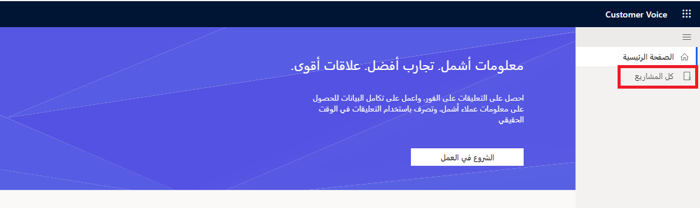](../media/all-projects.png#lightbox)

1.  حدد اسم أحد المشاريع التي لديك حق الوصول إليها.

    > [!div class="mx-imgBorder"]
    > [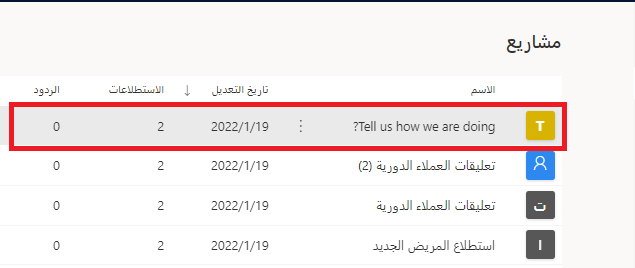](../media/accessible-projects.png#lightbox)

1.  من داخل المشروع، حدد اسم التقرير الذي يتطابق مع أحد الاستطلاعات التي لديها ردود.

    > [!div class="mx-imgBorder"]
    > [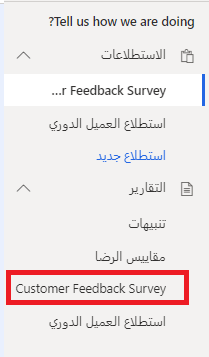](../media/customer-feedback-survey.png#lightbox)

1.  راجع التقرير. سيعرض كل سؤال في الاستطلاع مخططاً مختلفاً يصور النتائج.

    > [!div class="mx-imgBorder"]
    > [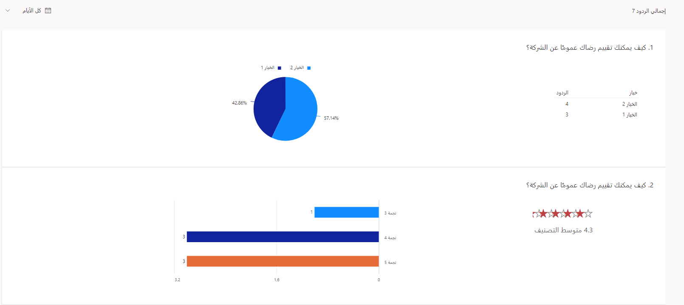](../media/report-review.png#lightbox)

1.  من الجانب الأيسر لتقرير الردود على الاستطلاع، حدد قائمة **المستجيبون**.

    > [!div class="mx-imgBorder"]
    > [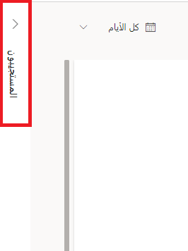](../media/respondents.png#lightbox)

1.  سيؤدي ذلك إلى عرض قائمة بجميع الردود على الاستطلاع التي تم تلقيها والمتعلقة بالرد على الاستطلاع الجاري عرضه. **انقر نقراً مزدوجاً** على أحد الردود من القائمة.

    > [!div class="mx-imgBorder"]
    > [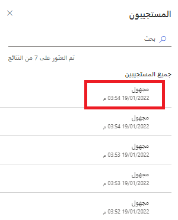](../media/anonymous-respondent.png#lightbox)

1.  قم بالتمرير عبر الإجابات المقدمة من علامة تبويب **الرد**.

    > [!div class="mx-imgBorder"]
    > [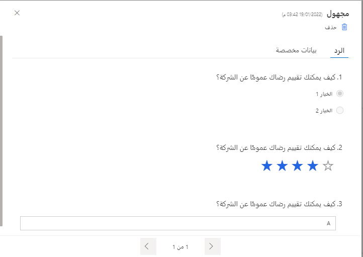](../media/anonymous-response.png#lightbox)

1.  إذا احتوت الردود على الاستطلاع على أي متغيرات، فيمكن الوصول إلى القيم من علامة التبويب **بيانات مخصصة**.

    > [!div class="mx-imgBorder"]
    > [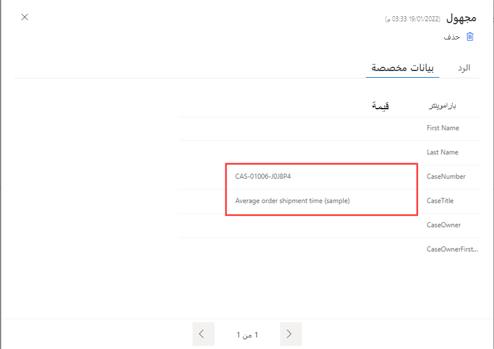](../media/personalized-data.png#lightbox)

## المهمة 2: تصفية نتائج الاستطلاع

1.  في المشروع الذي انتقلت إليه في المهمة 1، حدد التقرير المناظر لأحد الاستطلاعات التي تحتوي على ردود على الاستطلاع.

    > [!div class="mx-imgBorder"]
    > 

1.  من أعلى يسار التقرير، حدد عنصر تحكم التقويم حيث يعرض **كل الأيام**.

    > [!div class="mx-imgBorder"]
    > 

1.  حدد **مخصص**، ثم حدد نطاق تاريخ يصل إلى 90 يوماً. 
    حدد **تطبيق.**

    > [!div class="mx-imgBorder"]
    > [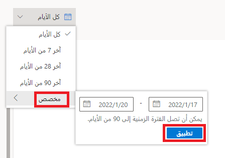](../media/custom-date-range.png#lightbox)

1.  بحسب عدد الردود الموجودة لديك على هذا الاستطلاع، قد لا يتم إرجاع أي رد. وفي هذه الحالة، سيظهر العدد الإجمالي للردود على أنها صفر، وستبيّن الأسئلة عدم وجود ردود.

    > [!div class="mx-imgBorder"]
    > [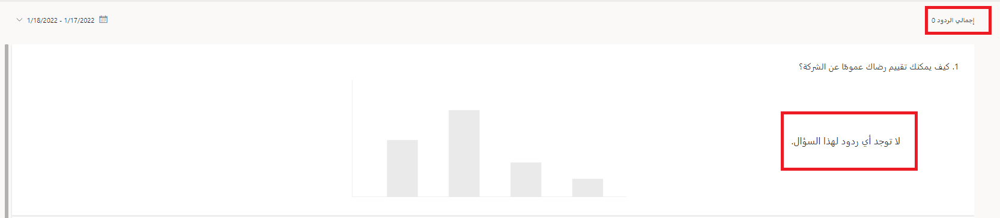](../media/zero-total-responses.png#lightbox)

1.  عند وجود ردود على الاستطلاع، سترى تغييراً في العدد الإجمالي للردود، وسيتم تعديل الرسوم المرئية لكل سؤال بحيث تعكس الردود التي تمت تصفيتها.

    > [!div class="mx-imgBorder"]
    > [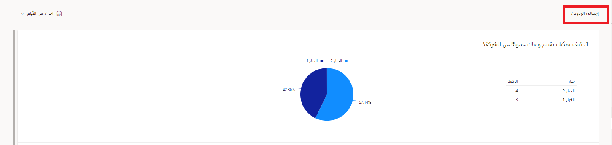](../media/total-responses-five.png#lightbox)

1.  انقر مرة أخرى على عامل تصفية التاريخ وحدد **كل الأيام** لإعادة جميع الردود على الاستطلاع إلى التقرير.

    > [!div class="mx-imgBorder"]
    > [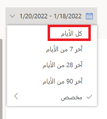](../media/all-days-not-custom.png#lightbox)

1.  حدد لوحة **المستجيبون** من الجانب الأيسر من التقرير.

    > [!div class="mx-imgBorder"]
    > 

1.  يمكن البحث عن الردود على الاستطلاع باستخدام اسم المستجيب أو عنوان بريده الإلكتروني. إذا كان لديك أي ردود تحمل اسماً، **فاكتب الأحرف القليلة الأولى من الاسم أو عنوان البريد الإلكتروني**. إذا كانت جميع الردود مجهولة، **فابدأ الكتابة في الكلمة "مجهول"**. 
    ستبدأ النتائج بالتصفية من تلقاء نفسها، أو يمكنك الضغط على **Enter**.

    > [!div class="mx-imgBorder"]
    > [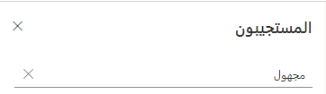](../media/anony-respondents.png#lightbox)

1.  ستقوم القائمة بتصفية جميع الردود على الاستطلاع المتطابقة وستعرضها. 
    لاحظ أن **عدد النتائج التي تم العثور عليها** سيتغير لمطابقة العدد الذي تمت تصفيته.

    > [!div class="mx-imgBorder"]
    > [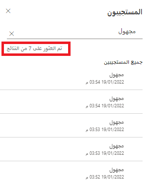](../media/results-found-anonymous.png#lightbox)

## المهمة 3: تصدير نتائج الاستطلاع

1.  في المشروع الذي انتقلت إليه في المهمة 1 والمهمة 2، حدد الزر **تصدير الكل** في الجزء العلوي الأيمن من تقرير الردود على الاستطلاع.

    > [!NOTE]
    > بغض النظر عن أي عوامل التصفية المطبقة، ستقوم ميزة التصدير بتصدير جميع الردود على الاستطلاع.

    > [!div class="mx-imgBorder"]
    > [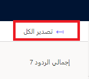](../media/export-all.png#lightbox)

1.  سيظهر إشعار في الزاوية العلوية اليسرى يشير إلى تصدير الردود. لا حاجة لتحديد رسالة الإعلام.

    > [!div class="mx-imgBorder"]
    > [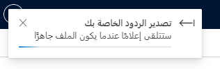](../media/exporting-responses.png#lightbox)

1.  عند اكتمال التصدير، ستظهر رسالة إعلام جديدة تشير إلى أن تصدير الردود قد تم. يمكن إغلاق رسالة الإعلام هذه.

    > [!div class="mx-imgBorder"]
    > [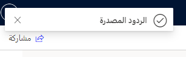](../media/responses-exported.png#lightbox)

1.  سيكون ملف Excel متاحاً للتنزيل ويمكن فتحه ومراجعته.

    > [!div class="mx-imgBorder"]
    > 
