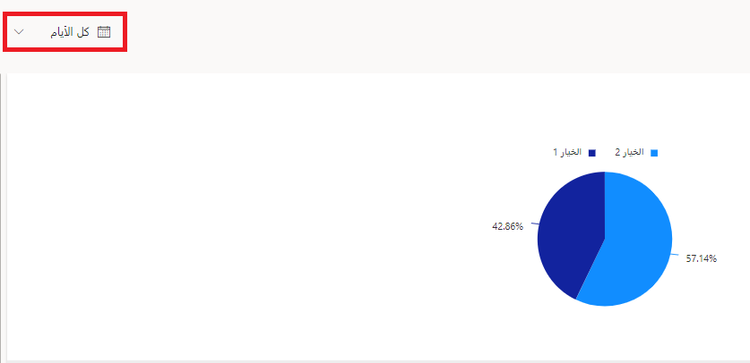
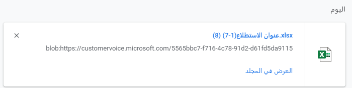

في هذا التمرين، ستقوم بمراجعة تقرير الردود على الاستطلاع لأحد الاستطلاعات داخل مشروع، ثم ستقوم بتصفية نتائج الاستطلاع وتصديرها.

> [!IMPORTANT]
> يمكنك استكمال هذا التمرين في بيئة إصدار تجريبي أو بيئة اختبار معزولة.
تأكد من أنك تملك حق الوصول إلى مشروع تم إرسال الردود على الاستطلاع المتعلق به.

## المهمة 1: مراجعة تقرير الردود على الاستطلاع

لمراجعه تقرير الردود على الاستطلاع، اتبع الخطوات التالية:

1.  انتقل إلى [Dynamics 365 Customer Voice](https://customervoice.microsoft.com/?azure-portal=true#) وسجّل الدخول باستخدام بيانات الاعتماد الخاصة بك.

1.  حدد **كافة المشاريع**.

    > [!div class="mx-imgBorder"]
    > 

1.  حدد اسم المشروع الذي لديك حق الوصول إليه.

    > [!div class="mx-imgBorder"]
    > 

1.  من داخل المشروع، حدد اسم التقرير الذي يتطابق مع استطلاع لديه ردود.

    > [!div class="mx-imgBorder"]
    > 

1.  راجع التقرير. سيعرض كل سؤال في الاستطلاع مخططاً مختلفاً يوفر رسوماً مرئية للنتائج.

    > [!div class="mx-imgBorder"]
    > 

1.  من الجانب الأيسر لتقرير الردود على الاستطلاع، حدد قائمة **المستجيبون**.

    > [!div class="mx-imgBorder"]
    > 

1.  ستظهر قائمة، تعرض جميع الردود على الاستطلاع التي تم تلقيها والمتعلقة بالرد على الاستطلاع الذي تستعرضه. انقر نقراً مزدوجاً على أحد الردود من القائمة.

    > [!div class="mx-imgBorder"]
    > 

1.  قم بالتمرير عبر الإجابات المقدمة من علامة تبويب **الرد**.

    > [!div class="mx-imgBorder"]
    > 

1.  إذا احتوت الردود على الاستطلاع على متغيرات، فيمكن الوصول إلى القيم من علامة التبويب **بيانات مخصصة**.

    > [!div class="mx-imgBorder"]
    > 

## المهمة 2: تصفية نتائج الاستطلاع

لتصفية نتائج الاستطلاع، اتبع الخطوات التالية:

1.  في المشروع الذي انتقلت إليه في المهمة 1، حدد التقرير المناظر لأحد الاستطلاعات التي تحتوي على ردود على الاستطلاع.

    > [!div class="mx-imgBorder"]
    > 

1.  من الزاوية العلوية اليسرى للتقرير، حدد عنصر تحكم التقويم حيث يعرض **كل الأيام**.

    > [!div class="mx-imgBorder"]
    > 

1.  حدد **مخصص**، ثم حدد نطاق تاريخ يصل إلى 90 يوماً.
    حدد **تطبيق**.

    > [!div class="mx-imgBorder"]
    > 

1.  بحسب عدد الردود على هذا الاستطلاع، قد لا تتوفر لديك ردود مرتجعة. وفي هذه الحالة، سيظهر العدد الإجمالي للردود على أنها صفر، وستبيّن الأسئلة عدم وجود ردود.

    > [!div class="mx-imgBorder"]
    > 

    عندما تكون الردود على الاستطلاع موجودة، سيتغير العدد الإجمالي للردود، وسيتم تعديل الرسوم المرئية لكل سؤال بحيث تعكس الردود التي تمت تصفيتها.

    > [!div class="mx-imgBorder"]
    > 

1.  حدد عامل تصفية التاريخ، ثم حدد **كل الأيام** لإعادة الردود على الاستطلاع إلى التقرير.

    > [!div class="mx-imgBorder"]
    > 

1.  حدد لوحة **المستجيبون** إلى الجانب الأيسر من التقرير.

    > [!div class="mx-imgBorder"]
    > 

1.  ابحث عن الردود على الاستطلاع باستخدام اسم المستجيب أو عنوان بريده الإلكتروني. إذا كان لديك أي ردود تحمل اسماً، فأدخل الأحرف القليلة الأولى من الاسم أو عنوان البريد الإلكتروني. إذا كانت جميع الردود مجهولة، فابدأ كتابة الكلمة **مجهول**.
    ستبدأ النتائج بالتصفية من تلقاء نفسها، أو يمكنك الضغط على **Enter**.

    > [!div class="mx-imgBorder"]
    > 

1.  ستقوم القائمة بتصفية جميع الردود على الاستطلاع المتطابقة وستعرضها.
    سيتغير عدد **النتائج التي تم العثور عليها** لمطابقة العدد الذي قمت بتصفيته.

    > [!div class="mx-imgBorder"]
    > 

## المهمة 3: تصدير نتائج الاستطلاع

لتصدير نتائج الاستطلاع، اتبع الخطوات التالية:

1.  في المشروع الذي انتقلت إليه في المهمة 1 والمهمة 2، حدد الزر **تصدير الكل** في الزاوية العلوية اليمنى من تقرير الردود على الاستطلاع.

    > [!NOTE]
    > بصرف النظر عن عوامل التصفية المطبقة، ستقوم ميزة التصدير بتصدير جميع الردود على الاستطلاع.

    > [!div class="mx-imgBorder"]
    > 

    سيظهر إعلام في أعلى اليسار يشير إلى تصدير الردود. لا حاجة لتحديد رسالة الإعلام.

    > [!div class="mx-imgBorder"]
    > 

1.  بعد اكتمال التصدير، ستظهر رسالة إعلام جديدة تشير إلى أن تصدير الردود قد تم. أغلق رسالة الإعلام هذه.

    > [!div class="mx-imgBorder"]
    > 

1.  سيكون ملف Excel متاحاً للتنزيل. افتح الملف وقم بمراجعته.

    > [!div class="mx-imgBorder"]
    > 
