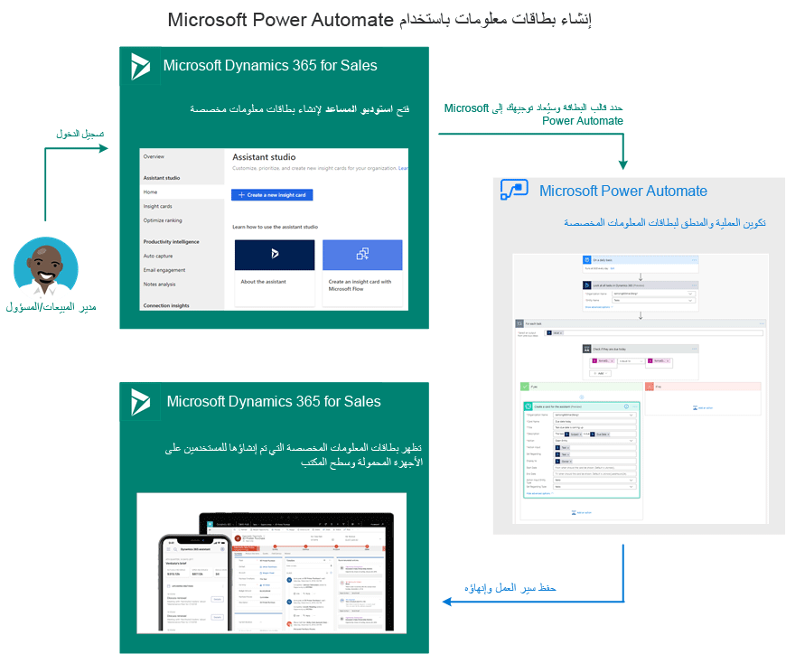

بصفتك مسؤولاً أو مدير مبيعات، يمكنك إنشاء إجراءات مقترحة خاصة بك أكثر ملاءمةً لمؤسستك من خلال ميزة إدارة المساعد. باستخدام الأحداث والشروط، يمكنك تخصيص الحالات التي يتم فيها إنشاء اقتراحات وإرسال المعلومات إلى سير عمل البائع. تساعد هذه التخصيصات البائعين على إغلاق الصفقات بسرعة أكبر. 

يوضح الرسم التخطيطي التالي تدفقاً عالي المستوى لإنشاء بطاقة المعلومات:

هل تحتاج إلى مساعدة؟ تواصل معنا من خلال [منتديات المجتمع](https://aka.ms/studioforums/?azure-portal=true).
