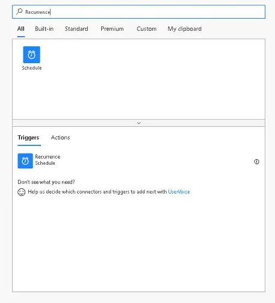
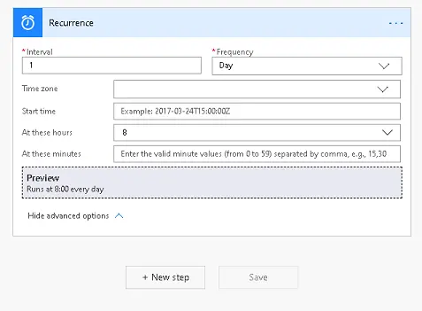
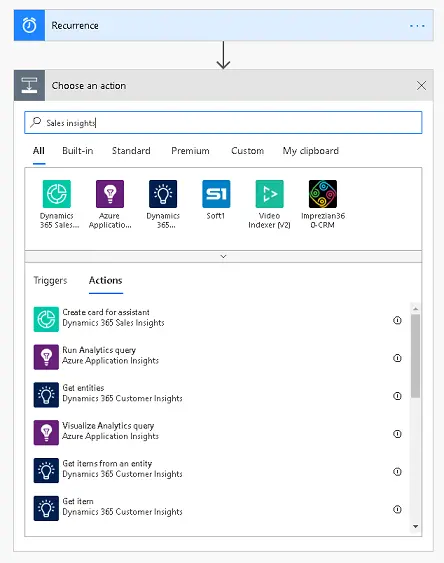
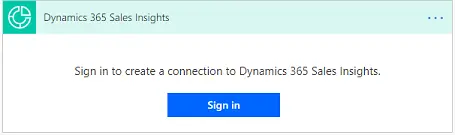
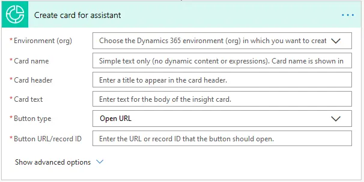
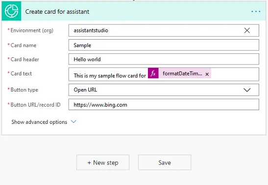
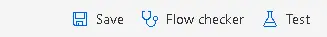
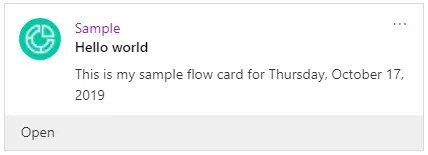

ستحتاج إما إلى بيئة تجريبية أو بيئة تحديد الصلاحيات مع Sales Insights لإكمال هذه البرامج التعليمية. 

### الهدف

لإنشاء نتيجة تحليلات "hello world" التي تُعرض في كل صباح على لوحة المعلومات لديك. 

## الخطوة 1: إنشاء مشغل لبدء التدفق

قم بتعيين مشغل يعمل كل صباح في 8 صباحًا.

في البحث، أدخل **تكرار.** من نتائج البحث، ضمن الخيار **المشغلات**، حدد **تكرار**.

ستري المشغل أدناه. أدخل **الفاصل الزمني** كـ **1** وحدد **التكرار** كـ **يوم.** يضمن إعداد قيم "الفاصل الزمني" و"التكرار" تشغيل المشغل مرة واحدة في اليوم.

يمكن تعيين الأعمدة الأخرى وفقًا لمتطلباتك. في هذا المثال، نقوم بتعيين **في هذه الساعات** كـ **8**، حيث إننا نريد تشغيل المشغل كل صباح في الساعة 8 ص.

## الخطوة 2: إضافة إجراء إلى المسار

في المربع الذي يشير إلى موصلات وإجراءات "البحث"، اكتب "Sales insights" أو "المساعد" وحدد الموصل **Dynamics 365 Sales Insights**. ضمن "إجراءات"، حدد **إنشاء بطاقة للمساعدة**.

إذا لم تجري اتصال مع موصل "Dynamics 365 Sales Insights"، فاستخدم حسابك في Dynamics 365 لتسجيل الدخول.

بعد تسجيل الدخول، يتم عرض الشاشة الموجودة أدناه، حيث يمكنك تحديد الأعمدة المطلوبة لإنشاء بطاقة.

| المعلمة            | الوصف                                                                                                                                                                                                                                   |
|----------------------|-----------------------------------------------------------------------------------------------------------------------------------------------------------------------------------------------------------------------------------------------|
| البيئة          | مؤسسة Dynamics 365 التي نريد إنشاء البطاقة فيها. يمكننا اختيار مؤسستك من القائمة المنسدلة المتوفرة.                                                                                                                                 |
| اسم البطاقة            | اسم تلك البطاقة التي ستظهر أعلى البطاقة. يجب ألا تتضمن السلسلة أحرفًا خاصة/محتوى ديناميكي.                                                                                                     |
| رأس البطاقة          | عنوان البطاقة الذي يظهر في رأس البطاقة أسفل أسم البطاقة مباشرةً.                                                                                                                                                               |
| نص البطاقة            | الوصف الذي سيظهر في النص الأساسي للبطاقة.                                                                                                                                                                                          |
| نوع الزر          | نوع الإجراء الذي يتم تنفيذه عند النقر فوق الزر الموجود على البطاقة. يمكن أن تكون إما عنوان URL مفتوح أو فتح جدول. (الإعداد الافتراضي هو عنوان URL مفتوح)                                                                                                    |
| زر عنوان URL/معرف السجل | إذا كان نوع الزر المحدد أعلاه هو عنوان URL مفتوح، فأدخل عنوان URL المراد فتحه. إذا كان نوع الزر هو فتح جدول، فأدخل معرف السجل للجدول المراد فتحه. في هذه الحالة، يكون هذا هو عنوان URL المفتوح، لذلك أدخلنا عنوان URL في هذا العمود. |

## الخطوة 3: أدخل المعلومات الخاصة بنتيجة التحليلات 

الأعمدة الأخرى اختيارية وتُركت فارغة لتلبية الغرض من هذا التدفق.

في الصورة السابقة، تمت تعبئة نص البطاقة ببعض النصوص والتعبيرات. التعبير هو **formatDateTime(utcNow(), 'D')** الذي يعرض التاريخ الحالي بالتنسيق: **الخميس، 17 أكتوبر 2019**.

## الخطوة 4: حفظ المسار
حدد **حفظ** في شاشة **إنشاء بطاقة للمساعد**.

## الخطوة 5: اختبار المسار 

يضمن الاختبار تكوين نتيجة التحليلات بشكل صحيح. لإجراء اختبار، انقر فوق **اختبار** في الجزء العلوي الأيمن واتبع الإرشادات.

والآن، يمكنك الاطلاع على البطاقة في لوحة معلومات Dynamics 365 كل يوم في الساعة 8 صباحًا. تعرض الصورة التالية مثالاً على كيفية عرض نتيجة التحليلات.

يمكنك أيضًا معرفة نوع البطاقة الموجودة في تكوين الاستوديو:

هل تحتاج إلى مساعدة؟ تواصل معنا من خلال [منتديات المجتمع](https://aka.ms/studioforums/?azure-portal=true).
