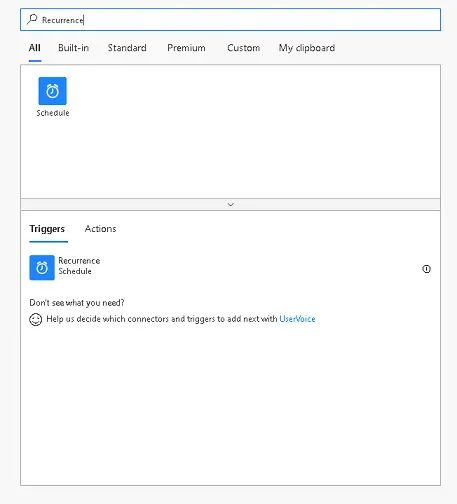
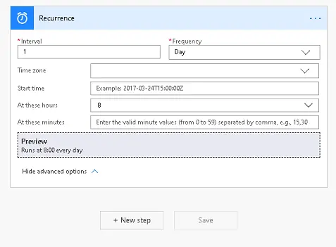
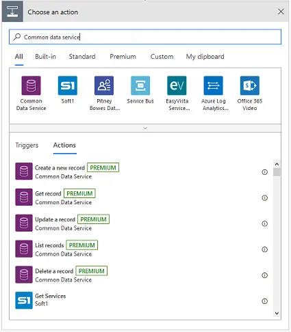
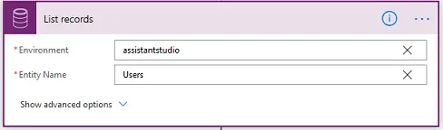
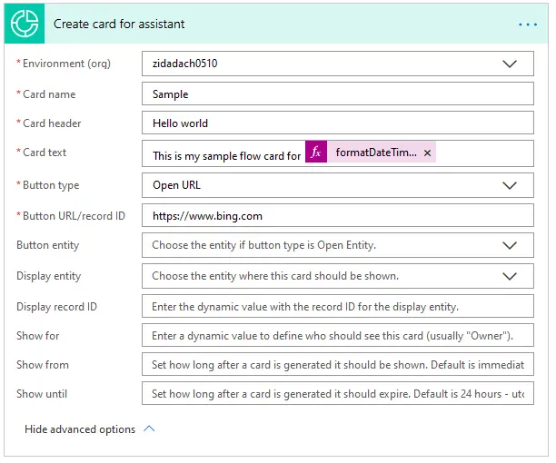
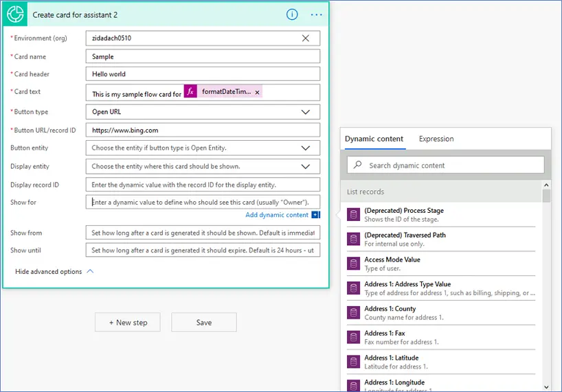
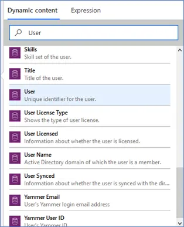
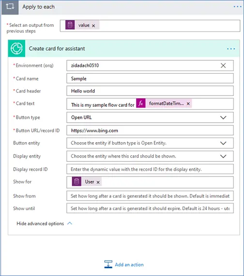

ستحتاج إما إلى بيئة تجريبية أو بيئة تحديد الصلاحيات مع Sales Insights لإكمال هذه البرامج التعليمية. 

### الهدف 

لإنشاء نتيجة تحليلات "hello world" التي تظهر كل صباح في لوحة المعلومات *لجميع* المستخدمين في مؤسستك.

## الخطوة 1: إنشاء مشغل لبدء التدفق

قم بتعيين مشغل يعمل كل صباح في 8 صباحًا.

في البحث، أدخل **تكرار.** من نتائج البحث، ضمن الخيار **المشغلات**، حدد **تكرار**.

ستري المشغل أدناه. أدخل **فاصل زمني** على أنه **1** وحدد **تكرار** على أنه **يوم ،** للتأكد من أنه سيتم تشغيل المشغل مرة واحدة في اليوم.

يمكن تعيين الأعمدة الأخرى وفقًا لمتطلباتك. في هذا المثال، نقوم بتعيين **في هذه الساعات** كـ **8**، حيث إننا نريد تشغيل المشغل كل صباح في الساعة 8 ص.

## الخطوة 2: تحديد جميع المستخدمين في المؤسسة

أضف إجراء إلى التدفق للحصول على قائمة المستخدمين من مؤسسة Dynamics 365.

ابحث عن موصل **Microsoft Dataverse** وحدده. ضمن **الإجراءات**، حدد **سجلات القوائم**.

ويمكنك إدخال المعلومات المطلوبة في الشاشة الموجودة بالأسفل لاسترداد المستخدمين من المؤسسة.

-   **البيئة** حدد مؤسستك من القائمة المنسدلة.

-   **اسم الجدول:** حدد **مستخدمين** من القائمة المنسدلة في الجدول.

## الخطوة 3: إنشاء بطاقة المعلومات

والآن، أضف الإجراء نفسه من "البرنامج التعليمي 1: Hello World"، ولكن هذه المرة ببعض الأعمدة الإضافية.

-   **جدول الأزرار**: إذا تم تحديد **نوع الزر** على أنه **جدول مفتوح**، فعندئذٍ حدد نوع الجدول من القائمة المنسدلة.

-   **عرض الجدول**: حدد نوع الجدول من القائمة المنسدلة التي تستخدم نموذج الجدول لعرض البطاقة.

-   **معرف سجل العرض**: معرف السجل الخاص بالجدول المتوافق مع نوع الجدول المحدد في عمود **عرض الجدول**.

-   **مستخدم العرض**: معرف السجل/معرف المستخدم للمستخدم الذي يجب أن يرى هذه البطاقة في لوحة معلومات Dynamics 365.

-   **وقت بدء العرض**: وقت البدء من الوقت الذي ينبغي فيه عرض البطاقة (إعداد افتراضي فور الإنشاء).

-   **وقت انتهاء العرض**: وقت انتهاء الصلاحية بعد عرضه (الإعداد الافتراضي هو 24 ساعة بعد الإنشاء).

لعرض هذه البطاقة لجميع المستخدمين، سيتم ملء عمود **مستخدم العرض**.

حدد عمود **مستخدم العرض** وسوف ينبثق مربع حوار. حدد إخراجًا لإجراء سابق. في هذه الحالة ، يكون إجراء **سجلات القوائم** من موصل **Common Data Service**.

من مربع البحث عن محتوى ديناميكي، ابحث عن **مستخدم** (المعرف الفريد للمستخدم) وحدده:

وبمجرد الانتهاء من ذلك، سيتم إنشاء عبارة **ينطبق على كل** والتي تعني أن سيتم إنشاء بطاقة لكل مستخدم تم إرجاعه من سجلات القوائم.

## الخطوة 4: انقر فوق حفظ واختبار

والآن، سيشاهد جميع المستخدمين هذه البطاقة في لوحة المعلومات لديهم.

هل تحتاج إلى مساعدة؟ تواصل معنا من خلال [منتديات المجتمع](https://aka.ms/studioforums/?azure-portal=true).
