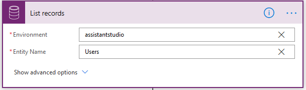

ستحتاج إما إلى بيئة تجريبية أو بيئة تحديد الصلاحيات مع Sales Insights لإكمال هذه البرامج التعليمية. 

### الهدف

لإنشاء نتيجة تحليلات للإيرادات، والتي تُعرض كل أسبوع في لوحة المعلومات لكافة المستخدمين.

## الخطوة 1: تعيين مشغل تكرار أسبوعي للتدفق

لنختار المشغل نفسه كما في السابق، ولكن في هذه المرة، قم بتعديل القيم حتى تعمل مرة واحدة في الأسبوع.

## الخطوة 2: تحديد جميع المستخدمين في المؤسسة

لنستخدم أيضاً الإجراء نفسه كما في السابق للحصول على قائمة المستخدمين من مؤسسة Dynamics 365 الخاصة بك.

وسنحصل الآن على الفرص المتاحة لجميع المستخدمين وحساب إجمالي الإيراد الذي تم الحصول عليه لكافة الفرص المغلقة في الأسبوع الماضي.

وللقيام بهذه الخطوة، تجب إضافة إجراء جديد، مثل **سجلات القائمة** وإحضار الفرص.

ونستخدم عمودين إضافيين في هذه الحالة:

-   **تحويل التجميع**: يُستخدم لإضافة الإيراد إلى كافة الفرص التي تم إرجاعها. نستخدم **التجميع (القيمة الفعلية مع مجموع مثل القيمة الفعلية)**.

-   **استعلام عامل التصفية**: يوفر القدرة على تصفية بعض البيانات استناداً إلى بعض الشروط. وفي الحالة التي لدينا، نرغب في الحصول على الفرص التي تم إغلاقها في الأسبوع الماضي ويمتلكها المستخدم الحالي. الشرط هو مزيج من النص والتعبيرات والمحتوى الديناميكي كما في الأمثلة السابقة:

    `actualclosedate le ***expression1**_ and actualclosedate ge _*_expression2_*_ and \_ownerid\_value eq _*_dynamicContent_**`

وفي هذا المثال، نستخدم القيم الآتية:

-   *التعبير 1* على النحو **utcNow()**

-   *التعبير 2*  على النحو **addDays(utcNow(), -7)**

-   *dynamicContent‎* على أنه **مستخدم**

## الخطوة 3: إنشاء بطاقة المعلومات 

لنقم بإنشاء البطاقة، حدد **إضافة إجراء**، وقم بإضافة إجراء **إنشاء بطاقة للمساعد**. قم بتعبئة القيم المطلوبة.

هل تحتاج إلى مساعدة؟ تواصل معنا من خلال [منتديات المجتمع](https://aka.ms/studioforums/?azure-portal=true).
