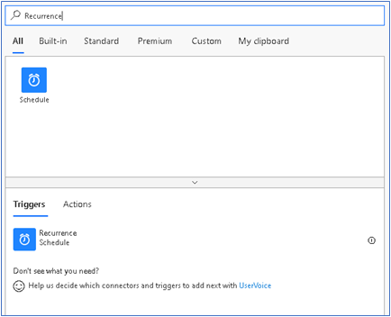

ستحتاج إما إلى بيئة تجريبية أو بيئة تحديد الصلاحيات مع Sales Insights لإكمال هذه البرامج التعليمية. 

### الهدف

إظهار تذكير لإغلاق الفرص في الأيام السبعة القادمة.

## الخطوة 1: قم بإعداد مشغل التكرار اليومي

قم بتعيين مشغل يعمل كل صباح في 8 صباحًا.

في البحث، أدخل **تكرار.** من نتائج البحث، ضمن الخيار **المشغلات**، حدد **تكرار**.

ستري المشغل أدناه. أدخل **الفاصل الزمني** كـ **1** وحدد **التكرار** كـ **يوم.**  يضمن ذلك تشغيل المشغل مرة واحدة في اليوم.

يمكن تعيين الأعمدة الأخرى وفقًا لمتطلباتك. في هذا المثال، نقوم بتعيين **> في هذه الساعات** على أنه **8**،حيث نريد تشغيل المشغل كل صباح في الساعة 8 صباحاً.

## الخطوة 2: إحضار جميع الفرص التي ستغلق في الأيام السبعة المقبلة

ابدأ بالحصول على جميع الفرص في المؤسسة. استخدم الموصل Dataverse لهذا كما هو موضح في مثال "Hello world".
استخدم إجراء "قائمة السجلات" للموصل Dataverse وحدد "الفرص" في القائمة المنسدلة للعمود "اسم الجدول".

**يمكن للمستخدمين المطلعين على مرشحات OData اتباع النهج التالي.** 

في عمود "استعلام التصفية"، استخدم estimatedclosedate le @{addDays(utcNow(),7)}. سيؤدي هذا إلى التصفية والحصول على جميع الفرص بتاريخ إغلاق تقديري أقل من سبعة أيام من utcNow.

**يمكن للمستخدمين غير المعتادين على تصفية OData اتباع النهج التالي.**

لجميع الفرص التي تم جلبها، استخدم شرطاً للتحقق مما إذا كان تاريخ الإغلاق المقدر في غضون أسبوع. الرجوع إلى لقطات الشاشة أدناه للحصول على دليل خطوة بخطوة.

ابحث عن "الحالة" للحصول على الإجراء الشرطي في التدفق.

ابحث عن تاريخ الإغلاق المقدر في المحتوى الديناميكي وحدد نفس القيمة في الشرط.

ستلاحظ أن الشرط قد تم تضمينه في إجراء "تطبيق على كل" لأن الإدخال المقدم كان من قائمة (قائمة الفرص).

قم بإنشاء شرط لتاريخ الإغلاق المقدر. هنا نستخدم تاريخ الإغلاق المقدر الذي يقل عن أو يساوي سبعة أيام من utcNow. 

## الخطوة 3: إنشاء بطاقة المعلومات 

الآن لإنشاء البطاقة، استخدم موصل Sales Insights في الجزء الحقيقي من الشرط. املأ الأعمدة بالأعمدة المطلوبة. يمكنك استخدام مخرجات الفرص لإنشاء بطاقات ذات صلة لكل فرصة. نظراً لأن الشرط وإجراء إنشاء البطاقة موجودان داخل إجراء "تطبيق على كل"، فسيتم تشغيلهما لكل فرصة.

لقد حددنا "فتح الجدول" كنوع الزر، ومن ثم قدمنا المعرف الفريد للفرصة باعتباره معرف السجل وحددنا "الفرص" كجدول الأزرار.

لاحظ أيضاً الأعمدة الأخرى، حيث قدمنا الفرص ومعرفها في عمودي "عرض الجدول" و "عرض معرف السجل". تم تعيين عمود "العرض لـ" كمالك لفرصة إظهار البطاقة للمالك المعني.

هل تحتاج إلى مساعدة؟ تواصل معنا من خلال [منتديات المجتمع](https://aka.ms/studioforums/?azure-portal=true).
