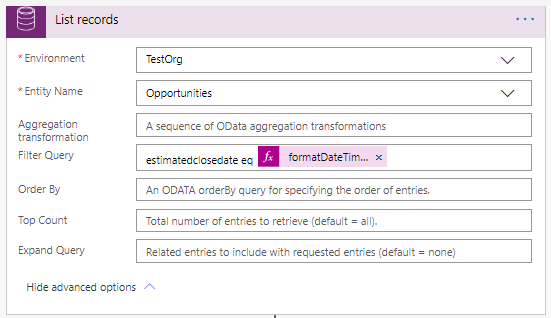

تم تقديم إمكانية إضافة إجراءات محددة بشكل مخصص إلى بطاقات المعلومات وهي متوفرة حاليًا في المعاينة.


يتم تقديم أنواع الأزرار الجديدة لعملية **إنشاء بطاقة للمساعد V2**.


### <a name="examples-use-case"></a>أمثلة حالة الاستخدام

سننشئ بطاقة معلومات يتم عرضها عندما يكون تاريخ الإغلاق التقديري للفرصة في غضون يوم واحد وسنضيف إجراءً لتمديد تاريخ الإغلاق المقدر بـ 10 أيام.

### <a name="test-data"></a>بيانات الاختبار

قم بإنشاء فرصة واحدة أو أكثر حيث يكون تاريخ الإغلاق المقدر هو التاريخ الحالي.

## <a name="step1createa-triggertostarttheflow"></a>الخطوة 1: إنشاء مشغل لبدء التدفق 

قم بتعيين مشغل يعمل كل صباح في 8 صباحًا. 

1. في البحث، أدخل  **تكرار**. من نتائج البحث، ضمن الخيار  **المشغلات** ، حدد  **تكرار**.

    

2. ستري المشغل أدناه. أدخل **الفاصل الزمني** كـ  **1** وحدد  **التكرار** كـ‏‎  **يوم**. يضمن ذلك تشغيل المشغل مرة واحدة في اليوم. 

    يمكن تعيين الأعمدة الأخرى وفقًا لمتطلباتك. في هذا المثال، نقوم بتعيين **في هذه الساعات** كـ **8**، حيث إننا نريد تشغيل المشغل كل صباح في الساعة 8 ص. 

    

## <a name="step2get-all-opportunities-which-are-closing-today"></a>الخطوة 2: احصل على جميع الفرص التي تغلق اليوم.

1.  حدد **خطوة جديدة** وفي مربع البحث، قم بإدخال **Microsoft Dataverse** وحدد **سجلات القائمة**.

    

2.  إضافة استعلام عامل تصفية لاسترداد كافة الفرص التي سيتم إغلاقها اليوم.

    ```estimatedclosedate eq @{formatDateTime(utcNow(), 'yyyy-MM-dd')}```

    

## <a name="step3for-every-opportunity-create-custom-insight-card"></a>الخطوة 3: إنشاء بطاقة معلومات مخصصة لكل فرصة

بالنسبة إلى كافة الفرص التي تم إحضارها من الخطوة السابقة، سنستخدم عملية جديدة **بإنشاء بطاقة للمساعد V2** وإنشاء بطاقة معلومات.

1.  انقر فوق **خطوة جديدة** ضمن إجراء **سجلات القائمة** وقم بإضافة إجراء **تطبيق على كل**.

    

2.  حدد كافة الفرص من **المحتوي الديناميكي** للتكرار.

    

3.  في عملية **التطبيق على كل**، حدد **إضافة إجراء** وابحث عن **رؤى المبيعات.** ستشاهد الاجراء الأعمق للمبيعات كما هو موضح في المقطع المقدم، حدد عملية **إنشاء بطاقة للمساعد V2**.

    

4.  أدخل البيئة والتفاصيل الأخرى حسب الحاجة. لمعرفه المزيد، راجع البرنامج التعليمي 1: Hello world.

    

يمكنك ملاحظة أن **تمديد تاريخ الإغلاق** يُستخدم كنص زر.

سنقوم بعمل **تمديد تاريخ الإغلاق** لتمديد تاريخ الإغلاق المقدر للفرصة ذات الصلة باستخدام REST والإجراء المخصص.

### <a name="action-using-rest"></a>إجراء استخدام REST

1.  حدد نوع الزر **REST** وقم بإضافة نقطة نهاية ODATA باستخدام معرف الفرصة المحدد من الخطوة السابقة. في نص REST، أضف json الحيوي مع التاريخ المستقبلي، 10 أيام من اليوم، وحدد الأسلوب كـ **تصحيح**.

    ```{"estimatedclosedate": "@{getFutureTime(10, 'Day', 'yyyy-MM-dd')}"}```

    

## <a name="step-4-save-the-flow"></a>الخطوة 4: حفظ المسار

## <a name="step-5-test-the-flow"></a>الخطوة 5: اختبار المسار

عندما يتم تشغيل المسار كما هو مجدول أو تقوم بتشغيله يدويًا، يجب أن تكون لديك بطاقة تم إنشاؤها وعرضها على لوحة المعلومات كما هو موضح أدناه.


لدينا الاجراء المحدد الخاص بنا متاح كزر على بطاقة رؤى المبيعات.

انقر فوق **تاريخ إغلاق التوسيع**. سيتم تحديث الفرصة بتاريخ الإغلاق المقدر الجديد ويتم عرض رسالة تأكيد.

قمنا بتمديد تاريخ الإغلاق المقدر للفرصة بإجراء جديد باستخدام اتصال REST.
