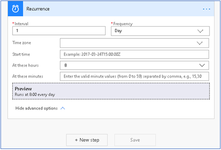

تم تقديم إمكانية إضافة إجراءات محددة بشكل مخصص إلى بطاقات المعلومات وهي متوفرة حاليًا في المعاينة.


يتم تقديم أنواع الأزرار الجديدة لعملية **إنشاء بطاقة للمساعد V2**.


### <a name="examples-use-case"></a>أمثلة حالة الاستخدام

سننشئ بطاقة معلومات يتم عرضها عندما يكون تاريخ الإغلاق التقديري للفرصة في غضون يوم واحد وسنضيف إجراءً لتمديد تاريخ الإغلاق المقدر بـ 10 أيام.

### <a name="test-data"></a>بيانات الاختبار

قم بإنشاء فرصة واحدة أو أكثر حيث يكون تاريخ الإغلاق المقدر هو التاريخ الحالي.

## <a name="step1createa-triggertostarttheflow"></a>الخطوة 1: إنشاء مشغل لبدء التدفق 

قم بتعيين مشغل يعمل كل صباح في 8 صباحًا. 

1. في البحث، أدخل  **تكرار**. من نتائج البحث، ضمن الخيار  **المشغلات** ، حدد  **تكرار**.

    

2. ستري المشغل أدناه. أدخل **الفاصل الزمني** كـ **1** وحدد **التكرار** كـ **يوم**. يضمن ذلك تشغيل المشغل مرة واحدة في اليوم. 

    يمكن تعيين الأعمدة الأخرى وفقًا لمتطلباتك. في هذا المثال، نقوم بتعيين **في هذه الساعات** كـ **8**، حيث إننا نريد تشغيل المشغل كل صباح في الساعة 8 ص. 

    

## <a name="step2get-all-opportunities-which-are-closing-today"></a>الخطوة 2: احصل على جميع الفرص التي تغلق اليوم.

1.  حدد **خطوة جديدة** وفي مربع البحث، قم بإدخال **Microsoft Dataverse** وحدد **سجلات القائمة**.

    

2.  إضافة استعلام عامل تصفية لاسترداد كافة الفرص التي سيتم إغلاقها اليوم.

    ```estimatedclosedate eq @{formatDateTime(utcNow(), 'yyyy-MM-dd')}```

    

## <a name="step3for-every-opportunity-create-the-custom-insight-card"></a>الخطوة 3: أنشئ بطاقة نتيجة تحليلات مخصصة لكل فرصة.

بالنسبة إلى كافة الفرص التي تم إحضارها من الخطوة السابقة، سنستخدم عملية جديدة **بإنشاء بطاقة للمساعد V2** وإنشاء بطاقة معلومات.

1.  انقر فوق **خطوة جديدة** ضمن إجراء **سجلات القائمة** وقم بإضافة إجراء **تطبيق على كل**.

    

2.  حدد كافة الفرص من **المحتوي الديناميكي** للتكرار.

    

3.  في عملية **التطبيق على كل**، حدد **إضافة إجراء** وابحث عن **رؤى المبيعات.** ستشاهد الاجراء الأعمق للمبيعات كما هو موضح في المقطع المقدم، حدد عملية **إنشاء بطاقة للمساعد V2**.

    

4.  إدخال البيئة

    

يمكنك ملاحظة أن **تمديد تاريخ الإغلاق** يُستخدم كنص زر.

سنقوم بعمل **تمديد تاريخ الإغلاق** لتمديد تاريخ الإغلاق المقدر للفرصة ذات الصلة باستخدام REST والإجراء المخصص.

### <a name="31-action-using-custom-action"></a>3.1 العمل باستخدام الإجراء المخصص

سنقوم الآن باستدعاء إجراء مخصص في CRM، والذي سيغير تاريخ الإغلاق المقدر.

### <a name="311-create-a-custom-action-inside-crm-to-extend-estimated-close-date"></a>3.1.1 إنشاء إجراء مخصص داخل CRM لتمديد تاريخ الإغلاق المقدر

لإنشاء إجراء مخصص، انتقل إلى **الإعدادات** > **العمليات** > **جديد**.

1.  أدخل الاسم كـ **تاريخ الإغلاق**، وحدد **الفئة** كـ **إجراء** و **الجدول** كـ **فرصة**.

    

2.  من **إضافة خطوة**، حدد **تحديث السجل**.

    

    

3.  حدد **تعيين الخصائص** ثم قم بتكوين **تاريخ الإغلاق المقدر** بعد 10 أيام **تاريخ الإغلاق المقدر**.

    

4.  حدد **حفظ وإغلاق** ثم قم بتنشيط الإجراء المخصص الذي ستكتشفه عمليتنا.

### <a name="312-invoking-custom-action-from-an-insight-card-with-opportunity-as-target"></a>3.1.2 استدعاء إجراء مخصص من بطاقة رؤية مع وجود فرصة كهدف

في **تطبيق على كل** إجراء، حدد **إضافة إجراء**.


1.  ابحث عن **Sales insight** وحدد **حدد إجراءً مخصصاً (عملية CRM) لبطاقة المعلومات**.

    

2.  حدد البيئة، ثم حدد **تصفية حسب الجدول** على أنها **فرص** و **إجراء مخصص (عملية CRM)** كـ **تاريخ إغلاق ممتد**.

    

    أدخل معرف الفرصة في المربع **الهدف الفرعي**. استخدم معرف الفرصة المستخدم في الخطوة السابقة من المحتوى الديناميكي.

    

    بعد التحديد سترى العملية على النحو التالي.

    

3.  أضف **إنشاء بطاقة للمساعد V2** الخطوة أدناه كما فعلنا لـ REST.

    

4.  حدد **نوع الزر** نوع الزر **إجراء مخصص (عملية CRM)**. سترى عموداً جديداً **إجراء مخصص لبطاقة المعلومات**.

5.  حدد **إجراء مخصص لبطاقة الإحصاءات** من النافذة المنبثقة للمحتوى الديناميكي. هذا إجراء مخصص حددناه في الخطوة السابقة.

    

أنت جاهز لتشغيل البطاقة ويبدو التكوين كما يلي.


## <a name="step-4-save-the-flow"></a>الخطوة 4: حفظ المسار

## <a name="step-5-test-the-flow"></a>الخطوة 5: اختبار المسار

عندما يتم تشغيل المسار كما هو مجدول أو تقوم بتشغيله يدويًا، يجب أن تكون لديك بطاقة تم إنشاؤها وعرضها على لوحة المعلومات كما هو موضح أدناه.


لدينا الاجراء المحدد الخاص بنا متاح كزر على بطاقة رؤى المبيعات.

انقر فوق **تاريخ إغلاق التوسيع**. سيتم تحديث الفرصة بتاريخ الإغلاق المقدر الجديد ويتم عرض رسالة تأكيد.


قمنا بتمديد تاريخ الإغلاق المقدر للفرصة بإجراء جديد باستخدام عملية CRM.
