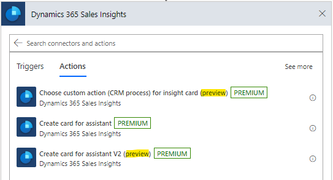
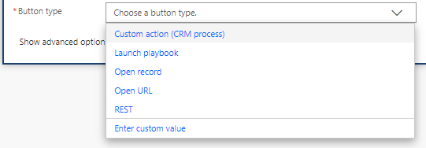
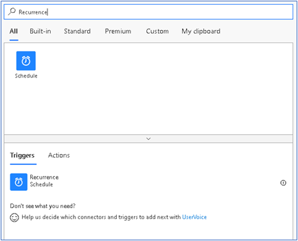
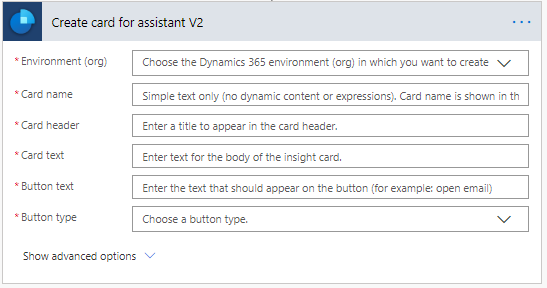
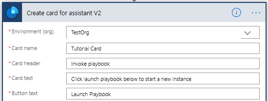
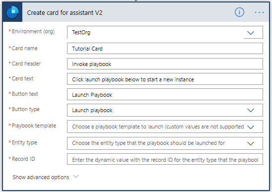
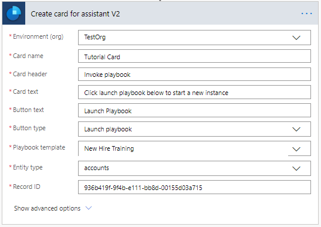
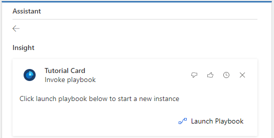
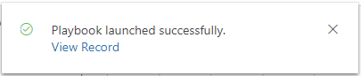

تم تقديم إمكانية إضافة إجراءات محددة بشكل مخصص إلى بطاقات المعلومات وهي متوفرة حالياً في المعاينة.

يتم تقديم أنواع أزرار الجديدة إلى عملية **إنشاء بطاقة للمساعد V2**.

## الخطوة 1: إنشاء مشغل لبدء التدفق 

قم بتعيين مشغل يعمل كل صباح في 8 صباحاً. 

1. في البحث، أدخل  **تكرار**. من نتائج البحث، ضمن الخيار المشغلات، حدد  **تكرار**.

    

2. ستري المشغل أدناه. أدخل **الفاصل الزمني** كـ **1** وحدد **التكرار** كـ **يوم**. يضمن ذلك تشغيل المشغل مرة واحدة في اليوم. 

    يمكن تعيين الأعمدة الأخرى وفقاً لمتطلباتك. في هذا المثال، نقوم بتعيين **في هذه الساعات** كـ **8**، حيث إننا نريد تشغيل المشغل كل صباح في الساعة 8 ص. 

    

## الخطوة 2: إضافة إجراء إلى المسار

1.  حدد **خطوة جديدة** وفي مربع البحث، أدخل **رؤى المبيعات** أو **المساعد**.

2.  حدد موصل **رؤى المبيعات**.

3.  ضمن الإجراءات، حدد **إنشاء بطاقة للمساعد V2**.

    

4.  أدخل البيئة والتفاصيل الأخرى حسب الحاجة. لمعرفة المزيد، راجع [البرنامج التعليمي 1: Hello world](/training/modules/sales-insights-lab/2-hello-world/?azure-portal=true).

    

## الخطوة 3: إضافة نوع زر "دليل المبادئ‬" لبدء تشغيل دليل المبادئ‬

1.  حدد **تشغيل دليل المبادئ‬** من نوع الزر لإضافة إجراء في بطاقة المعلومات لتشغيل دليل المبادئ. لمعرفه المزيد، راجع [فرض أفضل الممارسات من خلال دليل المبادئ](/dynamics365/sales-enterprise/enforce-best-practices-playbooks/?azure-portal=true).

    

2.  حدد قالب دليل المبادئ ونوع الجدول والسجل الهدف.

    

## الخطوة 4: حفظ المسار

## الخطوة 5: اختبار المسار

تشغيل المسار يدوياً أو عند تشغيله كما هو مجدول، يجب أن تكون بطاقة المعلومات الجديدة متوفرة في التطبيق.

## الخطوة 6: التحقق من بدء تشغيل دليل المبادئ

حدد **تشغيل دليل المبادئ** وتشغيل مثيل دليلا المبادئ الجديد.

للتحقق، من رسالة التأكيد، حدد **عرض السجل**.

