تم اعتماد القدرة على إنشاء بطاقة معلومات تحتوي على إجرائين/زرّين كحدٍ أقصى وهي متاحة حاليًا في المعاينة.

تمت الإضافة إلى عملية **إنشاء بطاقة للمساعد V3 (معاينة)**.

> [!div class="mx-imgBorder"]
> [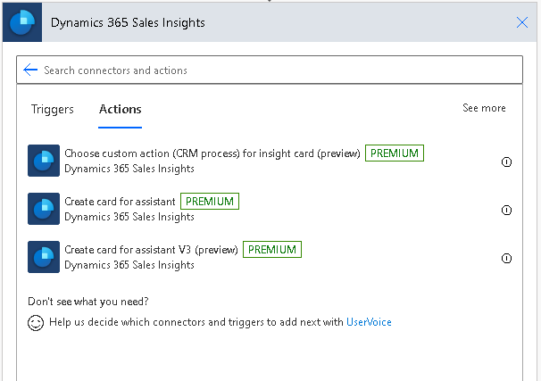](../media/create-card-assistant-ss.png#lightbox)

**مثال:** لإنشاء بطاقة معلومات سيتم عرضها عندما يكون تاريخ إقفال الفرصة المقدر في نطاق يوم. ستتم إضافة إجراء واحد لتمديد تاريخ الإقفال بحلول 10 أيام وإجراء آخر لفتح الفرصة.

## الخطوة 1: إنشاء مشغل لبدء التدفق

قم بتعيين مشغل يعمل كل صباح في 8 صباحًا.

1.  في البحث، أدخل **تكرار**. من نتائج البحث، ضمن الخيار المشغلات، حدد **تكرار**.

    > [!div class="mx-imgBorder"]
    > [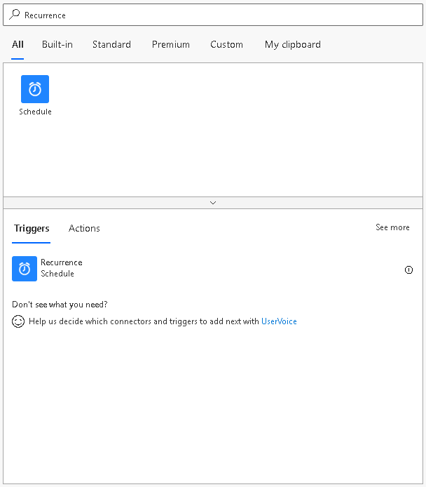](../media/select-recurrence-ss.png#lightbox)

1.  ستري المشغل أدناه. أدخل **الفاصل الزمني** كـ **1** وحدد **التكرار** كـ **يوم**.  يضمن ذلك تشغيل المشغل مرة واحدة في اليوم. يمكن تعيين الأعمدة الأخرى وفقًا لمتطلباتك. في هذا المثال، نقوم بتعيين **في هذه الساعات** كـ **8**، حيث إننا نريد تشغيل المشغل كل صباح في الساعة 8 ص.

    > [!div class="mx-imgBorder"]
    > [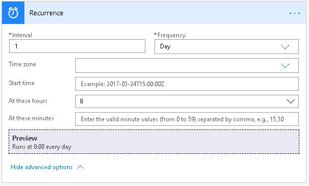](../media/run-every-morning-ss.png#lightbox)

## الخطوة 2: احصل على جميع الفرص التي تغلق اليوم

1.  حدد **خطوة جديدة** وفي مربع البحث، قم بإدخال **Microsoft Dataverse** وحدد **سجلات القائمة**.

    > [!div class="mx-imgBorder"]
    > [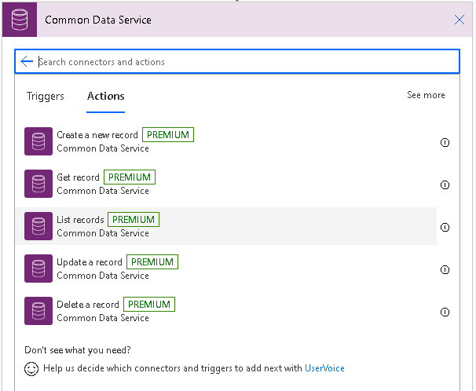](../media/list-records-ss.png#lightbox)

1.  إضافة استعلام عامل تصفية لاسترداد كافة الفرص التي سيتم إغلاقها اليوم.

    `estimatedclosedate eq @{formatDateTime(utcNow(), 'yyyy-MM-dd')}`

    > [!div class="mx-imgBorder"]
    > [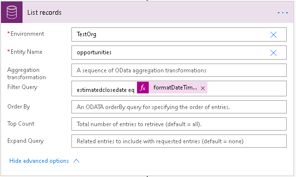](../media/filter-query-ss.png#lightbox)

## الخطوة 3: إنشاء بطاقة معلومات مخصصة لكل فرصة

بالنسبة إلى الفرص التي تم إحضارها من الخطوة السابقة، سنستخدم عملية جديدة **بإنشاء بطاقة للمساعد V3** وإنشاء بطاقة معلومات.

1.  انقر فوق **خطوة جديدة** ضمن إجراء **سجلات القائمة** وقم بإضافة إجراء **تطبيق على كل**.

    > [!div class="mx-imgBorder"]
    > [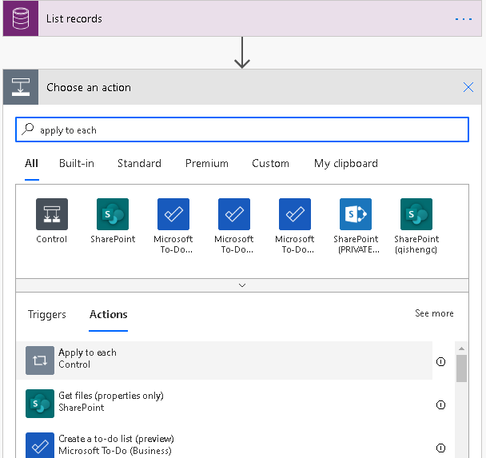](../media/apply-each-action-ss.png#lightbox)

1.  في عملية **تطبيق على كل**، حدد **إضافة إجراء** وابحث عن **Sales Insights.** ضمن الإجراءات، حدد عملية **إنشاء بطاقة للمساعد V3**.

    > [!div class="mx-imgBorder"]
    > [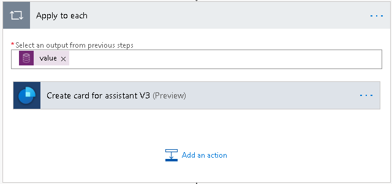](../media/choose-create-card-assistant-ss.png#lightbox)

## الخطوة 4: إدخال التفاصيل واختيار نوع إجراء أساسي

1.  أدخل البيئة والتفاصيل الأخرى حسب الحاجة.

1.  حدد **متبقي** من القائمة المنسدلة **نوع الإجراء الأساسي**.

    > [!div class="mx-imgBorder"]
    > [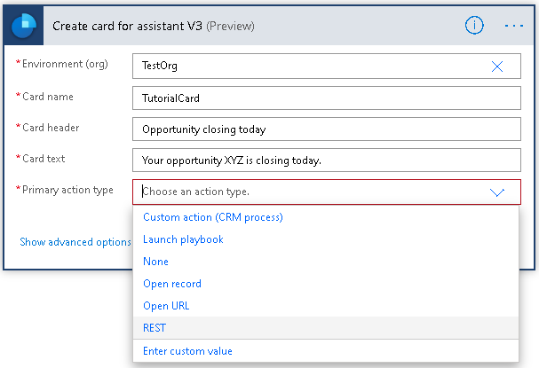](../media/primary-action-type-ss.png#lightbox)

1.  بمجرد تحديد "متبقي"، ستشاهد الأعمدة المقابلة لهذا الإجراء. أدخل الآن قيمًا لنص الإجراء "أساسي" ونقطة النهاية وأسلوب http والنص الأساسي على النحو الآتي. ارجع إلى [البرنامج التعليمي 5 - إضافة زر إجراء مخصص إلى بطاقة المعلومات لاستدعاء](/learn/modules/sales-insights-lab/5a-custom-action-button-rest/?azure-portal=true) "متبقي" للحصول على مزيد من التفاصيل حول هذا الاجراء.

    - **نقطة نهاية:** `https://TestOrg.crm10.dynamics.com/api/data/v9.0/opportunities(ID-FromPreviousStep)`
    
    - **أسلوب HTTP:** PATCH
    
    - **النص الأساسي:** `{"estimatedclosedate": "@{getFutureTime(10, 'Day', 'yyyy-MM-dd')}"}`

    > [!div class="mx-imgBorder"]
    > [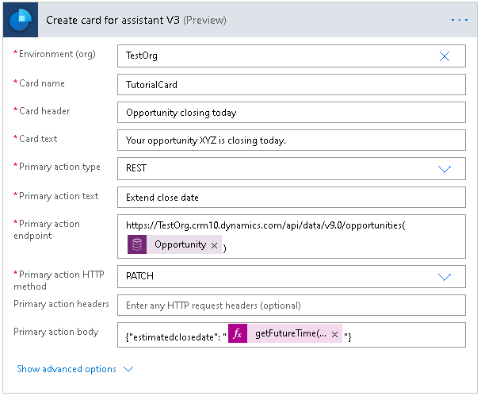](../media/action-values-ss.png#lightbox)

## الخطوة 5: إضافة نوع الإجراء "ثانوي"

قم بتنفيذ هذه الخطوة فقط إذا كنت قد قمت بالفعل بإضافة إجراء "أساسي" إلى العملية.

1.  انقر فوق **عرض الخيارات المتقدمة**.

1.  حدد **فتح سجل** من القائمة المنسدلة **نوع الإجراء ثانوي**.

1.  بمجرد تحديد "فتح سجل"، ستشاهد الأعمدة المقابلة لهذا الإجراء. أدخل الآن قيمًا لنص الإجراء "ثانوي" ونوع الجدول ومعرف السجل.

    > [!div class="mx-imgBorder"]
    > [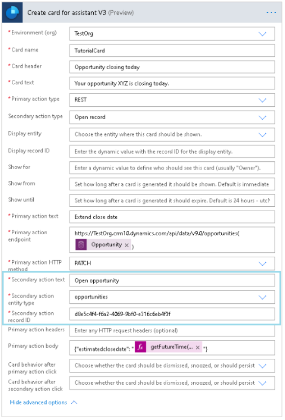](../media/secondary-action-type-ssm.png#lightbox)

## الخطوة 6: حفظ التدفق واختباره

تشغيل المسار يدويًا أو عند تشغيله كما هو مجدول، يجب أن تكون بطاقة المعلومات الجديدة متوفرة في التطبيق.

> [!div class="mx-imgBorder"]
> [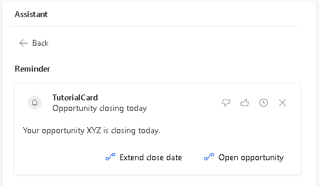](../media/new-insight-card-ss.png#lightbox)
